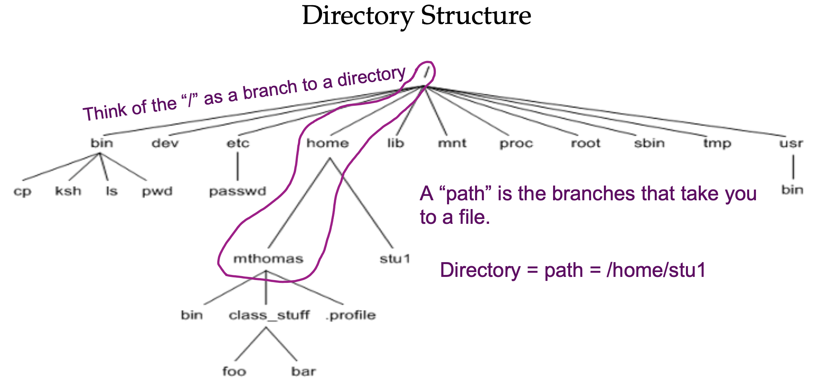
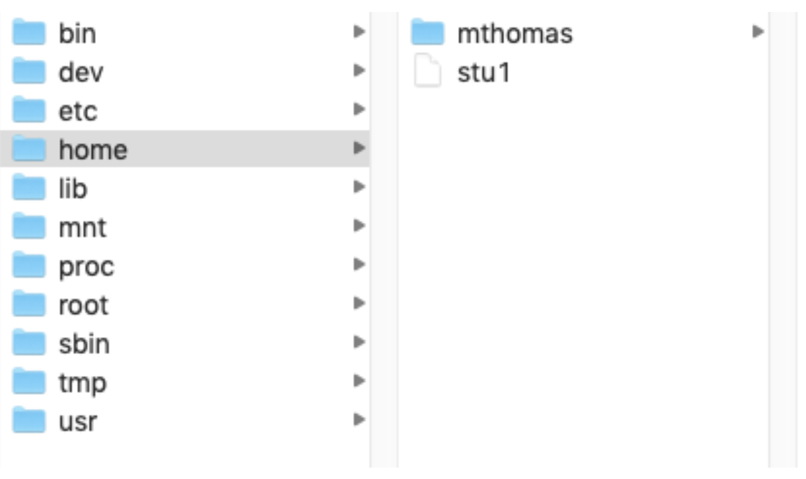
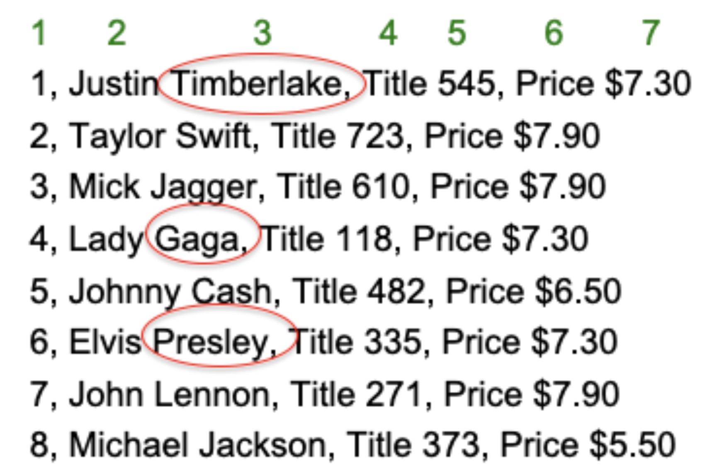
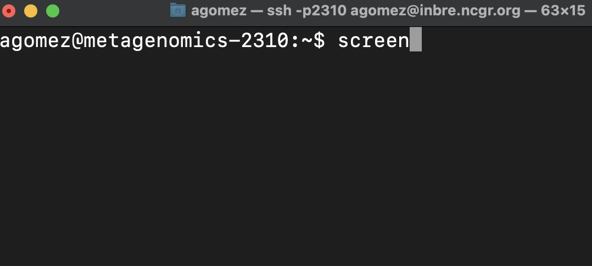

# Linux

## Connecting to the linux server

1. Open your terminal.

2. Type the following on your command line, substituting in your username for <username>.

```
ssh -p2402 <username>@inbre.ncgr.org
```

3. Enter your password.

If you have trouble connecting, please contact Ethan Price at inbre\@ncgr.org.

## What are Linux, bash, and Ghostwheel?

### A little shell... aka the $ prompt is the command line interface{-}

+ A shell is a user interface to the operating system.
    + CLI (Command Line Interface)
    + GUI (Graphical User Interface)
+ Bourne-Again SHell (bash) is a Unix shell and command language
+ Each command drives a program or script by talking to the Operating System
(Linux)

### Directory Structure{-}

{width=80%}

In a Finder window, you would see this:

{width=60%}

### Find the shell in system you’ll use to log into the NCGR’s server

+ For **Windows**: search for MobaXterm from the start menu.
    + It may be useful to drag the terminal icon to the **desktop** for easier access in the future.

+ For **Mac**: search for "terminal" in the bar located in the Launchpad (rocket icon in the taskbar).
    + It may be useful to drag the terminal icon into the **Dock** for easier access in the future.

### Log on to Ghostwheel server 

Enter the following command to log on to logrus:

+ substitute **your** personal username in for "username"

```
ssh -p2402 <username>@inbre.ncgr.org
```

Notes:

+ Because we’re logging in remotely, the -p option is required to specify port 2402. 
+ If you’re prompted to confirm the connection, say "yes", then enter your password.

### Now that I logged on, where am I?

You’re at the command line interface of the logrus analysis server!

To the left of the command prompt, you should see something like this: 

+ agomez@metagenomics-2402:~$

Command **output** is shown after the "##" in this document.

## Linux basics: Part I:

### Understanding Directories

print working directory (pwd), mkdir (make directory), and list contents (ls)

```
pwd
```

```
## /home/agomez
```

+ This is your "home" directory.

Now, create a dir under your home directory for this linux class:

```
mkdir linuxc

ls
```

```
## linuxc
```

### Listing options

using the ls command

+ **l**ong list:

```
ls -l
```

```
## total 4
## drwx 2 agomez agomez 10 Aug 17 22:50 linuxc
```

+ **l**ong list, by **t**ime, **r**everse order -old to new:

```
ls -ltr
```
    
```
## total 4
## drwx 2 agomez agomez 10 Aug 17 22:50 linuxc
```

### Navigation

1) "**c**hange **d**irectory" to the directory you made
+ where ~ is shorthand for your home directory

```
cd ~/linuxc

pwd
```

```
## /home/agomez/linuxc
```

### Files: creating with touch command

1) Create a file

```
touch newfile.txt

ls -l
```

```
## total 0
## -rw-rw-r-- 1 eprice eprice 0 Aug 17 22:50 newfile.txt
```

2) Change to your home dir

```
cd ~ 

pwd
```

```
## /home/agomez
```

### History command

lists the commands you have entered

```
history
```

```
## 17 ls -ltr
## 18 cd ../linuxc
## 19 ls -ltr
## 20 history
```

Scroll through recent commands with the up and down arrows.

To perform a command from the list by number:

```
!17
```

To perform the last command you made:

```
!!
```

### Files: creating by redirecting standard out

redirect operator **>**

To send output to a file instead of standard out:

+ standard out is just the terminal
   
    
```
history > history.txt

ls -l
```

```
## total 4
## -rw-rw-r-- 1 eprice eprice 0    Aug 17 22:50 history.txt
## drwxrwxr-x 2 eprice eprice 4096 Aug 17 22:50 linuxc
```

```
cat history.txt
```

```
## 17 ls -ltr
## 18 cd ../linuxc
## 19 ls -ltr
## 20 history
## 21 ls -ltr
## 20 history > history
```

Now you have a file with your commands!

### File name completion with tab

To autocomplete remainder of file name instead of typing it all in:

+ cat h...(press tab)
    + cat history
+ prevents typos and saves time

### Files: moving files from one filename to another

**m**o**v**ing "mv" command

#### Syntax: mv sourcefilename destinationfilename{-}

```
mv history.txt history_file.txt

ls -l
```

```
## total 4
## -rw-rw-r-- 1 eprice eprice 0    Aug 17 22:50 history_file.txt 
## drwxrwxr-x 2 eprice eprice 4096 Aug 17 22:50 linuxc
```

### Files: copying files from one filename to another

**c**o**p**ying "cp" command

#### Syntax: cp sourcefilename destinationfilename{-}

1) Change back to the linuxc directory:

```
cd ~/linuxc
```

2) Make a "back up" copy of a file in your working directory:

```
cp ~/linuxc/newfile.txt newfile_bu.txt
```

3) Check if the newly copied file is there:

```
ls
```

```
## newfile_bu.txt
## newfile.txt
```

### Files: securely copying files between your laptop and logrus 

**s**ecure **c**o**p**y "scp" command

+ a secure way to copy files to/from a server while you're working on an outside network
    + like from your home or starbucks to the linux server and vice versa

#### Syntax: scp [options] sourcepath destinationpath{-}

1) Create a file to copy

```
touch scp_test.txt
```

2) 
+ **Mac** users
    + open a **local** terminal
    + do **not** connect it to logrus
+ **Windows** users
    + open a new MobaXterm session (shell)
    
3) Run the scp command from your **local** terminal window:
+ to **download** the file **to your computer** from logrus
+ the last period means that the destination is your working directory

```
scp -P 2402 <username>@inbre.ncgr.org:~/linuxc/scp_test.txt .
```

Note: When you designate a port with secure copy (scp), you use a capital P.

You will be prompted for your logrus password if not using MobaXterm.

4) Check to see if the file you copied from logrus is on **your** computer!

5) Now **upload** a file **to logrus** from your computer
+ Again, run the scp command from your **local** terminal window:

```
scp -P 2402 scp_test.txt <username>@inbre.ncgr.org:~/linuxc
```

6) Check to see if the file you copied from your computer is on **logrus**!

### Files and directories: removing files is deleting files

**r**e**m**oving "rm" command

#### Syntax: rm [options] filename{-}

```
rm -i newfile_bu.txt
```

```
## rm: remove regular empty file newfile_bu.txt?
```

Enter "yes" or "y" in response to the question:

```
yes

ls -l
```

```
## total 0
## -rw-rw-r-- 1 eprice eprice 0 Aug 17 22:50 newfile.txt
```

At this point everyone should have the above in their linuxc class directory.

### Tool box: How to abort a command/process

Hold "control" key then hit "c" key, then release. 

+ Control-key often referred to as CTRL. 

Let’s say you type a command and nothing happens; it hangs.
This can happen when the syntax doesn’t make sense. 
Good time for CTRL c

```
cat
```

If you can't execute commands, then CTRL c

```
## ^C
```

You should be returned to your prompt: username@metagenomics-2402:~/linuxc$


## Linux basics: Part II

### Files: Symbolic links and the soft link (-s)

#### Syntax: ln -s FileYouWantToLink/PointTo NameYouWantToGiveIt{-}

```
ln -s /home/data/metagenomics-2402/covid.fasta covid.fasta

ls -l
```

```
## total 0
## lrwxrwxrwx 1 eprice eprice 26 Aug 17 22:50 covid.fasta -> /home/agomez/covid.fasta 
## -rw-rw-r-- 1 eprice Aug 17 22:50 newfile.txt
```

### Understanding a fasta file format

Fasta files (.fasta or .fa) contain one or more sequences, each preceded by a **header** starting with ">".

Show only the **first 10 lines** of a file with "head" command:

```
head covid.fasta
```

```
## >NC_045512.2 |Severe acute respiratory syndrome coronavirus 2 isolate Wuhan-Hu-1, co
## ATTAAAGGTTTATACCTTCCCAGGTAACAAACCAACCAACTTTCGATCTCTTGTAGATCT
## GTTCTCTAAACGAACTTTAAAATCTGTGTGGCTGTCACTCGGCTGCATGCTTAGTGCACT
## CACGCAGTATAATTAATAACTAATTACTGTCGTTGACAGGACACGAGTAACTCGTCTATC
## TTCTGCAGGCTGCTTACGGTTTCGTCCGTGTTGCAGCCGATCATCAGCACATCTAGGTTT
## CGTCCGGGTGTGACCGAAAGGTAAGATGGAGAGCCTTGTCCCTGGTTTCAACGAGAAAAC
## ACACGTCCAACTCAGTTTGCCTGTTTTACAGGTTCGCGACGTGCTCGTACGTGGCTTTGG
## AGACTCCGTGGAGGAGGTCTTATCAGAGGCACGTCAACATCTTAAAGATGGCACTTGTGG
## CTTAGTAGAAGTTGAAAAAGGCGTTTTGCCTCAACTTGAACAGCCCTATGTGTTCATCAA
## ACGTTCGGATGCTCGAACTGCACCTCATGGTCATGTTATGGTTGAGCTGGTAGCAGAACT
```

Now show only the **last 10 lines** of a file using the "tail" command:

```
tail covid.fasta
```

```
## TATTGACGCATACAAAACATTCCCACCAACAGAGCCTAAAAAGGACAAAAAGAAGAAGGC
## TGATGAAACTCAAGCCTTACCGCAGAGACAGAAGAAACAGCAAACTGTGACTCTTCTTCC
## TGCTGCAGATTTGGATGATTTCTCCAAACAATTGCAACAATCCATGAGCAGTGCTGACTC
## AACTCAGGCCTAAACTCATGCAGACCACACAAGGCAGATGGGCTATATAAACGTTTTCGC
## TTTTCCGTTTACGATATATAGTCTACTCTTGTGCAGAATGAATTCTCGTAACTACATAGC
## ACAAGTAGATGTAGTTAACTTTAATCTCACATAGCAATCTTTAATCAGTGTGTAACATTA
## GGGAGGACTTGAAAGAGCCACCACATTTTCACCGAGGCCACGCGGAGTACGATCGAGTGT
## ACAGTGAACAATGCTAGGGAGAGCTGCCTATATGGAAGAGCCCTAATGTGTAAAATTAAT
## TTTAGTAGTGCTATCCCCATGTGATTTTAATAGCTTCTTAGGAGAATGACAAAAAAAAAA
## AAAAAAAAAAAAAAAAAAAAAAA
```

#### The pipe operator will redirect output of a command to another command.{-}

Use the pipe operator to redirect "cat" output to "head":

+ The symbol "|" denotes a pipe

```
cat covid.fasta | head
```

```
## >NC_045512.2 |Severe acute respiratory syndrome coronavirus 2 isolate Wuhan-Hu-1, co
## ATTAAAGGTTTATACCTTCCCAGGTAACAAACCAACCAACTTTCGATCTCTTGTAGATCT
## GTTCTCTAAACGAACTTTAAAATCTGTGTGGCTGTCACTCGGCTGCATGCTTAGTGCACT
## CACGCAGTATAATTAATAACTAATTACTGTCGTTGACAGGACACGAGTAACTCGTCTATC
## TTCTGCAGGCTGCTTACGGTTTCGTCCGTGTTGCAGCCGATCATCAGCACATCTAGGTTT
## CGTCCGGGTGTGACCGAAAGGTAAGATGGAGAGCCTTGTCCCTGGTTTCAACGAGAAAAC
## ACACGTCCAACTCAGTTTGCCTGTTTTACAGGTTCGCGACGTGCTCGTACGTGGCTTTGG
## AGACTCCGTGGAGGAGGTCTTATCAGAGGCACGTCAACATCTTAAAGATGGCACTTGTGG
## CTTAGTAGAAGTTGAAAAAGGCGTTTTGCCTCAACTTGAACAGCCCTATGTGTTCATCAA
## ACGTTCGGATGCTCGAACTGCACCTCATGGTCATGTTATGGTTGAGCTGGTAGCAGAACT
```

```
cat covid.fasta | tail
```

```
## TATTGACGCATACAAAACATTCCCACCAACAGAGCCTAAAAAGGACAAAAAGAAGAAGGC
## TGATGAAACTCAAGCCTTACCGCAGAGACAGAAGAAACAGCAAACTGTGACTCTTCTTCC
## TGCTGCAGATTTGGATGATTTCTCCAAACAATTGCAACAATCCATGAGCAGTGCTGACTC
## AACTCAGGCCTAAACTCATGCAGACCACACAAGGCAGATGGGCTATATAAACGTTTTCGC
## TTTTCCGTTTACGATATATAGTCTACTCTTGTGCAGAATGAATTCTCGTAACTACATAGC
## ACAAGTAGATGTAGTTAACTTTAATCTCACATAGCAATCTTTAATCAGTGTGTAACATTA
## GGGAGGACTTGAAAGAGCCACCACATTTTCACCGAGGCCACGCGGAGTACGATCGAGTGT
## ACAGTGAACAATGCTAGGGAGAGCTGCCTATATGGAAGAGCCCTAATGTGTAAAATTAAT
## TTTAGTAGTGCTATCCCCATGTGATTTTAATAGCTTCTTAGGAGAATGACAAAAAAAAAA
## AAAAAAAAAAAAAAAAAAAAAAA
```

### Understanding fastq (fq) file format

Fastq files contain sequence reads and associated **meta data**.

```
ln -s /home/data/metagenomics-2402/SP1.fq 

ls -ltr
```

```
## total 0
## -rw-rw-r-- 1 eprice eprice 0 Aug 17 22:50 newfile.txt
## lrwxrwxrwx 1 eprice eprice 26 Aug 17 22:50 covid.fasta -> /home/eprice/covid.fasta 
## lrwxrwxrwx 1 eprice eprice Aug 17 22:50 SP1.fq -> /home/fds/unix_basics/SP1.fq
```

Tail the last 4 lines:

```
tail -n 4 SP1.fq
```

```
## @cluster_834:UMI_TTAAGG
## AGGGTGGGGGATCACATTTATTGTATTGAGG 
## +
## =A=@AB===>4?A=??EEB?EB@C?ECB=A?
```

A fastq file has 4 lines per record:

+ The header; starts with "@"
+ The sequence
+ Throwaway line; begins with "+" 
+ Phred-scaled quality scores

##### What is the difference between this and a fasta file?{-}

### Using grep (global regular expression print) to extract metrics

Grep will output the lines containing a provided expression.

#### Syntax: grep [options] "expression" filename{-}

```
grep ">" covid.fasta
```

```
## >NC_045512.2 |Severe acute respiratory syndrome coronavirus 2 isolate Wuhan-Hu-1, co
## >MT627325.1 |Severe acute respiratory syndrome coronavirus 2 isolate SARS-CoV-2/huma
## >MT622319.1 |Severe acute respiratory syndrome coronavirus 2 isolate SARS-CoV-2/huma
## >MT568634.1 |Severe acute respiratory syndrome coronavirus 2 isolate SARS-CoV-2/huma
## >MT568635.1 |Severe acute respiratory syndrome coronavirus 2 isolate SARS-CoV-2/huma
## >MT568636.1 |Severe acute respiratory syndrome coronavirus 2 isolate SARS-CoV-2/huma
## >MT568637.1 |Severe acute respiratory syndrome coronavirus 2 isolate SARS-CoV-2/huma
## >MT568638.1 |Severe acute respiratory syndrome coronavirus 2 isolate SARS-CoV-2/huma
## >MT568639.1 |Severe acute respiratory syndrome coronavirus 2 isolate SARS-CoV-2/huma
## >MT568640.1 |Severe acute respiratory syndrome coronavirus 2 isolate SARS-CoV-2/huma
## >MT568641.1 |Severe acute respiratory syndrome coronavirus 2 isolate SARS-CoV-2/huma
## >MT407649.1 |Severe acute respiratory syndrome coronavirus 2 isolate SARS-CoV-2/huma
## >MT407650.1 |Severe acute respiratory syndrome coronavirus 2 isolate SARS-CoV-2/huma
## >MT407651.1 |Severe acute respiratory syndrome coronavirus 2 isolate SARS-CoV-2/huma
## >MT407652.1 |Severe acute respiratory syndrome coronavirus 2 isolate SARS-CoV-2/huma
## >MT407653.1 |Severe acute respiratory syndrome coronavirus 2 isolate SARS-CoV-2/huma
## >MT407654.1 |Severe acute respiratory syndrome coronavirus 2 isolate SARS-CoV-2/huma
## >MT407655.1 |Severe acute respiratory syndrome coronavirus 2 isolate SARS-CoV-2/huma
## >MT407656.1 |Severe acute respiratory syndrome coronavirus 2 isolate SARS-CoV-2/huma
## >MT407657.1 |Severe acute respiratory syndrome coronavirus 2 isolate SARS-CoV-2/huma
## >MT407658.1 |Severe acute respiratory syndrome coronavirus 2 isolate SARS-CoV-2/huma
## >MT407659.1 |Severe acute respiratory syndrome coronavirus 2 isolate SARS-CoV-2/huma
## >MT534630.1 |Severe acute respiratory syndrome coronavirus 2 isolate SARS-CoV-2/huma
## >MT510727.1 |Severe acute respiratory syndrome coronavirus 2 isolate SARS-CoV-2/huma
## >MT510728.1 |Severe acute respiratory syndrome coronavirus 2 isolate SARS-CoV-2/huma
## >MT079843.1 |Severe acute respiratory syndrome coronavirus 2 isolate SARS-CoV-2/huma
## >MT079844.1 |Severe acute respiratory syndrome coronavirus 2 isolate SARS-CoV-2/huma
## >MT079845.1 |Severe acute respiratory syndrome coronavirus 2 isolate SARS-CoV-2/huma
## >MT079846.1 |Severe acute respiratory syndrome coronavirus 2 isolate SARS-CoV-2/huma
## >MT079847.1 |Severe acute respiratory syndrome coronavirus 2 isolate SARS-CoV-2/huma
## >MT079848.1 |Severe acute respiratory syndrome coronavirus 2 isolate SARS-CoV-2/huma
## >MT079849.1 |Severe acute respiratory syndrome coronavirus 2 isolate SARS-CoV-2/huma
## >MT079850.1 |Severe acute respiratory syndrome coronavirus 2 isolate SARS-CoV-2/huma
## >MT079851.1 |Severe acute respiratory syndrome coronavirus 2 isolate SARS-CoV-2/huma
## >MT079852.1 |Severe acute respiratory syndrome coronavirus 2 isolate SARS-CoV-2/huma
## >MT079853.1 |Severe acute respiratory syndrome coronavirus 2 isolate SARS-CoV-2/huma
## >MT079854.1 |Severe acute respiratory syndrome coronavirus 2 isolate SARS-CoV-2/huma
## >MT446312.1 |Severe acute respiratory syndrome coronavirus 2 isolate SARS-CoV-2/huma
## >MT412134.1 |Severe acute respiratory syndrome coronavirus 2 isolate SARS-CoV-2/huma
## >MT396241.1 |Severe acute respiratory syndrome coronavirus 2 isolate SARS-CoV-2/huma
## >MT039874.1 |Severe acute respiratory syndrome coronavirus 2 isolate SARS-CoV-2/huma
## >MT281577.1 |Severe acute respiratory syndrome coronavirus 2 isolate SARS-CoV-2/huma
## >MT291826.1 |Severe acute respiratory syndrome coronavirus 2 isolate SARS-CoV-2/huma
## >MT291827.1 |Severe acute respiratory syndrome coronavirus 2 isolate SARS-CoV-2/huma
## >MT291828.1 |Severe acute respiratory syndrome coronavirus 2 isolate SARS-CoV-2/huma
## >MT291829.1 |Severe acute respiratory syndrome coronavirus 2 isolate SARS-CoV-2/huma
## >MT291830.1 |Severe acute respiratory syndrome coronavirus 2 isolate SARS-CoV-2/huma
## >MT291831.1 |Severe acute respiratory syndrome coronavirus 2 isolate SARS-CoV-2/huma
## >MT291832.1 |Severe acute respiratory syndrome coronavirus 2 isolate SARS-CoV-2/huma
## >MT291833.1 |Severe acute respiratory syndrome coronavirus 2 isolate SARS-CoV-2/huma
## >MT291834.1 |Severe acute respiratory syndrome coronavirus 2 isolate SARS-CoV-2/huma
## >MT291835.2 |Severe acute respiratory syndrome coronavirus 2 isolate SARS-CoV-2/huma
## >MT291836.1 |Severe acute respiratory syndrome coronavirus 2 isolate SARS-CoV-2/huma
## >MT259226.1 |Severe acute respiratory syndrome coronavirus 2 isolate SARS-CoV-2/huma
## >MT259227.1 |Severe acute respiratory syndrome coronavirus 2 isolate SARS-CoV-2/huma
## >MT259228.1 |Severe acute respiratory syndrome coronavirus 2 isolate SARS-CoV-2/huma
## >MT259229.1 |Severe acute respiratory syndrome coronavirus 2 isolate SARS-CoV-2/huma
## >MT259230.1 |Severe acute respiratory syndrome coronavirus 2 isolate SARS-CoV-2/huma
## >MT259231.1 |Severe acute respiratory syndrome coronavirus 2 isolate SARS-CoV-2/huma
## >MT253696.1 |Severe acute respiratory syndrome coronavirus 2 isolate SARS-CoV-2/huma
## >MT253697.1 |Severe acute respiratory syndrome coronavirus 2 isolate SARS-CoV-2/huma
## >MT253698.1 |Severe acute respiratory syndrome coronavirus 2 isolate SARS-CoV-2/huma
## >MT253699.1 |Severe acute respiratory syndrome coronavirus 2 isolate SARS-CoV-2/huma
## >MT253700.1 |Severe acute respiratory syndrome coronavirus 2 isolate SARS-CoV-2/huma
## >MT253701.1 |Severe acute respiratory syndrome coronavirus 2 isolate SARS-CoV-2/huma
## >MT253702.1 |Severe acute respiratory syndrome coronavirus 2 isolate SARS-CoV-2/huma
## >MT253703.1 |Severe acute respiratory syndrome coronavirus 2 isolate SARS-CoV-2/huma
## >MT253704.1 |Severe acute respiratory syndrome coronavirus 2 isolate SARS-CoV-2/huma
## >MT253705.1 |Severe acute respiratory syndrome coronavirus 2 isolate SARS-CoV-2/huma
## >MT253706.1 |Severe acute respiratory syndrome coronavirus 2 isolate SARS-CoV-2/huma
## >MT253707.1 |Severe acute respiratory syndrome coronavirus 2 isolate SARS-CoV-2/huma
## >MT253708.1 |Severe acute respiratory syndrome coronavirus 2 isolate SARS-CoV-2/huma
## >MT253709.1 |Severe acute respiratory syndrome coronavirus 2 isolate SARS-CoV-2/huma
## >MT253710.1 |Severe acute respiratory syndrome coronavirus 2 isolate SARS-CoV-2/huma
## >MT226610.1 |Severe acute respiratory syndrome coronavirus 2 isolate SARS-CoV-2/huma
## >MT121215.1 |Severe acute respiratory syndrome coronavirus 2 isolate SARS-CoV-2/huma
## >MT135041.1 |Severe acute respiratory syndrome coronavirus 2 isolate SARS-CoV-2/huma
## >MT135042.1 |Severe acute respiratory syndrome coronavirus 2 isolate SARS-CoV-2/huma
## >MT135043.1 |Severe acute respiratory syndrome coronavirus 2 isolate SARS-CoV-2/huma
## >MT135044.1 |Severe acute respiratory syndrome coronavirus 2 isolate SARS-CoV-2/huma
## >MT123290.1 |Severe acute respiratory syndrome coronavirus 2 isolate SARS-CoV-2/huma
## >MT123291.2 |Severe acute respiratory syndrome coronavirus 2 isolate SARS-CoV-2/huma
## >MT123292.2 |Severe acute respiratory syndrome coronavirus 2 isolate SARS-CoV-2/huma
## >MT123293.2 |Severe acute respiratory syndrome coronavirus 2 isolate SARS-CoV-2/huma
## >MT093631.2 |Severe acute respiratory syndrome coronavirus 2 isolate SARS-CoV-2/huma
## >MT049951.1 |Severe acute respiratory syndrome coronavirus 2 isolate SARS-CoV-2/huma
## >MT039873.1 |Severe acute respiratory syndrome coronavirus 2 isolate HZ-1, complete
## >MT019529.1 |Severe acute respiratory syndrome coronavirus 2 isolate BetaCoV/Wuhan/I
## >MT019530.1 |Severe acute respiratory syndrome coronavirus 2 isolate BetaCoV/Wuhan/I
## >MT019531.1 |Severe acute respiratory syndrome coronavirus 2 isolate BetaCoV/Wuhan/I
## >MT019532.1 |Severe acute respiratory syndrome coronavirus 2 isolate BetaCoV/Wuhan/I
## >MT019533.1 |Severe acute respiratory syndrome coronavirus 2 isolate BetaCoV/Wuhan/I
## >MN996527.1 |Severe acute respiratory syndrome coronavirus 2 isolate WIV02, complete
## >MN996528.1 |Severe acute respiratory syndrome coronavirus 2 isolate WIV04, complete
## >MN996529.1 |Severe acute respiratory syndrome coronavirus 2 isolate WIV05, complete
## >MN996530.1 |Severe acute respiratory syndrome coronavirus 2 isolate WIV06, complete
## >MN996531.1 |Severe acute respiratory syndrome coronavirus 2 isolate WIV07, complete
## >MN988668.1 |Severe acute respiratory syndrome coronavirus 2 isolate 2019-nCoV WHU01
## >MN988669.1 |Severe acute respiratory syndrome coronavirus 2 isolate 2019-nCoV WHU02
## >MN938384.1 |Severe acute respiratory syndrome coronavirus 2 isolate 2019-nCoV_HKU-S
## >MN975262.1 |Severe acute respiratory syndrome coronavirus 2 isolate 2019-nCoV_HKU-S
## >MN908947.3 |Severe acute respiratory syndrome coronavirus 2 isolate Wuhan-Hu-1, com
```

Adding the "-c" option counts the number of lines containing a match 

+ **not** the number of matches!

```
grep -c ">" covid.fasta
```

```
## 102
```

The "-v" option reverses the grep search, which is the first step towards finding the total length of sequences

```
grep -v ">" covid.fasta
```

Use <CTRL> c to halt the overflow of output.

We can add in the pipe operator to redirect our output to the "wc" command. 

The output shows the number of newline characters, followed by line count and total character count.

```
grep -v ">" covid.fasta | wc
```

wc: prints newline, word, and byte counts for each file:

```
## 50812 50812 3096018
```

Let’s trim out the newline characters with "tr -d" before doing the word count:

```
grep -v ">" covid.fasta | tr -d '\n' | wc
```

```
##       0       1 3045206
```

### Working with compressed files

Powerful Z commands (zcat) 

+ p. 1 of 2

Let’s copy another file:

```
cp /home/data/metagenomics-2402/table1.txt.gz .
zcat table1.txt.gz

```

```
## 1, Justin Timberlake, Title 545, Price $7.30
## 2, Taylor Swift, Title 723, Price $7.90
## 3, Mick Jagger, Title 610, Price $7.90
## 4, Lady Gaga, Title 118, Price $7.30
## 5, Johnny Cash, Title 482, Price $6.50
## 6, Elvis Presley, Title 335, Price $7.30
## 7, John Lennon, Title 271, Price $7.90
## 8, Michael Jackson, Title 373, Price $5.50
```

```
zgrep "Jagger" table1.txt.gz
```

```
## 3, Mick Jagger, Title 610, Price $7.90
```

!! = last command

:s = substitute /word1/with word2

```
!!:s/Jagger/John
```

```
## 5, Johnny Cash, Title 482, Price $6.50
## 7, John Lennon, Title 271, Price $7.90
```

### Start ^ and end $ symbols

Powerful Z commands (zgrep) 

+ p. 2 of 2

Display all the lines that start with 8:

```
zgrep "^8" table1.txt.gz
```

```
## 8, Michael Jackson, Title 373, Price $5.50
```

Display all the lines that end with 50:

```
zgrep "50$" table1.txt.gz
```

```
## 5, Johnny Cash, Title 482, Price $6.50
## 8, Michael Jackson, Title 373, Price $5.50
```

### Files: parsing and creating data-subsets

p.1 of 5

Be sure you are in linuxc directory (as usual)


AWK command

+ **A**ho, **W**einberger and **K**ernighan 
    + the authors of the language

General syntax:

+ awk ’pattern {action}’ input-file
    + output goes to standard out=terminal
+ awk ’pattern {action}’ input-file > output-file
    + or send to an output file

#### Exercise:{-}

How many fields does the 1st row of table1.txt have?

Let’s look at the 1st row of table1.txt:

1, Justin Timberlake, Title 545, Price $7.30

How many fields does it have?

### Files: parsing and creating data-subsets 

p. 2 of 5

```
gunzip table1.txt.gz

cat table1.txt
```

```
## 1, Justin Timberlake, Title 545, Price $7.30
## 2, Taylor Swift, Title 723, Price $7.90
## 3, Mick Jagger, Title 610, Price $7.90
## 4, Lady Gaga, Title 118, Price $7.30
## 5, Johnny Cash, Title 482, Price $6.50
## 6, Elvis Presley, Title 335, Price $7.30
## 7, John Lennon, Title 271, Price $7.90
## 8, Michael Jackson, Title 373, Price $5.50
```

```
awk '{print $1 $3 $5}' table1.txt
```

```
## 1,Timberlake,545,
## 2,Swift,723,
## 3,Jagger,610,
## 4,Gaga,118,
## 5,Cash,482,
## 6,Presley,335,
## 7,Lennon,271,
## 8,Jackson,373,
```

### Files: parsing and creating data-subsets 

p. 3 of 5

Using field separator command -F

```
cat table1.txt
```

```
## 1, Justin Timberlake, Title 545, Price $7.30
## 2, Taylor Swift, Title 723, Price $7.90
## 3, Mick Jagger, Title 610, Price $7.90
## 4, Lady Gaga, Title 118, Price $7.30
## 5, Johnny Cash, Title 482, Price $6.50
## 6, Elvis Presley, Title 335, Price $7.30
## 7, John Lennon, Title 271, Price $7.90
## 8, Michael Jackson, Title 373, Price $5.50
```

```
awk -F, '{print $3}' table1.txt
```

```
##  Title 545
##  Title 723
##  Title 610
##  Title 118
##  Title 482
##  Title 335
##  Title 271
##  Title 373
```

### Files: parsing and creating data-subsets 

p. 4 of 5: Conditional awk 

Time to really watch for syntax errors!

1) Statements inside the curly brackets {statement} are called a block.

2) If you put a conditional expression in front of a block with with ==, the statement inside the block will be executed **only if** the condition is **true**.

3) The whole awk command is inside ' '. 
+ For example: 
    + awk '$7=="$7.30"{print $3}' table1.txt
+ The condition is: 
    + if $7=="$7.30"
    + meaning if the element at column 7 is equal to "$7.30", then execute statement(s) in the block {print $3}.

### Revisiting table1 and *previous* awk command 

p. 5 of 5

```
awk '$7=="$7.30" {print $3}' table1.txt
```

```
## Timberlake,
## Gaga,
## Presley,
```

{width=60%}

### Files: **S**tream **ED**itor (sed)

text substitution

#### Syntax: sed s/pattern/replacement{-}

Examples:

```
echo "it’s a trap" | sed s/ra/ar/
```

```
## it’s a tarp
```

Say you want to change all price occurrences of $7.90 to $8.90 from table1.txt, and save the changes to a new file. 

You can do this with sed.

```
sed 's/7.90/8.90/' table1.txt > table2.txt
```

Use cat to display the contens of the new file:

```
cat table2.txt
```

```
## 1, Justin Timberlake, Title 545, Price $7.30
## 2, Taylor Swift, Title 723, Price $8.90
## 3, Mick Jagger, Title 610, Price $8.90
## 4, Lady Gaga, Title 118, Price $7.30
## 5, Johnny Cash, Title 482, Price $6.50
## 6, Elvis Presley, Title 335, Price $7.30
## 7, John Lennon, Title 271, Price $8.90
## 8, Michael Jackson, Title 373, Price $5.50
```

### The Bash "for" Loop

Suppose we want to run a command for a **group of files** in a directory. We can use a for loop to target all of them at once.

#### Syntax: for variablename in filenameexpression; do command ${variablename}; done {-}

```
for file in *; do echo ${file}; done
```

```
## covid.fasta
## newfile.txt
## SP1.fq
## table1.txt
## table2.txt
```

+ The part up to the first semicolon targets every file in the working directory with the "*" wildcard
+ The second part will sequentially echo each file in the working directory 
+ The third part is required to terminate the loop

### Help with command syntax

If you forget details of a certain command, documentation can easily be found with a web search.

There is also cheat sheet on the weebly site under Supplemental Documents.

### Exercises

1. Using awk, print to output the first names of artists with album prices over $7.50 from ta- ble1.txt. Then redirect this output to a file named homework_1.txt

2. Using sed, replace all commas with semicolons in table1.txt. Save this to a file named home- work_2.txt

3. Piping history to grep, show all commands you’ve used with the expression "ls". Save this to a file named homework_3.txt

4. Piping cat to wc -l on the history text file made during the tutorial, count the number of lines in it.

5. Using scp, download table1.txt to your own machine. Check it’s there, then upload it back to logrus.

## Linux basics: Part III

### Using the Screen Command{-}

{width=60%}

### Exercise{-}

1) Log on to logrus server

2) Enter the following command to log on to logrus: 

```
ssh -p2402 <username>@inbre.ncgr.org
```

+ Don't forget to substitute **your** personal username in

3) Make a new directory under **your home directory**:

```
mkdir fastq_files
```

4) Enter into the new directory:

```
cd fastq_files
```

5) Move the fastq file from yesterday to the present working directory:

```
mv ~/linuxc/SP1.fq .

ls -ltr
```

```
## total 0
## lrwxrwxrwx 1 elavelle elavelle 28 Aug 17 22:50 SP1.fq -> /home/data/metagenomics-2402/SP1.fq
```

6) How can we count the number of records in a fastq file?

```
grep -c "@cluster" SP1.fq
```

```
## 250
```

7) If you want to determine the number of lines in a file, you can use the "wc" command.

```
cat SP1.fq | wc -l
```

```
## 1000
```


8) Why does the first command output 250 and the second 1000?


### More Exercises
1. With one command, send a copy of table1.txt in the linuxc directory to your home directory with the name table1_bu.txt

2. Print to standard output the last line of table1.txt

3. Use a loop to count the number of lines in all files in the linuxc directory.

4. Print to standard output the last names of music artists with album prices less than or equal to $7.30

5. Create a file with only the accession numbers of the sequences contained in the covid.fasta file (with no additional spaces or symbols).


