# Introduction to Pangenomics

## What is a "pangenome"?

The term “pangenome” was first coined by Sigaux et al. and was used to describe a public database containing an assessment of genome and transcriptome alterations in major types of tumors, tissues, and experimental models.

+ Sigaux F. Génome du cancer ou de la construction des cartes d'identité moléculaire des tumeurs [Cancer genome or the development of molecular portraits of tumors]. Bull Acad Natl Med. 2000;184(7):1441-7; discussion 1448-9. French. PMID: 11261250.

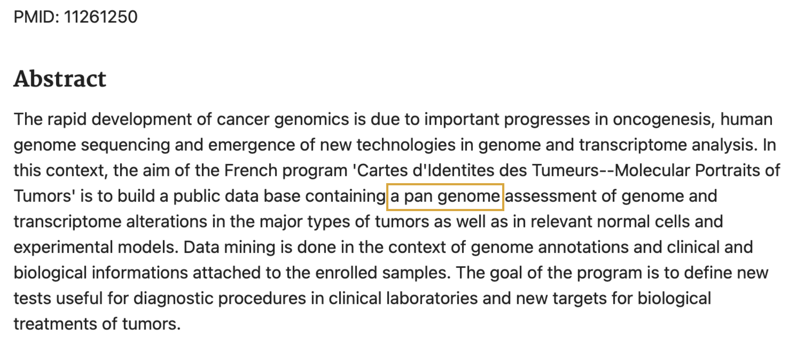{width=80%}

The term was later revitalized by Tettelin et al. to describe a microbial genome by which genes were in the core (present in all strains) and which genes were dispensable (missing from one or more of the strains).

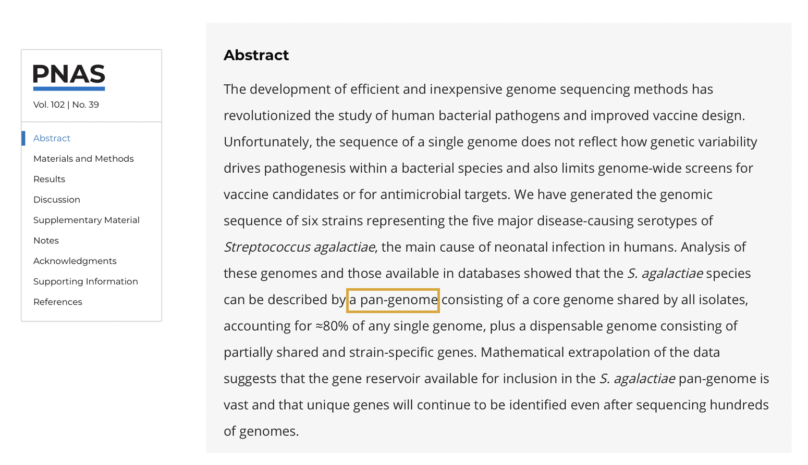{width=80%}

+ Tettelin, H., Masignani, V., Cieslewicz, M. J., Donati, C., Medini, D., Ward, N. L., ... & Fraser, C. M. (2005). Genome analysis of multiple pathogenic isolates of Streptococcus agalactiae: implications for the microbial “pan-genome”. Proceedings of the National Academy of Sciences, 102(39), 13950-13955.

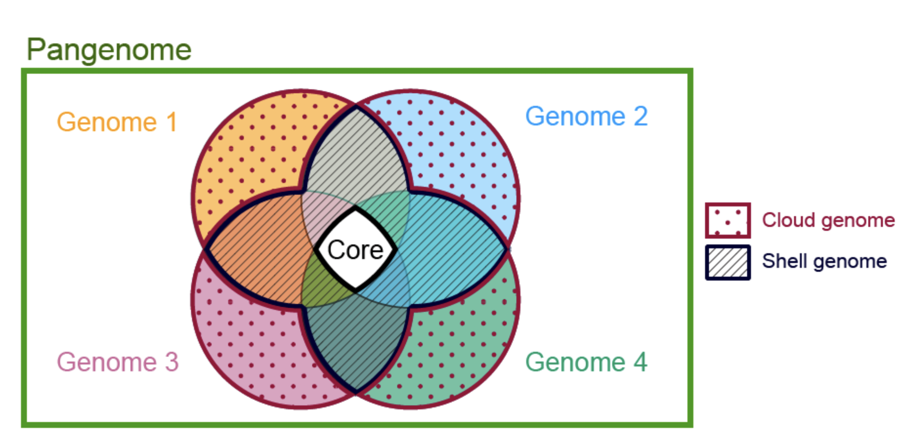{width=80%}

### Open vs. Closed Genomes

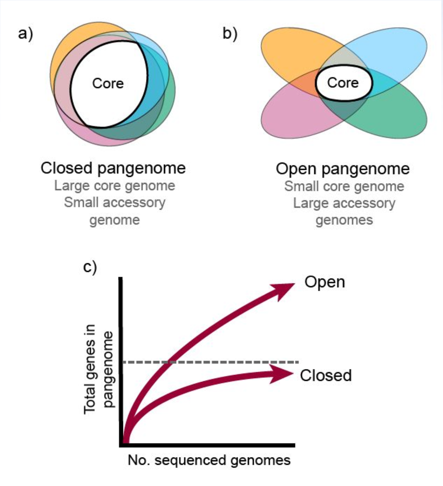{width=65%}

### Then vs. Now

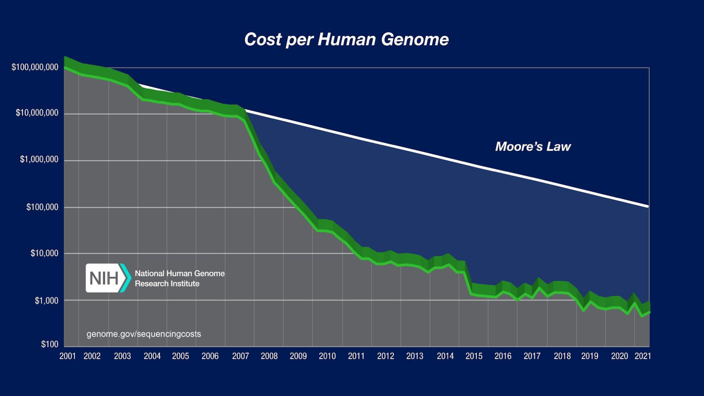{width=90%}

- Low Cost
- High Quality Long Reads (HiFi)
- Many reference-quality assemblies per species

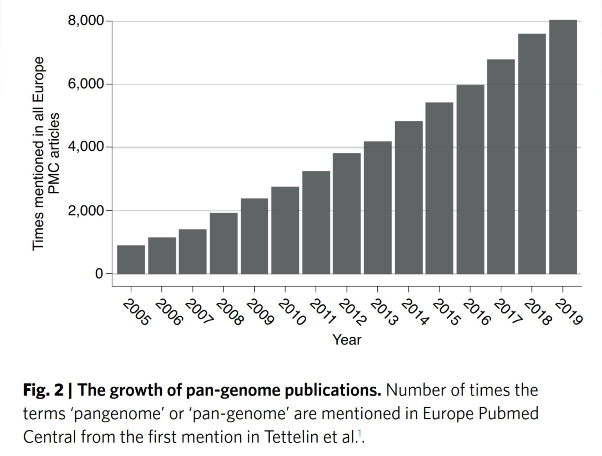{width=75%}

### "Pangenome" Today

“Any collection of genomic sequences to be analyzed jointly or to be used as a reference. These sequences can be linked in a graph-like structure, or simply constitute sets of (aligned or unaligned) sequences.” – Computational Pangenomics Consortium

https://academic.oup.com/bib/article/19/1/118/2566735

### The Benefit of Pangenomes

+ Removes reference bias
  + May only represent one organism
  + Could be a “mosaic”of individuals, i.e. doesn’t represent a coherent haplotype
  + Allele bias
  + Doesn’t include common variation
+ Allow multiple assemblies to be analyzed simultaneously, i.e. efficiently

###  What are pangenomes good for?

+ Core vs dispensable genes:
  + How big is the core?
  + How big is the dispensable?
  + How big is the pangenome?
  + What traits are associated with the core/dispensable?
+ Unbiased read mapping and variant calling
+ More robust variation-trait association
+ Visual exploration of genomic structure of population

##  Computational Pangenomics

“Questions about efficient data structures, algorithms and statistical methods to perform bioinformatic analyses of pan-genomes give rise to the discipline of ‘computational pan-genomics’.”

 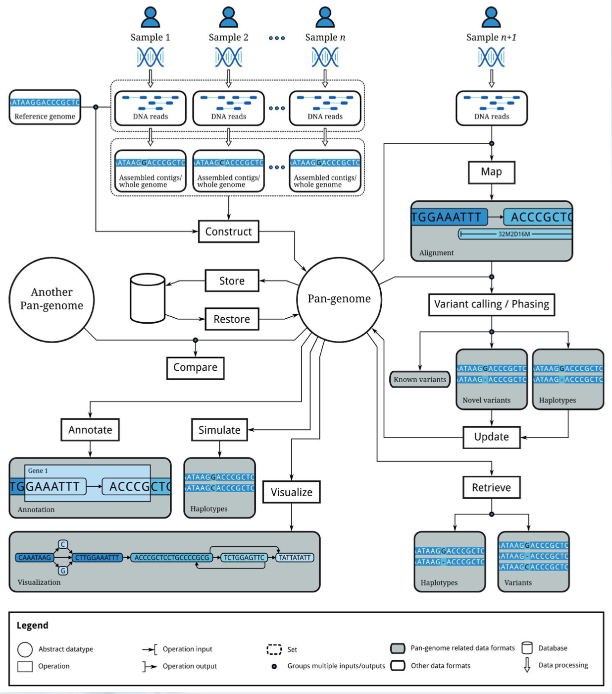{width=90%}    

### Pangenome Representations

+ Gene sets
+ Multiple sequence alignments
+ K-mer sets
+ Graphs
  + De Bruijn graphs
  + Haptotype graphs
  + **Variation graphs**

### Variation Graphs

+ Variation forms bubbles Nodes represent sequences
+ Chains of nodes represent contiguous sequence in one or more assemblies
+ The sequences of nodes connected by an edge may overlap
+ Graphs can be acyclic or cyclic
+ Haplotypes are “threaded” through graph as paths

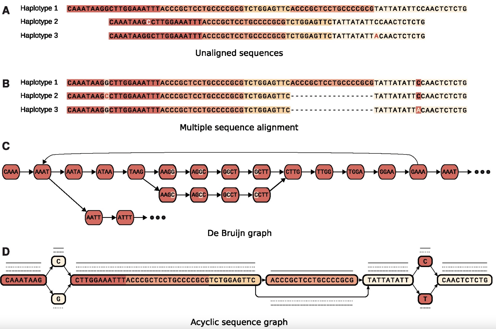{width=96%}

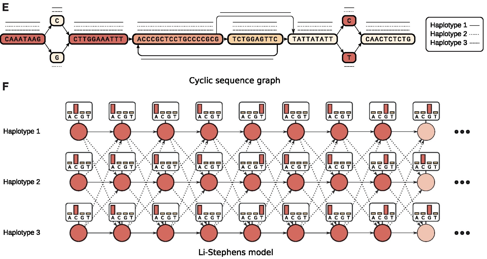{width=96%}

### Types of Variation Graphs

1. Reference Graph (vg)
  + A reference with variants
  + E.G. [Human reference now includes VCF with common variation](https://www.ncbi.nlm.nih.gov/genome/guide/human/)
2. Reference Backbone; “iterative” (minigraph)
  + Graph starts as reference and other sequences are layered
on, i.e. variants can be relative to sequences other than the
reference
3. Reference-Free (Cactus and pggb)
  + Graph is built using non-reference techniques, such as multiple sequence alignment


These are all methods used by the [Human Pangenome Reference Consortium](https://humanpangenome.org)

### Mapping Reads to Variation Graphs

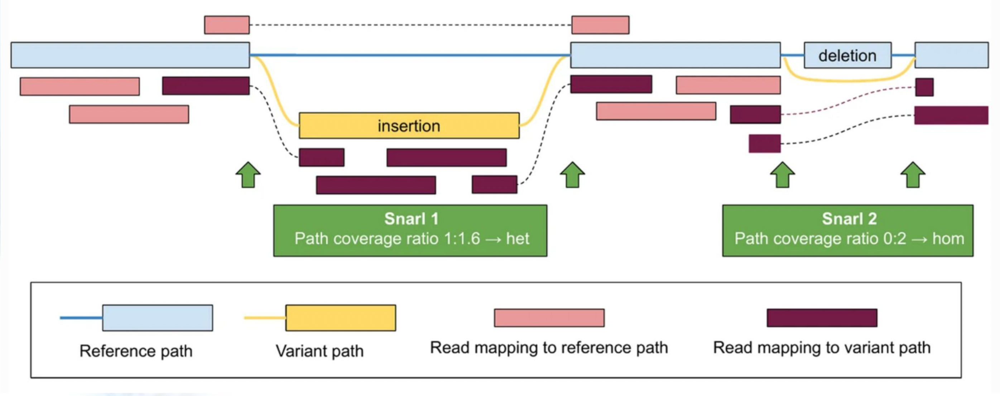{width=100%}

## Pangenome Data Sets

+ [Human Reference + Variation VCF](https://www.ncbi.nlm.nih.gov/genome/guide/human/)
+ [Human Pangenome Reference Consortium](https://humanpangenome.org)
+ [Zoonomia (200 mammalss) Project](https://zoonomiaproject.org/the-data/)
+ [Maize NAM founder genomes](https://www.science.org/doi/10.1126/science.abg5289)
+ [Yeast Population Reference Panel (YPRP)](https://yjx1217.github.io/Yeast_PacBio_2016/welcome/)

### Data/Yeast Genomes:

{width=100%}

+ 12 Mb
+ 16 chromosomes
+ [12 strains from Yeast Population Reference Panel (YPRP)](https://yjx1217.github.io/Yeast_PacBio_2016/welcome/)
  + 7 Saccharomyces cerevisiae (brewer’s yeast)
    + Includes S288C reference
+ 5 *Saccharomyces paradoxus* (wild yeast)

+ [Manuscript](https://www.ncbi.nlm.nih.gov/pmc/articles/PMC2659681/)
+ Software (LRSDAY)
  + [Manuscript](https://www.nature.com/articles/nprot.2018.025)
  + [GitHub](https://github.com/yjx1217/LRSDAY)

### Yeast Assemblies

+ [YPRP: 12 Yeast PacBio Assemblies (Chromosome level)](https://yjx1217.github.io/Yeast_PacBio_2016/data/)
  + ~100-200x PacBio sequencing reads
  + HGAP + Quiver polishing
  + ~200-500x Illumina (Pilon correction)
  + Manual curation
  + Annotation

### SK1 Illumina Reads

SK1 is the most distant from S288C

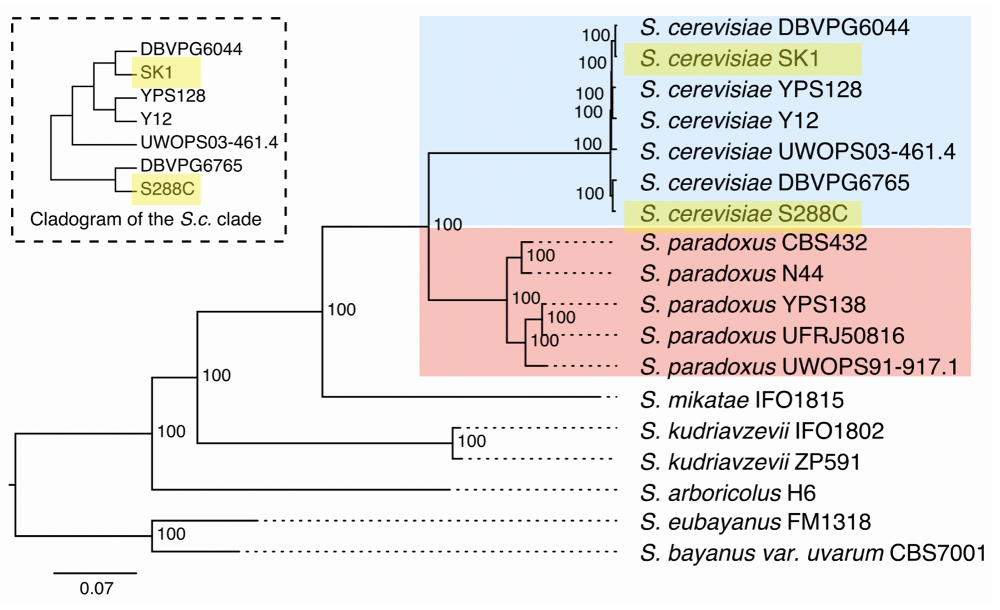{width=100%}

### CUP1 Gene

{width=100%}

+ [CUP1](https://www.yeastgenome.org/locus/S000001095) - A gene involved in heavy metal (copper) tolerance with copy-number variation (CNV) in population.
+ [YHR054C](https://www.yeastgenome.org/locus/S000001096) - Putative protein of unknown function.

### We Changed the Names

+ YPRP FASTA files only contain chromosome names
+ We prefixed every chromosome with its assembly name and a "." delineator
  + e.g. S288C.chrVIII
+ [Pangenome Sequence Naming Specification](https://github.com/pangenome/PanSN-spec)

```{r include=FALSE}
# automatically create a bib database for R packages
knitr::write_bib(c(
  .packages(), 'bookdown', 'knitr', 'rmarkdown'
), 'packages.bib')
```
