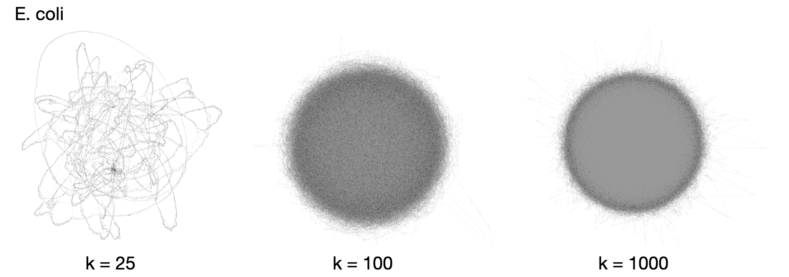
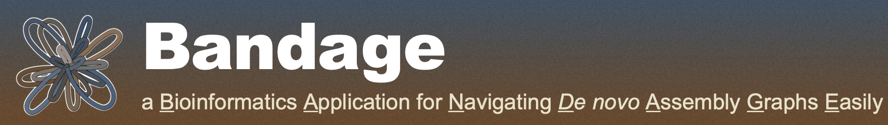

# Visualizing Genomes

{width=100%}

## Set up Directories

1. Make sure you're working in a **screen**

2. Make directory

```
mkdir ~/viz
```
3. Navigate to the directory

```
cd ~/viz
```
4. Link to data

```
ln -s /home/data/pangenomics-2402/yprp/ .
```

## Graphical Fragment Assembly (GFA) format

+ Originally developed for representing genomes during assembly
+ Now used for pangenomics 
+ More on this later...

## Bandage

{width=100%}

+ BLAST integration
  + Can build a local BLAST database of the graph
  + Can do a web BLAST search with sequences from nodes
2. More details on making CSV labels: https://github.com/rrwick/Bandage/wiki/CSV-labels

### **Group exercise:**{-}

1. Copy the following example graph from inbre to your computer:
```
inbre.ncgr.org:/home/<username>/viz/yprp/example/S288C.SK1.minigraph.gfa
```
2. Open Bandage and load the graph
3. Spend some time exploring the graph
4. If your have BLAST, find [CUP1](https://www.yeastgenome.org/locus/S000001095) and [YHR054C](https://www.yeastgenome.org/locus/S000001096) via BLAST
  + How many copies are in the graph?
  + What does the structure it’s in look like?
  + Take a screenshot of the region that CUP1 is in with the gene colored

## General Feature Format (GFF)

https://genome.ucsc.edu/FAQ/FAQformat.html#format3


+ Plain text file
+ 3 different versions
+ Each line represents a feature
+ 9 Columns
  + Tab separated
  + First 7 are the same for all feature types
    + seqname, source, feature, start, end, score, strand
  + 8th column is phase of CDS (coding DNA sequence) features
    + 0, 1, or 2 for CDS features, . otherwise
  + 9th column is for additional attributes related to feature

## Browser Extensible Data (BED) Format

https://genome.ucsc.edu/FAQ/FAQformat.html#format1

+ Plain text file
+ Designed for drawing features in genome browsers
+ Each line represents a genomic region and associated annotations
  + Features aren’t necessary biological
+ 12 Columns
  + Tab or white-space separated
  + First 3 are required
    + chrom, chromStart, chromEnd
  + The next 9 are optional
    + name, score, strand, thickStart, thickEnd, itemRgb, blockCount, blockSizes, blockStart

## Integrative Genomics Viewer (IGV)

https://software.broadinstitute.org/software/igv/

+ View GFF/BED files relative to FASTA and multiple sequence alignments
+ Doesn’t work with with names that contain dots “.”
  + This conflicts with our naming convention, but we’ll work around it...

### **Group exercise:**{-}

1. Open IGV with S288C and GFF from [YPRP](https://yjx1217.github.io/Yeast_PacBio_2016/data/)
2. Find [CUP1](https://www.yeastgenome.org/locus/S000001095) and [YHR054C](https://www.yeastgenome.org/locus/S000001096)
    + How many copies does it have?

## Linking IGV with Bandage

1. Convert graph from GFA to BED

```
gfatools gfa2bed yprp/example/S288C.SK1.minigraph.gfa > S288C.SK1.minigraph.bed

```

### **Group Exercise**{-}

1. Find an interesting structure in Bandage
2. Get its node ID(s)
3. `grep` the BED file for the ID(s)

Why isn’t this BED file going to work in IGV?
+ How should we solve this issue?

4. Implement *your* solution
5. Are there any other nuances you notice in the BED file?


