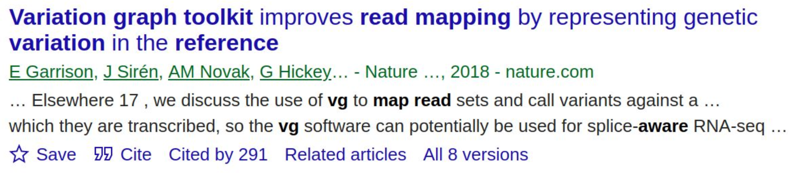
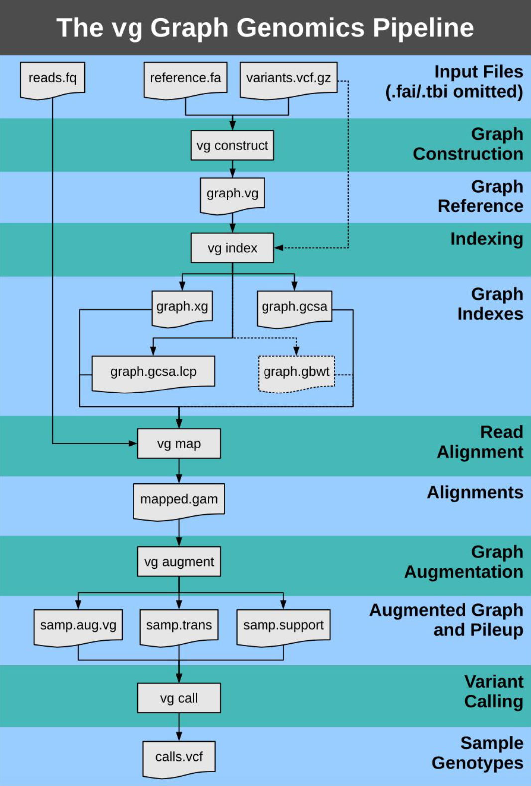
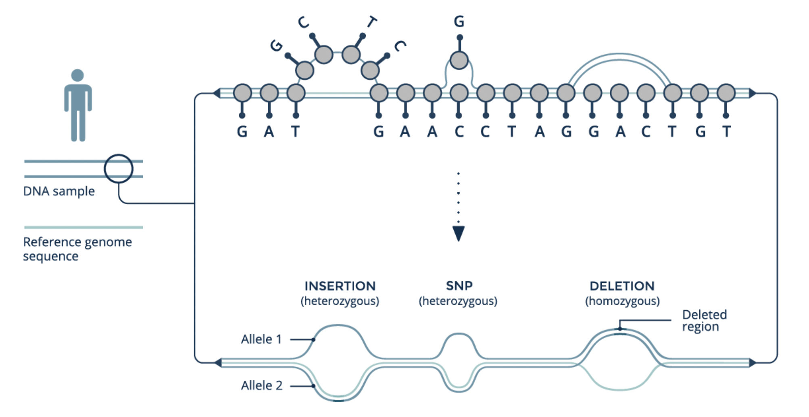

# Reference Graphs with VG

## Variation Graph Toolkit (VG)

+ Constructs graphs
+ Manipulates graphs
+ Indexes graphs
+ Maps sequences to graphs
+ Calls variants on mapped sequences
+ Visualizes graphs

{width=65%}

{width=100%}

Also does:

+ [Transcriptomic analysis](https://github.com/vgteam/vg#transcriptomic-analysis)
+ Assembly-based pipelines
+ So much more

Graphs are cyclic, but otherwise general, i.e. reference, iterative, reference-free, etc.

## Reference Graphs

A reference genome "decorated" with variants:

{width=100%}
 
## Pipeline

1. Prepare input
2. Construct graph
3. View with Bandage

## Preparing the Input

Already **done** for you:

+ Reference FASTA
  + Description lines should only contain chromosome names
  + Remove extraneous sequences, e.g. mitochondrial DNA
+ VCF
  + Ideally chromosome names exactly match chromosome names in reference

## Set up directories

1. Make sure you're working in a **screen**
2. Make directory

```
mkdir ~/vg
```
3. Navigate to the directory

```
cd ~/vg
```
4. Link to data

```
ln -s /home/data/pangenomics-2402/yprp .
```

## Variant Call (VCF) Format

https://en.wikipedia.org/wiki/Variant_Call_Format 

+ Plain text file
+ Header:
  + Header lines start with #
  + Header lines with special keywords start with ##
+ Columns
  + Tab separated
  + 8 mandatory columns
    + CHROM, POS, ID, REF, ALT, QUAL , FILTER, INFO
  + 9th column is optional
    + FORMAT
  + Each additional column represents a sample and has the format described in the FORMAT column
 
## Variation Graph (VG) Format

https://github.com/vgteam/vg/wiki/File-Formats

+ [Protocol Buffer](https://protobuf.dev) messages (protobufs) describing a graph that can store sequence in its nodes and paths
+ Encoded as binary
+ Code for reading/writing protobufs can be generated for
many languages
+ [vg.proto](https://github.com/vgteam/libvgio/blob/master/deps/vg.proto)

## Yeast Data

Reference: **S288C**

VCF: [3 SV calling pipelines on the 11 non-reference strains](https://link.springer.com/article/10.1186/s13059-020-1941-7)

+ [Minimap2](https://github.com/lh3/minimap2) and paftools call
+ [LAST](https://last.cbrc.jp) and [AsmVar](https://github.com/bioinformatics-centre/AsmVar)
+ [nucmer](https://github.com/mummer4/mummer) and [Assemblytics](https://github.com/marianattestad/assemblytics)

This workshop used an updated version of the Phase 1 pipeline available [here](https://github.com/alancleary/sv-genotyping-paper/tree/master/yeast#1-prepare-yeast-assemblies-and-call-svs-relative-to-the-reference-strain-s288c)

## Construct Graph

Construct a graph from the reference and VCF:
```
vg construct -r yprp/assemblies/S288C.genome.fa -v yprp/variants/S288C.vcf -S -a -f -p -t 20 > S288C.vg
```

+ **-r yprp/assemblies/S288C.fa**
    + the reference genome
+ **-v yprp/variants/S288C.sv.vcf**
    + the VCF file containing variants (indels, structures, etc)
+ **-S**
    + include structural variants in construction of graph
+ **-a**
    + save paths for alts of variants by variant ID
+ **-f**
    + don't chop up alternate alleles from input VCF
+ **-p**
    + show progress
+ **-t 20** 
    + use 20 threads
+ **> S288C.vg**
    + write the standard out (the computed graph) into S288C.vg

Compact chains of nodes:
```
vg mod -u S288C.vg -t 20 > S288C.unchop.vg
```

+ **-u**
    + unchop nodes, i.e. compact chains

## Viewing with Bandage

Convert the graph from vg to gfa:
```
vg view S288C.unchop.vg -g > S288C.unchop.gfa
```

+ **-g**
    + output GFA format

### Exercise

1. Open with Bandage
2. Where’s CUP1?
3. Does the graph capture any CNV?
4. What does it look like?
5. Take a screenshot of the CUP1 region
 
## VG Index Formats

https://github.com/vgteam/vg/wiki/File-Formats

XG (lightweight graph / path representation)

+ Binary file containing graph structure (nodes, edges, paths) but no sequences
+ Complex data structure that answers graph queries efficiently

GCSA (Generalized Compressed Suffix Array)

+ Equivalent to .sa file created by bwa index
+ Binary file containing a suffix array that efficiently looks up where sequences occur in the graph

## Indexing

Generate .xg and .gcsa files (1min):
```
vg index -x S288C.xg -g S288C.gcsa S288C.vg -t 20
```

+ **-x S288C.xg**
    + the output .xg file
+ **-g S288C.gcsa** 
    + the output GCSA file
+ **-t 20** 
    + use 20 threads
    
NOTE: **Don’t** index the **unchopped** file!

NOTE: You can index a GFA file but this may have implications for mapping.
There’s also an [autoindex](https://github.com/vgteam/vg/wiki/Automatic-indexing-for-read-mapping-and-downstream-inference) command.

## Graph Alignment/Map (GAM) Format
 
https://github.com/vgteam/vg/wiki/File-Formats

+ Analogous to BAM, but for graphs
+ Binary file describing where reads mapped to in the graph
structure
+ Uncompressed has one read per line
+ Can be converted to JSON for manual parsing (very inefficient!)

## Read Mapping

Map reads (9min):
```
vg map -d S288C -f yprp/reads/SK1.illumina.fastq.gz -t 20 > S288C.SK1.illumina.gam
```

+ **-d S288C**
    + use the S288C.xg and S288C.gcsa files
+ **-f yprp/reads/SK1.illumina.fastq.gz**
    + the reads file
+ **-t 20**
    + use 20 threads
+ **S288C.SK1.illumina.gam**
    + the output GAM file

Computing mapping stats (<1min):

```
vg stats -a S288C.SK1.illumina.gam
```

+ **-a**
    + input is an alignment (GAM) file


##  Bringing Alignments Back to Single Genomes

Map reads (1min):

```
vg surject -x S288C.xg -b S288C.SK1.illumina.gam -t 20 > S288C.SK1.illumina.BAM
```
+ **-x S288C.xg**
    + graph or xg to use
+ **-b**
    + BAM output
+ **-t 20**
    + use 20 threads

### **Exercise:**{-}

1. Rename chromosomes in BED for use with IGV
2. Copy BED to personal computer
3. Spend some time looking at BED in IGV and share any interesting observations
you may have? 
+ What’s up with CUP1?
 

##  Preparing the BAM IGV (or other genome viewer)

**Only necessary if genome viewer can’t match UCSC style names names in BAM to chromosomes in reference.**

1. Convert BAM to SAM (<1min):

```
samtools view -h -o S288C.SK1.illumina.sam S288C.SK1.illumina.BAM
```

2. Remove assembly name (<1min):

```
sed 's/S288C.//' S288C.SK1.illumina.sam > S288C.SK1.illumina.renamed.sam
```
 
3. Convert SAM to BAM (6min):

```
samtools view -bS S288C.SK1.illumina.renamed.sam > S288C.SK1.illumina.renamed.bam
```
<===
 
4. Sort the bam file (6min):

```
samtools sort -o S288C.SK1.illumina.renamed.sorted.bam S288C.SK1.illumina.renamed.bam
```

5. Index BAM (<1min):

```
samtools index S288C.SK1.illumina.renamed.sorted.bam
```

## Pack (pileup support) Format

https://github.com/vgteam/vg/wiki/File-Formats

+ Binary file
+ Computes pileup support for each read in a mapping
+ The format isn’t actually documented...

## Calling Graph Supported Variants

Compute read support for variation already in the graph (<1min):

```
vg pack -x S288C.xg -g S288C.SK1.illumina.gam -Q 5 -s 5 -o S288C.SK1.illumina.pack -t 20
```

+ **-Q 5**
    + ignore mapping and base quality < 5
+ **-s 5**
    + ignore the first and last 5pb of each read
+ **-o S288C.SK1.illumina.pack**
    + the output pack file
+ **-t 20**
    + use 20 threads
    
Generate a VCF from the support (<1min):

```
vg call S288C.xg -k S288C.SK1.illumina.pack -t 20 > S288C.SK1.illumina.graph_calls.vcf
```

## Calling Novel Variants

Augment the graph with the mapped reads (45min):

```
vg augment S288C.vg S288C.SK1.illumina.gam -A S288C.SK1.illumina.aug.gam -t 20 > S288C.SK1.illumina.aug.vg
```

+ *NOTE: Only supports VG files and indexes used for mapping must be built from the same VG file being augmented, i.e. indexes build from GFA files that were then converted to VG won’t work.*

Index the augmented graph (1min):

``` 
vg index -x S288C.SK1.illumina.aug.xg S288C.SK1.illumina.aug.vg -t 20
```

Compute read support for novel variation (2min):

```
vg pack -x S288C.SK1.illumina.aug.xg -g S288C.SK1.illumina.aug.gam -Q 5 -s 5 -o S288C.SK1.illumina.aug.pack -t 20
```

Generate a VCF from the support (3min)

```
vg call S288C.SK1.illumina.aug.xg -k S288C.SK1.illumina.aug.pack -t 20 > S288C.SK1.illumina.aug_calls.vcf
 ```
 
## Calling Variants Already in the Graph

Output variants used to construct graph (<1min):

```
vg deconstruct S288C.xg -P S288C -t 20 > S288C.deconstruct.vcf
 ```
 
+ **-P S288C**
    + report variants relative to paths with names that start with S288C

**`S288C.deconstruct.vcf` might not be identical to S288C.vcf because VG takes liberties with variants when constructing the graph.**

##  Pros and Cons Reference Graphs

**Pros:**

+ Graphs are relatively small
  + Easy to inspect visually
  + Good for low-quality / fragmented assemblies
  + Shorter run-times

**Cons:**

+ Variation represented is determined by VCF pipeline
  + Only describes variation relative to the reference
  + Suboptimal mappings
  + Suboptimal population structure
 
##  Additional vg Commands that are Useful

### vg combine

Combines two or more graphs into one.

+ Use to construct graph in parts (e.g. individual chromosomes) and then combine
+ Use to combine graphs of related species

### Modifying and Simplifying Graphs

**vg chunk** - Splits graphs or alignments into smaller chunks. 

**vg mod** - Used to modify graphs.

  + We’ve already used vg mod -u to “unchop” nodes. 

**vg simplifying** - Simplifies a graph.

**vg find** - Used to identify subgraphs based on various metrics and parameters.

  + e.g. anchored by a region on a specific chromosome. 

Use **--help** with any command to learn how to use it.

## Drawing Graphs 

**vg view** - Outputs graphs and other structures for drawing.

  + We’ve already used vg *view -g* to convert from vg to gfa for viewing in Bandage.
  + Can also output dot (among other files types) which is a more general graph drawing format (compatible with [Graphviz](https://graphviz.org)).

**vg viz** - Basic graph drawing ([documentation](https://github.com/vgteam/vg/wiki/Visualization)).
  + Recommend only using on **small (sub)graphs**.
  + Use in conjunction with *chunk*, *mod*, and/or *find* to draw an interesting subgraph.
  + You can include mapped reads in the visualization!
 

