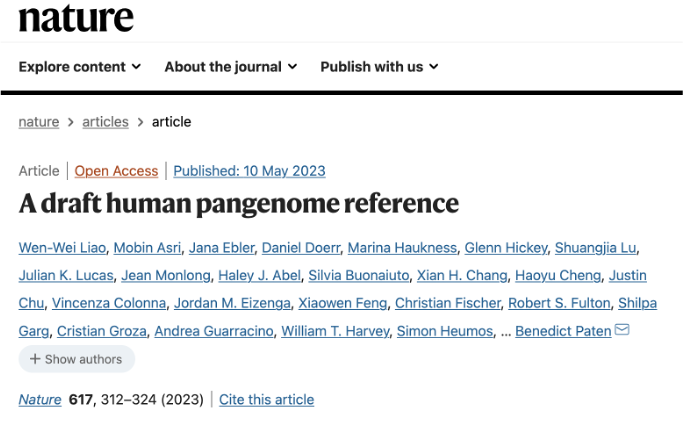
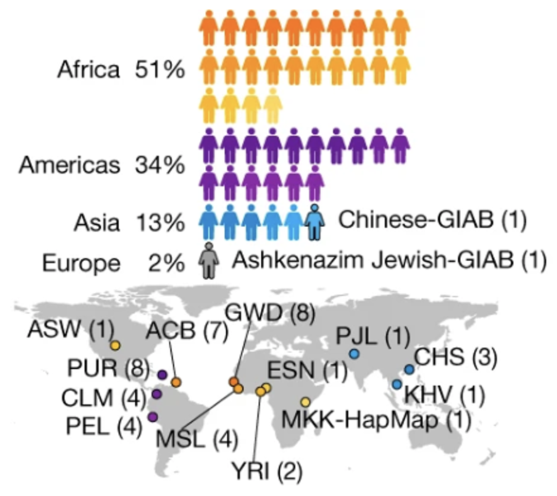
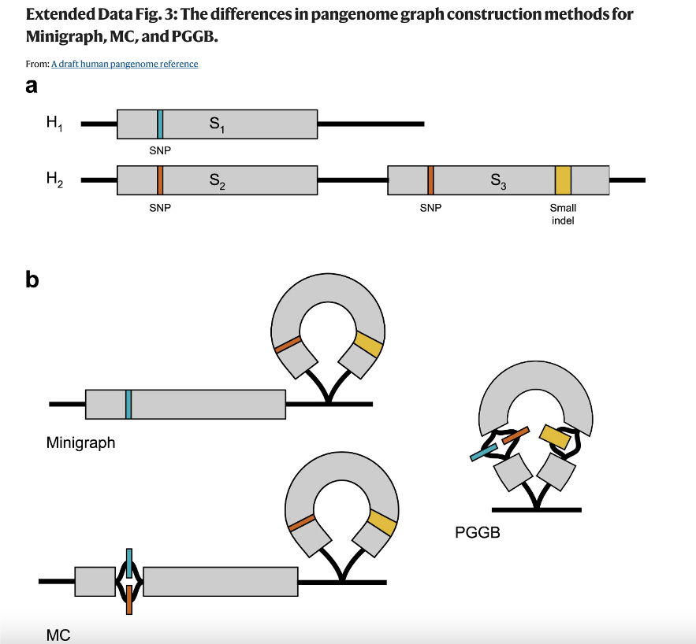
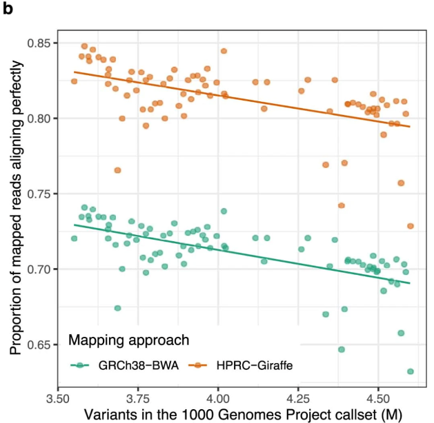
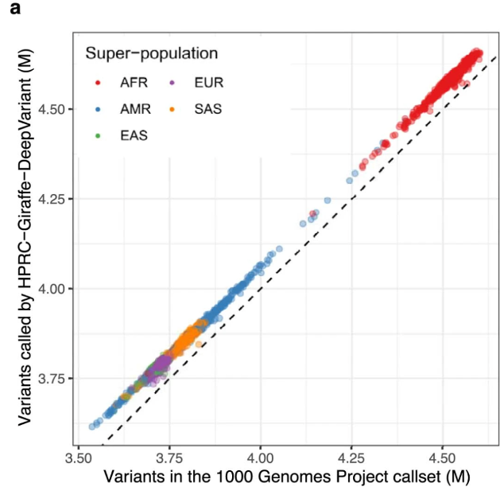
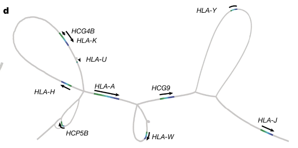
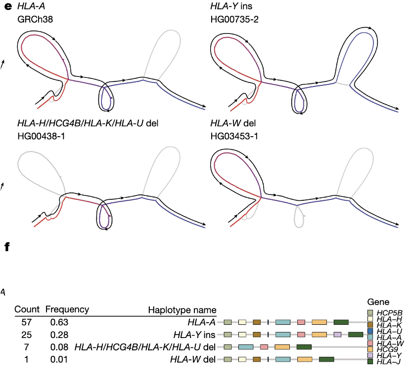
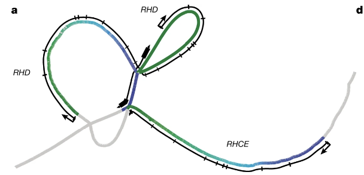
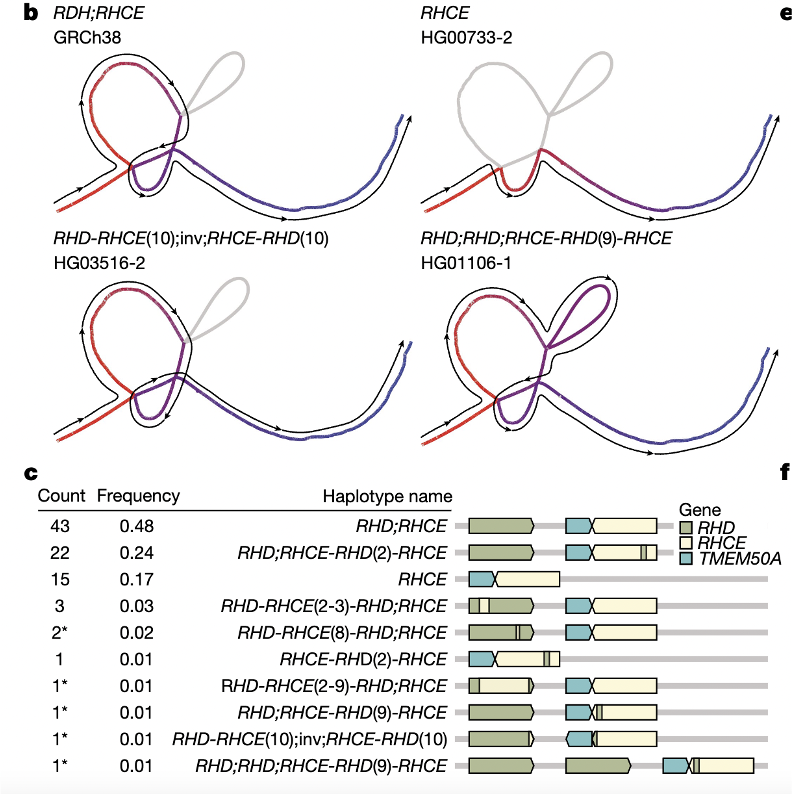

# Draft Human Pangenome Reference

{width=60%}

## Samples
47 phased, diploid genomes (aim for 350)

* 29 lymphoblastoid cell lines \
    + “limiting selection to those lines classified as karyotypically  normal and with low passage (to avoid artefacts from cell culture)” 

* 18 sequenced by others (some supplemented) \
    + Aimed for “genetic and biogeographic diversity”
    

{width=70%}

**Population_Code	Description	Super_Population_Code**

ASW	American's of African Ancestry in SW USA AFR\
ACB	African Carribean in Barbados AFR\
PUR	Puerto Rican from Puerto Rica	AMR\
CLM	Colombian from Medellian, Colombia AMR\
PEL	Peruvian from Lima, Peru AMR\

MSL	Mende in Sierra Leone AFR\
GWD Gambian in Western Division AFR\
YRI	Yoruba in Ibadan, Nigera AFR\
ESN	Esan in Nigera AFR\
MKK Maasai in Kinyawa, Kenya AFR\

PJL Punjabi in Lahore, Pakistan SAS\

CHS	Southern Han Chinese	EAS\
KHV	Kinh in Ho Chi Minh City, Vietnam	EAS\

**Super-Populations**

AFR, African\
AMR, Ad Mixed American\
EAS, East Asian\
EUR, European\
SAS, South Asian\

## Strategy

**Sequencing** \

PacBio HiFi \
Oxford Nanopore \
Bionano optical maps \
High-coverage Hi-C \
Illumina short-read sequencing \
High-coverage Illumina sequencing data for both parents

**Assembly**\

Trio-HiFiasm

**Graphs** \

*Minigraph* \
* Fast pangenome graph builder based on the minimap2 aligner \
* Only structural variation >=50nt

*Minigraph-Cactus (MC)* \
* Refines minigraph output to include SNPs and other small variants \
* Rewrote minigraph to write chains of minimizers \
* Rewrote cactus to be able to read in minigraph output

*PanGenome Graph Builder (PGGB)* \
* All pairwise genome assembly alignments -> graph \
* Uses graph normalization to make sure that chromosome paths are linear \
* Allows for cyclic graph structures that capture structural variation.

{width=80%}

## Results

**More Genetic Variation Captured**

*The pangenome captures more polymorphic sequences*

* 119 Mb of euchromatic polymorphic sequences
  * 90 MB = structural variation

* 1,115 gene duplications

*We can align more (short) reads to the pangenome*
{width=80%}

<!-- If we had captured all human diversity in the pangenome, the regression lines wouldn't slope downward; the most diverse samples are still not finding perfect matches for all their reads-->

*We can call more variants more accurately*

Aligning short reads to the pangenome

* lowered error in small variants by 34%\
* increased structural variants calls per haplotype by 104% (“vast majority”)

*We can call variants across a broad set of populations*

<!-- "Small variants" -->

{width=80%}

*Variation in complex, medically-relevant Regions*

HLA region (helps the immune system distinguish between self and invader)

{width=80%}

{width=80%}

Rh region (involved in Rh blood type)

{width=80%}

{width=80%}
