# Incremental Graphs with *minigraph*

<!--todo
1. call command
2. Upload and test minigraph draft human pangenome reference
3. New algorithm explanation
-->

## Minigraph Functions

Constructs graphs

Maps sequences to graphs

https://github.com/lh3/minigraph


## Minigraph Overview

Maps diverged sequences and adds them into the graph iteratively. It is not reference-free nor does it aim to find every single variant, but it does well in finding structural variants.

"It is fairly efficient and can construct a graph from 90 human assemblies in a couple of days using 24 CPU cores. Older versions of minigraph was unable to produce base alignment. The latest version can. Please add option -c for graph generation as it generally improves the quality of graphs."

1-to-1 orthogonal regions

<center>
{width=50%}
</center>

## Minimizers and Minimap2
Minigraph is built off of ideas and code from Minimap2.

### Minimizers {-}
From the minimap2 usage:
"A minimizer is the smallest k-mer in a window of w consecutive k-mers."

Essentially a minimizer tags a sequence window with the kmer that is first alphabetically.


A nice tutorial:  
+ https://homolog.us/blogs/bioinfo/2017/10/25/intro-minimizer/

### Minimap2 {-}
Minimap2 is a fast sequence aligner.
It can align short or long reads or assemblies against a reference using the seed-chain-align approach that many aligners employ. It finds exact matches (anchors) between query minimizers (seeds) and indexed reference minimizers. It links colinear anchors together (chains). For nt-level alignment it fills in regions between anchors within chains and between chains (align).

https://github.com/lh3/minimap2  
https://academic.oup.com/bioinformatics/article/34/18/3094/4994778

## Pipeline

1. Prepare the input
2. Build graphs
+ Build a single genome graph and incrementally add more sequences
+ Or build a graph for all sequences at once
3. View with Bandage

## Yeast Assemblies

*12 Mb*  
*16 chromosomes*

<br>
Yeast Population Reference Panel (YPRP)  https://yjx1217.github.io/Yeast_PacBio_2016/data/

12 Yeast PacBio Assemblies (Chromosome level)

>1. ~100-200x PacBio sequencing reads 
>2. HGAP + Quiver polishing  
>3. ~200-500x Illumina (Pilon correction)  
>4. Manual curation  
>5. Annotation

<br>


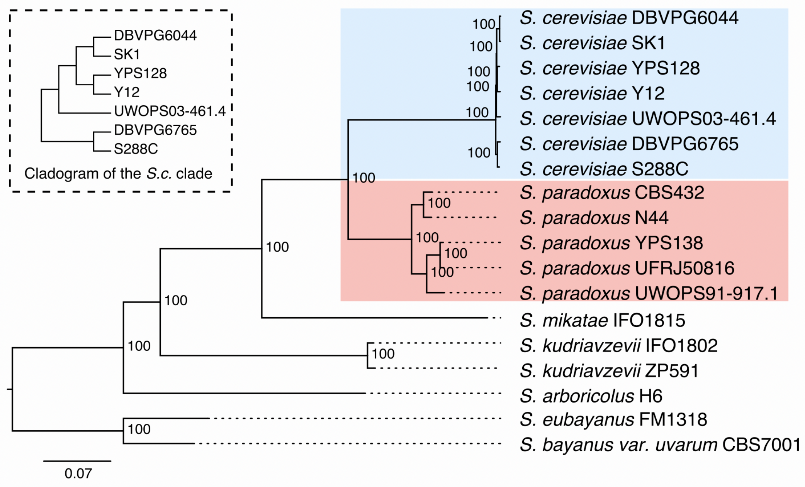{width=100%}


<br>

>Make sure your chromosome names are unique across all samples and that they contain the sample name. We’re using \<strain name>.\<chromosome> (>S288C.chrVIII)

<br>

## Prepare the Input

1. Make sure you're working in a **screen**

2. Make Directory

```{bash, eval=FALSE}
mkdir ~/minigraph
```
3. Navigate to the Directory

```{bash, eval=FALSE}
cd ~/minigraph
```
4. Link to data

```{bash, eval=FALSE}
ln -s /home/data/pangenomics-2402/yprp/assemblies/*.fa .
```

## Graphical Fragment Assembly (GFA) format


Tab-delimited text

Lines start with one of the following types:


| Type | Description | Explanation |
|:--|:-----|:---------|
| **H**  |  Header  |       |
| **S**  |  Segment  |  A continuous sequence or subsequence   |
| **L** |  Link |  Segment overlaps (basepairs & orientations)  |
| **J** | Jump | Jumps link sequences across gaps |
| **C** | Containment | Segment contained in another segment |
| **P** | Path | An ordered & oriented list of linked segments |
| **W** | Walk | An ordered & oriented list of segments w/o overlaps |
| **#** | Comment | |

Optional Fields TAG:TYPE:VALUE  
http://gfa-spec.github.io/GFA-spec/GFA1.html

Let's go to the specification to look at optional fields and an example:  
http://gfa-spec.github.io/GFA-spec/GFA1.html


## *reference* Graphical Fragment Assembly (rGFA)

https://github.com/lh3/gfatools/blob/master/doc/rGFA.md

+ Strict subset of GFA
+ Tags that trace origin
+ Stable coordinates

<center>
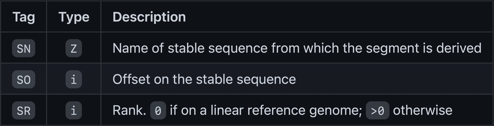{width=80%}

{width=70%}
</center>

## Build rGFA Graphs


1. The first sequence in the graph is used as a “reference”:

```{bash, eval=FALSE}
minigraph -cxggs reference.fa -t 20 -c > ref.minigraph.gfa
```

+ **-xggs** 
    + build a graph using a simple (ggs) algorithm
+ **-t 20**
    + use 20 threads (default is 4)
+ **-c**
    + perform base alignment; RECOMMENDED
    
"Please add option -c for graph generation as it generally improves the quality of graphs."


2. Incrementally add strains to graph:

```{bash, eval=FALSE}
minigraph -cxggs ref.minigraph.gfa strain_1.fa > strain_1.minigraph.gfa

minigraph -cxggs strain_1.gfa strain_2.fa > strain_2.minigrpah.gfa
...

minigraph -cxggs string_N-1.gfa strain_N.fa > yprp.minigraph.gfa
```

3. Or build a graph for all strains at once:

```{bash, eval=FALSE}
minigraph -cxggs ref.minigraph.gfa strain_*.fa > yprp.minigraph.gfa
```

## Reference Graph

Let's create a graph for the reference (S288C) and answer the following questions. This is a small dataset so we'll use the default threads (4).


1. Make the reference graph

```{bash, eval=FALSE}
minigraph -cxggs S288C.genome.fa > ref.minigraph.gfa
```

<!--Note that the -c option doesn't do anything for this initial graph but it does when we start adding other strains. The graph is much more broken up and has many more segments likely because it is recognizing more diversity. Slightly fewer primary alignments with Illumina reads.-->

2. How many lines in the gfa file?

```{bash, eval=FALSE}
wc -l ref.minigraph.gfa
```

<details>
  <summary>Click for Answer</summary>
```
16
```
</details> 


3. What type of lines are they?

```{bash, eval=FALSE}
cut -f 1 ref.minigraph.gfa | sort | uniq -c
```

<details>
  <summary>Click for Answer</summary>
```
All of them are "S" or segment
```
</details> 

### Reference Graph Bandage Visualization {-}

Download your gfa file onto your computer and upload it into Bandage.

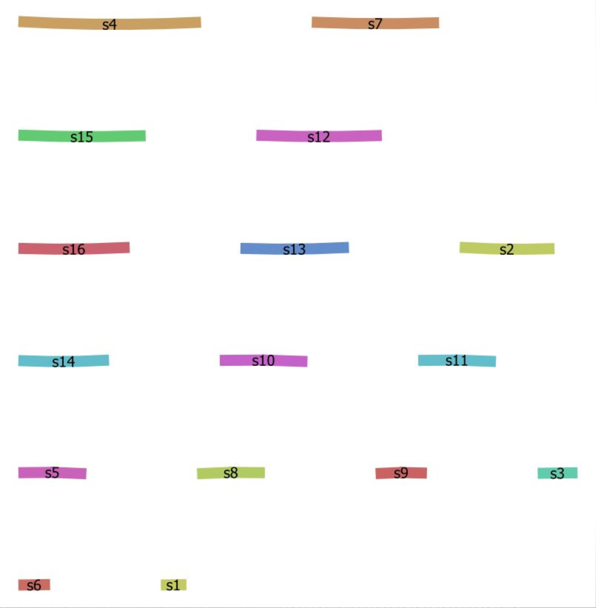{width=70%}

## YPRP Graphs


1. Add in the rest of the lines
+ we’ll do this alphabetically
+ capture the stderr

```{bash, eval=FALSE}
minigraph -xggs -c ref.minigraph.gfa $(ls *.fa | grep -v S288C) > yprp.minigraph.gfa 2>yprp.minigraph.err
```

*Note:* We can simply use the reference fasta instead of a gfa

```{bash, eval=FALSE}
minigraph -xggs -c S288C.genome.fa $(ls *fa | grep -v S288C) > yprp.minigraph.gfa 2>yprp.minigraph.err
```

Try to answer the following questions:

1. How many lines are in the gfa file?

<details>
  <summary>Click for Answer</summary>
```{bash, eval=FALSE}
wc -l yprp.minigraph.gfa
```

<span style="color: lightgray;">
32306 yprp.minigraph.gfa
</span>\

</details> 

<br>

2. What type of lines are they?

<details>
  <summary>Click for Answer</summary>
  
```{bash, eval=FALSE}
cut -f 1 yprp.minigraph.gfa | sort | uniq -c
```

<span style="color: lightgray;">
  18612 L\
  13694 S
</span>\
  
</details> 

<br>

3. How many yeast assemblies have inversions compared to S288C (hint: look in the stderr)?

<details>
  <summary>Click for Answer</summary>
  
```{bash, eval=FALSE}
grep inversions yprp.minigraph.err
```

<span style="color: lightgray;">
[M::mg_ggsimple_cigar::11.337*2.72] inserted 1791 events, including 0 inversions\
[M::mg_ggsimple_cigar::17.749*2.88] inserted 336 events, including 0 inversions\
[M::mg_ggsimple_cigar::22.268*2.92] inserted 176 events, including 0 inversions\
[M::mg_ggsimple_cigar::27.169*2.95] inserted 451 events, including 1 inversions\
[M::mg_ggsimple_cigar::35.508*2.90] inserted 56 events, including 2 inversions\
[M::mg_ggsimple_cigar::49.950*3.02] inserted 728 events, including 0 inversions\
[M::mg_ggsimple_cigar::53.680*2.96] inserted 208 events, including 5 inversions\
[M::mg_ggsimple_cigar::62.465*3.01] inserted 679 events, including 0 inversions\
[M::mg_ggsimple_cigar::72.274*3.04] inserted 134 events, including 1 inversions\
[M::mg_ggsimple_cigar::79.327*3.04] inserted 117 events, including 0 inversions\
[M::mg_ggsimple_cigar::82.656*3.06] inserted 258 events, including 1 inversions

10 inversions total (in 5 samples)
</span>\

</details> 

<br>

### YPRP Graph Statistics {-}

```{bash, eval=FALSE}
gfatools stat yprp.minigraph.gfa
```

Number of segments: 13694\
Number of links: 18612\
Number of arcs: 37224\
Max rank: 11\
Total segment length: 15422961\
Average segment length: 1126.257\
Sum of rank-0 segment lengths: 12157149\
Max degree: 6\
Average degree: 1.359


### YPRP Graph in Bandage {-}

Take a look at the YPRP graph in Bandage. Your might be rendered differently.

{width=100%} 
<br>
<br>

## Structures in the graph

### Insertions and Diverged Regions {-}

Search for segment s1054 then zoom out a little so you can see the segments around it.

Trace the S288C path (hint: the S288C segments are numbered sequentially with the lower segment numbers).

Identify insertions and regions that have diverged.

 
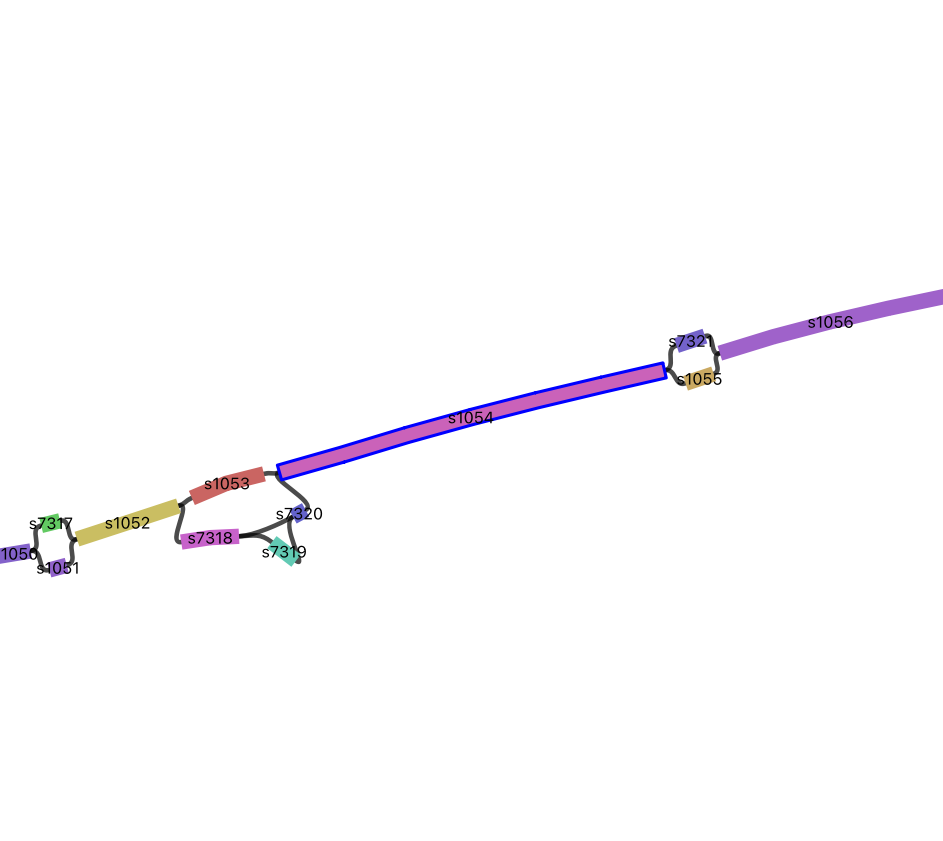{width=100%} 

### Group Exercise{-}

1. Find a simple and a complex region
2. Discuss it in your group
3. Share it with everyone
4. Keep track of the segments

### Inversions {-}

Here are some examples of inversions.

{width=75%} 


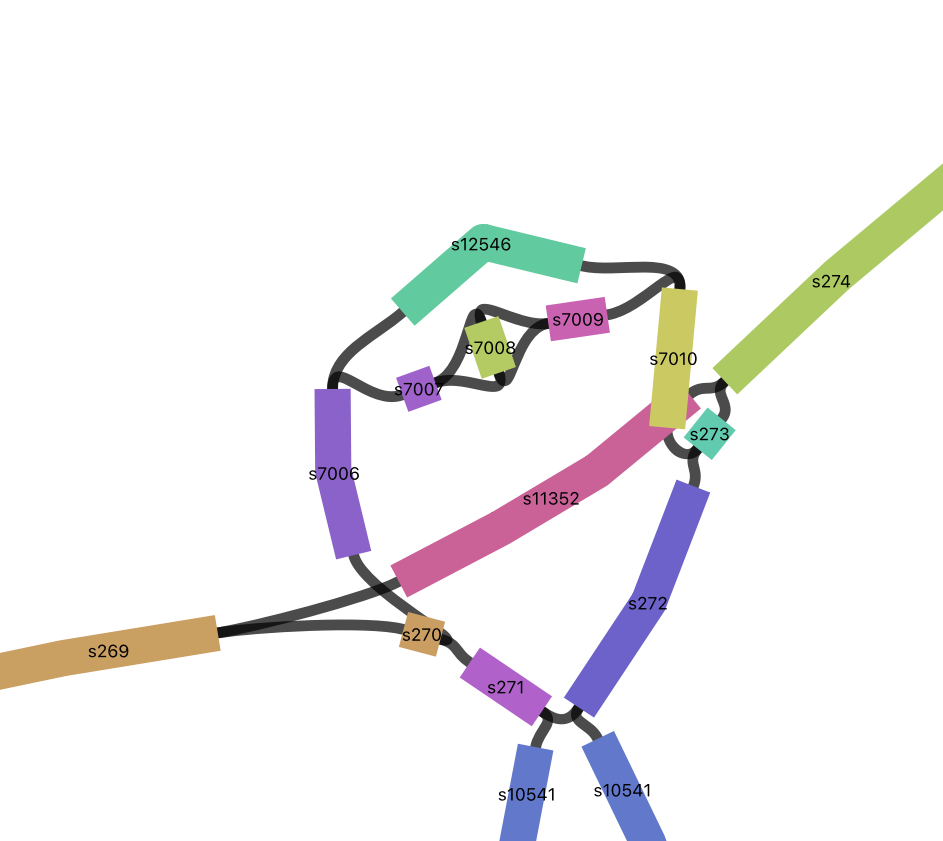{width=75%} 


Let's find them in bandage.

s7008

s10547


Click on the node and surrounding nodes to see how long they are.\
Click on the links (black) to see the direction that paths can travel.

Click on the inverted node Choose "Color by continguity" under "Graph Display" then click on "Determine contiguity" to see which nodes the inverted node connects to.

Do a web-blast in Bandage to see what they might code for (click on the node then choose from the Output menu: Web Blast Selected Nodes). Also blast the adjacent segments to get some context.

blastn will do a nucleotide to nucleotide alignment (default) or you can choose blastx to blast it against a protein database (if it isn't coding there won't be any hits).

<!--s7008 might have something to do with mating type based on the blastn hits; no blastx hits-->

<!--s10547 does have a blastx hit but it doesn't have a function; looks like it is simply a de novo gene call from DNA sequencing; some of surrounding sequence have hits-->

<!--you could also click on the graphics of the targets but often they don't have annotation-->


### Inversions in the GFA {-}

I found the inversions by searching the graph GFA file for pairs of segments that have two links between them. Give it a try.

```{bash, eval=FALSE}
grep '^L' yprp.minigraph.gfa | awk '{print $2 "\t" $4}'|sort|uniq -c|awk '$1>=2{print}'
```


      2 s10391	s10392\
      2 s10392	s10393\
      2 s10546	s10547\
      2 s10547	s10548\
      2 s10574	s10575\
      2 s10575	s10576\
      2 s10704	s10518\
      2 s6244	s6245\
      2 s6245	s6246\
      2 s7007	s7008\
      2 s7008	s7009


1. Pull out s7008, its adjacent segments and the links connecting them

```{bash, eval=FALSE}
gfatools view -l s7008 -r 1 yprp.minigraph.gfa
```

>**-l STR/@FILE**.       segment list to subset [ ]   
>**-r INT**.       subset radius (effective with -l) [0]
    
Showing just the links here:

L	s7007	+	s7008	+	0M	SR:i:1	L1:i:33	L2:i:381\
L	s7007	+	s7008	-	0M	SR:i:4	L1:i:33	L2:i:381\
L	s7008	+	s7009	+	0M	SR:i:1	L1:i:381	L2:i:305\
L	s7008	-	s7009	+	0M	SR:i:4	L1:i:381	L2:i:305


2. Now do the same for s10547

3. Try extending the surrounding region by increasing the -r parameter

Note: you can pull out subgraphs like these and load them into Bandage. This is helpful if the graphs are really large and slow to load.

## Minigraph Blog

Heng Li
http://lh3.github.io/2021/01/11/minigraph-as-a-multi-assembly-sv-caller

## Bonus Questions

1. What is the longest segment in the graph?
[Hint: Parse out the number from the 4th field of the segment line]
2. What is the shortest segment in the graph?
3. What cigar strings exist for the overlaps in the links? [Hint:
Field 6 of the link line]
4. How many segments are attributed to each genome? [Hint: Parse out field 5 of the segment line]

<details>
  <summary>Click for Answer</summary>
1. What is the longest segment in the graph?

```{bash, eval=FALSE}
grep "^S" yprp.minigraph.gfa |cut -f 4|sed 's/.\+://'|sort -n | tail -1
```

2. What is the shortest segment in the graph?

```{bash, eval=FALSE}
grep "^S" yprp.minigraph.gfa |cut -f 4|sed 's/.\+://'|sort -n | head -1
```

3. What cigar strings exist for the overlaps in the links? [Hint: Field 6 of the link line]

```{bash, eval=FALSE}
grep "^L" yprp.minigraph.gfa |cut -f 6|sort -u
```

4. How many segments are attributed to each genome?

```{bash, eval=FALSE}
grep "^S" yprp.minigraph.gfa |cut -f 5|sed 's/SN:Z://'|sed 's/\..\+//'|sort|uniq -c
```

*Note:* There are lots of ways to do this.

</details>
 

## Graph to Fasta

We can convert the gfa graph file to a fasta file the represents the sequence of the pangenome.

>Fasta format:  
>>header  
>ACGCGCTAGCGCGAC  
>ACGGCGTAGGGGCAG  
>ACGGCT

```{bash, eval=FALSE}
gfatools gfa2fa -s yprp.minigraph.gfa > minigraph.stable.fa
```

### FASTA questions {-}

Answer the following questions:

1. How many sequences?

2. Take a look at the headers


<details>
  <summary>Click for Answer</summary>
  
1. How many sequences?

```{bash, eval=FALSE}
grep -c '>' minigraph.stable.fa
```

2. Take a look at the headers

```{bash, eval=FALSE}
grep '>' minigraph.stable.fa|less
```

</details>

<<!--When there is a second or third column it shows where the sequence fits in the graph.-->

## GAF format (read alignments)

“The only visual difference between GAF and PAF is that the 6th column in GAF may encode a graph path like >MT_human:0-4001<MT_orang:3426-3927 instead of a contig/chromosome name.”

https://github.com/lh3/minigraph


Let's look at PAF format
https://lh3.github.io/minimap2/minimap2.html


## Read Mapping

Align reads from SK1 to the minigraph

21,906,518 paired Illumina reads  
Read length = 151 nts

```{bash, eval=FALSE}
minigraph -x sr yprp.minigraph.gfa /home/data/pangenomics-2402/yprp/reads/SK1.illumina.fastq.gz -t 20 > SK1.mapped.gaf
```

>**-x sr**        map short reads (sr)


## Read Mapping Stats

In theory, we could convert from GAF to GAM using vg convert then calculate stats with vg stats but the conversions doesn't work.

Count the number of primary alignments

```{bash, eval=FALSE}
grep -c "tp:A:P" SK1.mapped.gaf
```

17298728 primary alignments  

Calculate the percent of reads that had alignments

17298728/21906518 = 78.97% of reads aligned


## Structural Variant Calling

Call structural variants with gfatools (doesn’t work with VG graphs last time I checked):

```{bash, eval=FALSE}
gfatools bubble yprp.minigraph.gfa > yprp.minigraph.structural.bed
```
 

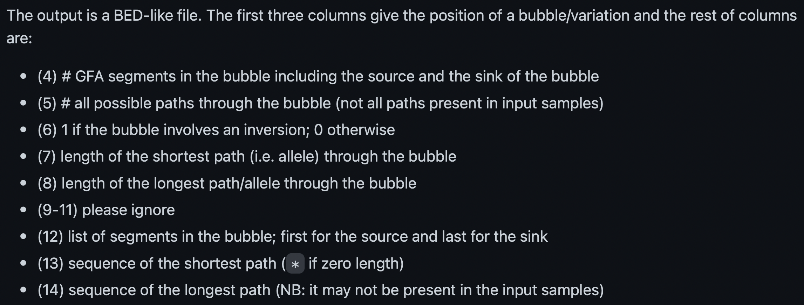{width=100%}
https://github.com/lh3/minigraph
 
### Structural Variant Stats {-}

1. Total number of variants:

```{bash, eval=FALSE}
wc -l yprp.minigraph.structural.bed
```

2. Indels (the shortest path is 0)

```{bash, eval=FALSE}
awk '$7==0{print}' yprp.minigraph.structural.bed|wc -l
```

3. Inversions

```{bash, eval=FALSE}
awk '$6==1{print}' yprp.minigraph.structural.bed | cut -f 1-12
```

{width=100%}


## CUP1

### Visualize the CUP1 region {-}

10 working copies + 1 pseudogene in S288C

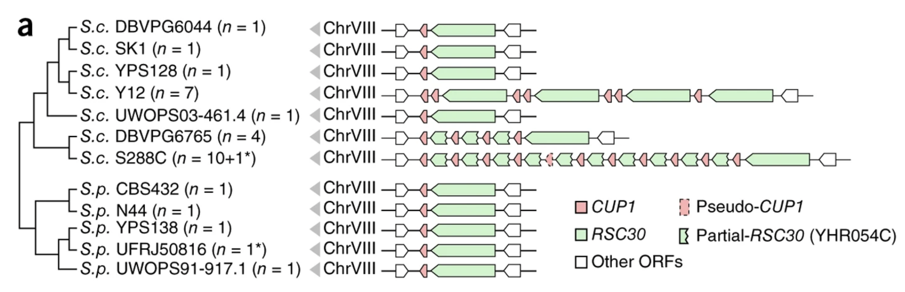{width=100%}
 
1. Find the region in the graph based on its S288C coordinates  
S288C.chrVIII:213045-233214

```{bash, eval=FALSE}
gfatools view -R S288C.chrVIII:213045-233214 yprp.minigraph.gfa > cup1.gfa
```


2. Create a .csv to bring in the segment names  
Note that you need a header

```{bash, eval=FALSE}
 cat <(echo "Segment,Name") <(grep "^S" cup1.gfa | awk '{print $2 "," $5}') > cup1.csv
```

3. Load the graph and the .csv file into Bandage

<center>
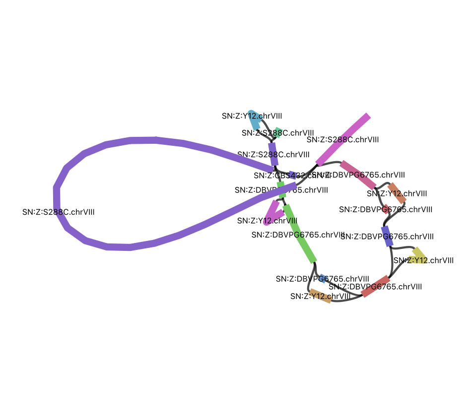{width=90%}
</center>


The picture below compares only S288C and SK1.

<center>
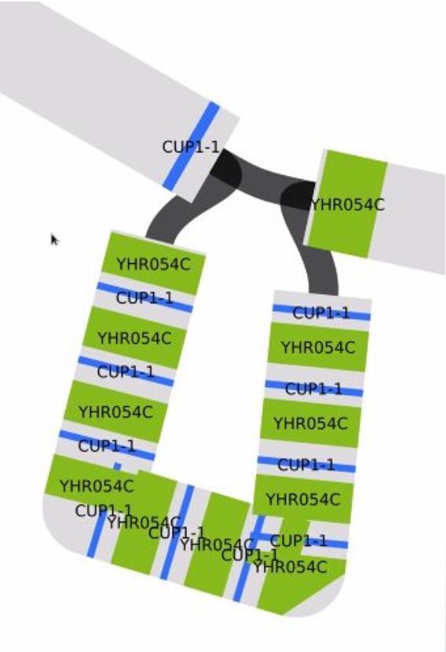{width=35%}

{width=100%}
</center>

Blast the two gene sequences to their positions. CUP1 is the smaller one. Gene sequences are in: /home/data/pangenomics-2402/yprp/CUP1/cup1.yhr054c.fa

<center>
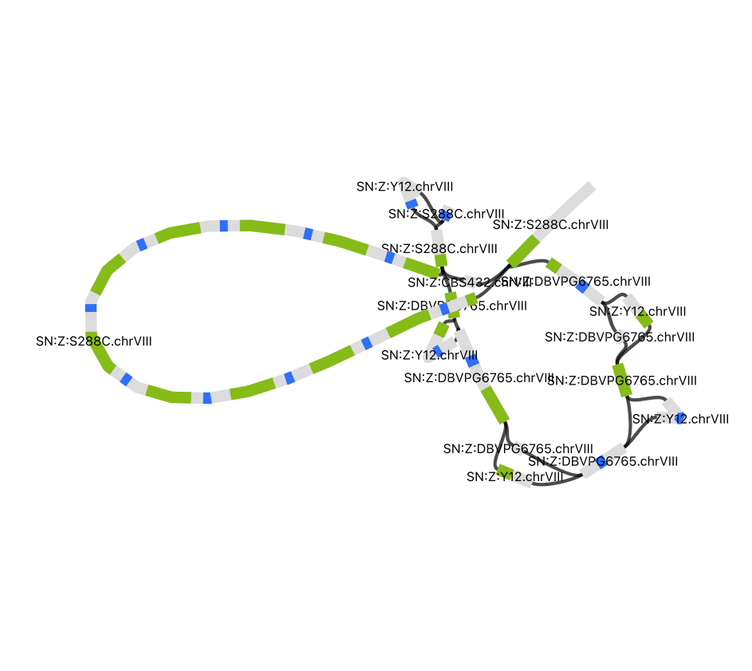{width=90%}
</center>

### CUP1 Paths in Y12 {-}

Let's find the Y12 paths through the graph for all bubbles in the CUP1 graph file. We will align the Y12 genome fasta to the CUP1 graph.

```{bash, eval=FALSE}
minigraph -xasm -l100 --call cup1.gfa Y12.genome.fa > Y12.call.bed
```

<span style="color: lightgray;">
S288C.chrVIII	213241	213241	>s3003	>s3004	>s13286:1157:+:Y12.chrVIII:206412:207603
S288C.chrVIII	213912	233912	>s3004	>s3006	>s10622>s13287>s10623>s13288>s10625>s13289>s10626>s13290>s10628:10263:+:Y12.chrVIII:208238:218516
</span>

alignment path through the bubble:path length:mapping strand:the contig name:approximate contig start:approximate contig end


### CUP1 Paths in all yeast genomes {-}

Let’s do all the samples:

```{bash, eval=FALSE}
for i in *.fa; do
   minigraph -xasm -l100 --call cup1.gfa $i > $i.call.bed
done
```

Compare to the Bandage Graph

## Minigraph Pros and Cons

**Pros**

Captures length variation   
Efficient   
Easy to add new genomes

**Cons**

Sample input order dependency  
Needs collinear chains so it doesn’t work well with many short segments such as rare SNPs.

https://github.com/lh3/minigraph#limitations

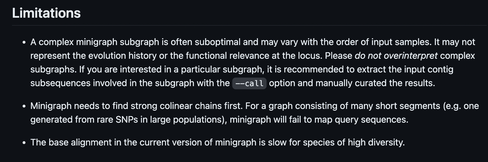{width=75%} 


## Blog Battle

**Heng Li (Minigraph)**

https://lh3.github.io/2019/07/08/on-a-reference-pan-genome-model

**Erik Garrison (VG)**

https://ekg.github.io/2019/07/09/Untangling-graphical-pangenomics

Focus on the "Working with other pangenomic methods" section

**Heng Li (Minigraph)**

https://lh3.github.io/2019/07/12/on-a-reference-pan-genome-model-part-ii
 
## Exercises

### Start with another reference {-}

1. What reference did you choose? 
2. What order are the other samples in?
3. How does the graph compare?
4. How does read mapping compare?
5. How do structural variant calls compare? 
6. How does the cup1 region compare? 
7. Any other interesting differences?

### Another Yeast Dataset {-}

A subset of yeast genomes from: https://www.nature.com/articles/s41586-018-0030-5.pdf
We will use 127 of these genomes.

Data are in: /home/data/pangenomics-2402/1011yeast/assemblies/A*fa.gz

Note that 1011genomes.fasta.gz in the same directory contains all of the assemblies. We'll need that for cuttlefish but if you use it for minigraph it will treat it as one assembly and try to put it on all at once. So, use the individual assemblies.

1. How many sequences in each assembly? Min? Max?
2. Make and characterize a minigraph
+ Choose 13 lines to match the number of genomes we ran earlier   
+ Try all 127 assemblies  
3. How do these graphs compare to our previous yeast graph? 
4. Pick a region from one of the graphs and make and characterize a subgraph. Visualize it in Bandage.

### Human GFA {-}

**lipoprotein(a) - LPA** 

The LPA gene is associated with coronary heart disease. It is highly variable and includes an intragenic copy number variation where one of the domains (KIV-2) can be present in 1 to 40+ copies, separated by introns.

This is how it looks in an older minigraph human pangenome with CHM13 as the base.

<center>
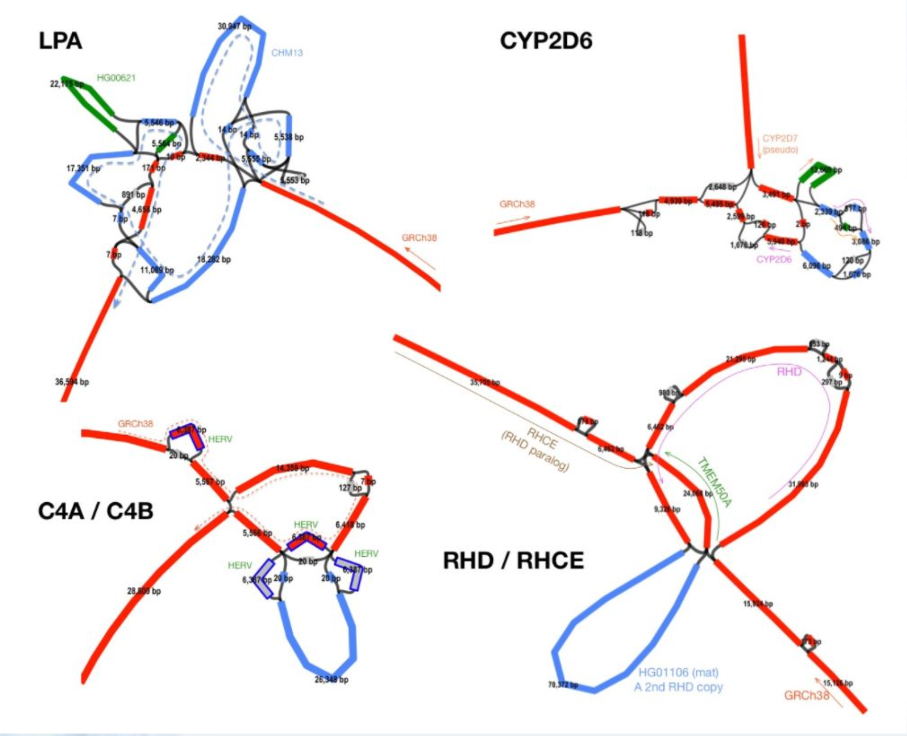{width=60%}
http://lh3.github.io/2021/01/11/minigraph-as-a-multi-assembly-sv-caller
</center>


There are a variable number of small exons in the gene.

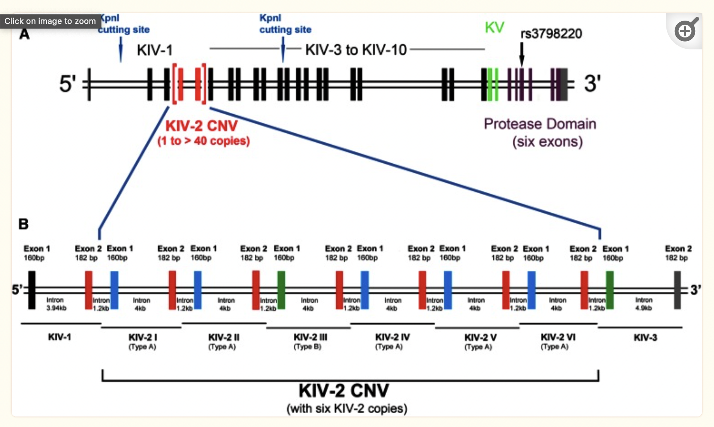{width=80%}

See if you can pull out and visualize the LPA region pictured below from minigraph draft human pangenome reference that uses the GRCh38 human reference genome as its base genome (https://www.nature.com/articles/s41586-023-05896-x). BLAST the LPA gene against the graph in Bandage.

Note: The GFA file is huge so don't try to download it and upload it into bandage. Pull out a subgraph and work with that.


The GFA file is here: /home/data/pangenomics-2402/human/graphs/hprc-v1.0-minigraph-grch38.gfa.gz (no need to unzip it). The LPA gene sequence is in /home/data/pangenomics-2402/human/genes/.

The LPA coordinates for GRCh38 are chr6:160531482-160664275

Note: The base genome is labelled as just chr6 whereas additional genomes have the sample name prepended before the chr.

There is also a graph with the CMH13 reference as the base genome in the same graph folder. It's LPA coordinates are chr6:161783172-162011762. See how that looks in Bandage.


<details>
  <summary>Click for Answer</summary>
  
GRCh38
  
gfatools view -R chr6:160531482-160664275 /home/data/pangenomics-2402/human/graphs/hprc-v1.0-minigraph-grch38.gfa.gz > human.lpa.gfa

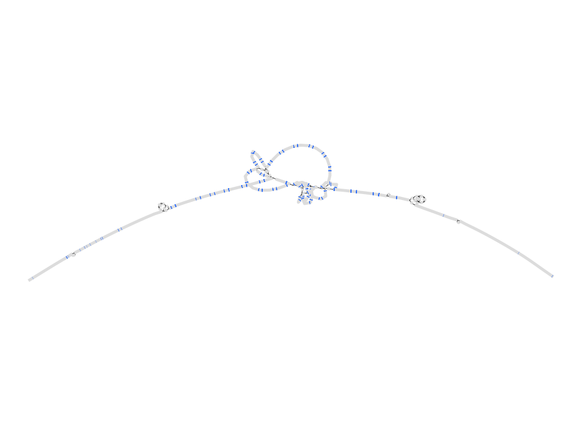{width=70%}

CHM13

gfatools view -R chr6:161783172-162011762 /home/data/pangenomics-2402/human/graphs/hprc-v1.0-minigraph-chm13.gfa.gz > human.lpa.chm13.gfa

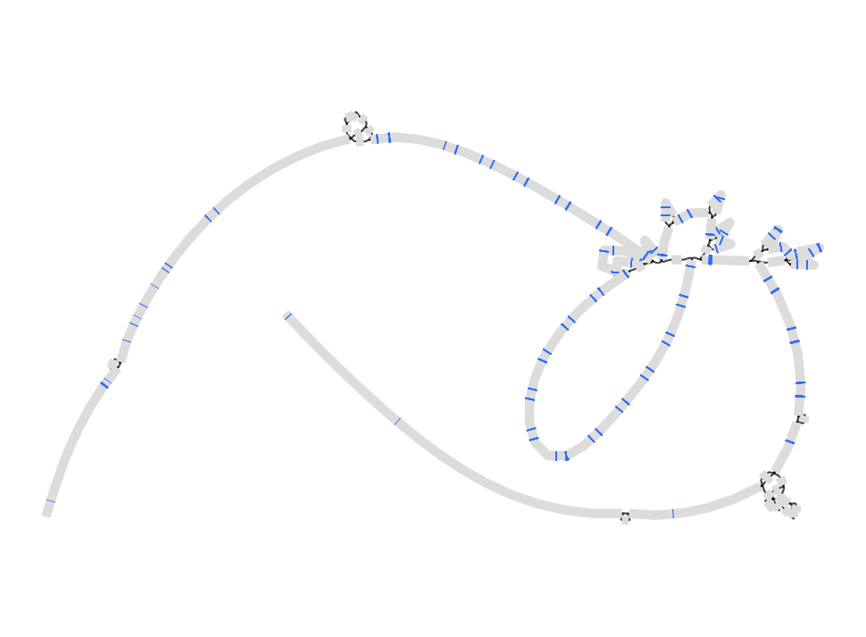{width=70%}

</details>

### Convert to VG and call variants {-}

Convert minigraph to vg (<1min):

```{bash, eval=FALSE}
vg convert -g yprp.minigraph.gfa -p > yprp.minigraph.vg
```

>**-g**        input GFA graph
>**-p**        output in PackedGraph format [default]

Note that for this and other vg commands you can use -t to increase the number of threads. Our dataset is small so we won't bother.

See https://github.com/vgteam/vg/wiki/File-Formats for more info on the PackedGraph format. Note that it is a binary format so if you want to look at it use "vg view".


Make vertices small enough (<=1024bp) for indexing (<1min):

```{bash, eval=FALSE}
vg mod -X 256 yprp.minigraph.vg > yprp.minigraph.mod.vg
```

>**-X**       max node size

*NOTE:* Converting to VG isn’t required if not calling variants, i.e. you can index and map directly on GFA.

1. Use vg to index the VG graph (2min)
2. Use vg to map SK1 reads to minigraph GFA (17min)
3. Use vg to call variants on read mapping GAM
    a. pack (20min)
    b. call (<1min)
    c. don’t do augment; run-time too long!

