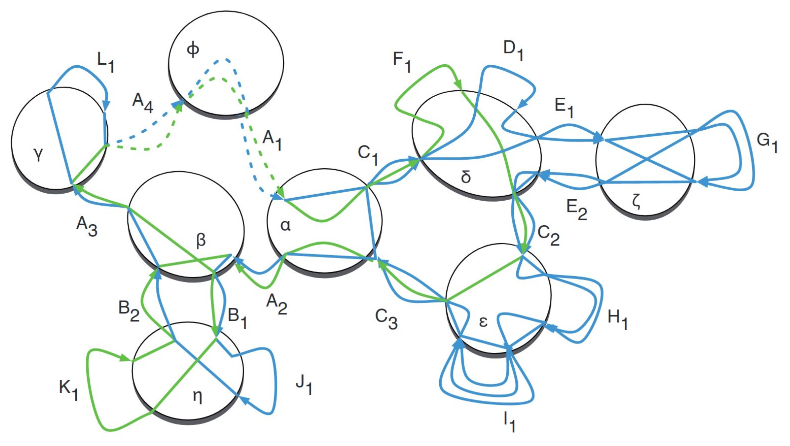
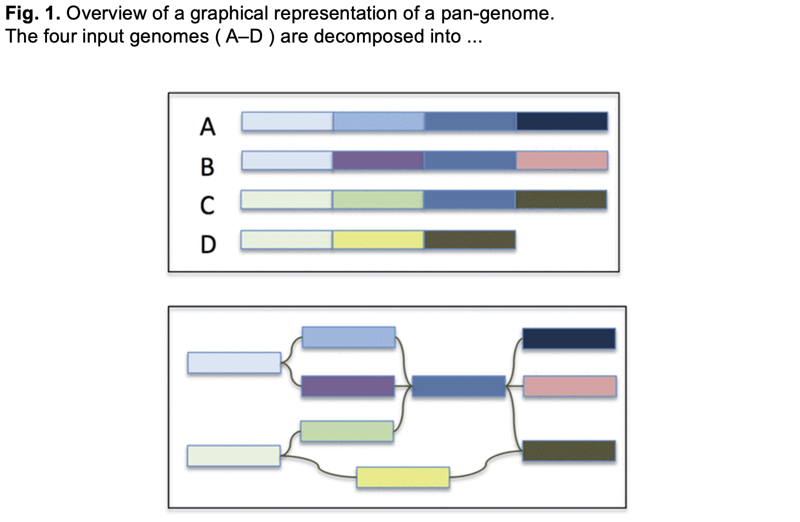

# Reference-Free Graphs with Cactus

## Cactus

https://github.com/ComparativeGenomicsToolkit/cactus

+ Reference-free whole genome MSA 
+ Constructs graph based on MSA
 
## Cactus Graphs

Cactus Graphs “naturally decompose the common substructures in a set of related genomes into a hierarchy of chains that can be visualized as two-dimensional multiple alignments and nets that can be visualized in circular genome plots”

https://www.liebertpub.com/ doi/abs/10.1089/cmb.2010.02 52

{width=100%} 

##  Cactus Algorithm

1. Multiple sequence aligner
2. Originally developed for multi-species alignments
3. Fast because it uses a guide tree (Newick format)
+ https://evolution.genetics.washington.edu/phylip/newicktree.html
4. Now supports minigraph GFA in place of guide tree for pangenome
alignments
+ https://github.com/lh3/minigraph

{width=100%}

## Reference-Free Graphs

https://academic.oup.com/bioinformatics/article/30/24/3476/2422268

{width=100%}

## Pipeline

1. minigraph
2. Prepare the input
3. cactus
4. vg
5. View with Bandage

### Set up Directories

1. Make sure you're working in a **screen**

2. Make sure you've sourced the pangenomics environment file
```
source /home/pangenomics/pangenomics_env
```

3. Make Directory

```
mkdir cactus
```
4. Navigate to the Directory

```
cd cactus
```
5. Link to data

```
cp -r /home/pangenomics/data/yprp/assemblies .
```

*Note:* Don't use "ln -s /home/pangenomics/data/yprp/ ."

## Yeast Data

Reference:
+ S288C

Using all 12 YPRP assemblies

## Preparing the Input

**(already done for you)**

1. FASTA files
+ Chromosome names should be unique across files
    + We’re using: 
    
    ```
    <strain name>.<chromosome>*
    ```
    
E.G.

>S288C.chrI

## minigraph

Use the graph we previously built: yprp.minigraph.gfa

## Preparing the Input (exercise)

1. Cactus seqFile tells Cactus where to load sequences from
+ Maps sequence names to file paths
    + We’re using: 
    
    ```
    “strain name>\t<path to sequence>”
    ```

    + Must include “_MINIGRAPH_” entry for path to minigraph GFA 

E.G.

seqFile:
S288C ./S288C.genome.fa _MINIGRAPH_ yprp.minigraph.gfa

+ It’s recommended the minigraph contains all the sequences in the seqFile

2. Call it **yprp.seqFile.txt**

## Cactus

1. Align each input FASTA to the minigraph (2min):

```
 cactus-graphmap jobStore yprp.seqFile.txt yprp.minigraph.gfa
 yprp.cactus.paf --outputFasta yprp.minigraph.gfa.fa
 --maxCores 20
 ```

+ **jobstore**
    + a directory where intermediate files should be stored (shouldn’t exist)
+ **yprp.seqfile.txt**
    + text file mapping sequence names to file paths
+ **yprp.minigraph.gfa**
    + the graph constructed by minigraph
+ **yprp.cactus.paf**
    + what to name the output pairwise mapping file
+ **yprp.minigraph.gfa.fa**
    + a FASTA to output the GFA’s sequence to 
*NOTE:* This command modifiers the seqFile. Make a copy before running!

2. Generate multiple alignment and VG graph (19min):

*NOTE*: Don’t run this command if you intend to use

```
 cactus-graphmap-split
 cactus-align jobStore yprp.seqFile.txt yprp.cactus.paf
 yprp.cactus.hal --pangenome --pafInput --outVG
 --reference S288C --maxCores 20
 ```

+ **yprp.cactus.hal**
    + what to name the output multiple sequence alignment file
+ **reference S288C**
    + the name of the reference in the seqFile (should be the same as
the reference in the minigraph GFA)

## Preparing the Input (exercise)

1. Cactus contigs files tells Cactus to contigs to split the graph on
+ A list of all the S288C contigs
+ Call it S288C.contigs.txt

### Preparing the Input (solution)

Make a reference contigs file:

```
grep -Po "^>\K.*" ~/cactus/yprp/assemblies/S288C.genome.fa >
S288C.contigs.txt
```

## Cactus Split

1. Align each input FASTA to the minigraph and split by reference chromosome (4min):

```
 cactus-graphmap-split jobStore yprp.seqFile.txt
 yprp.minigraph.gfa yprp.cactus.paf
 --refContigsFile S288C.contigs.txt --reference S288C
 --outDir chroms --maxCores 20
 ```
 
+ **yprp.seqFile.txt**
    + modified version from previous *cactus-graphmap* command
+ **yprp.cactus.paf**
    + output from previous *cactus-graphmap* command
+ **-refContigsFile**
    + the names of the chromosomes in the reference FASTA
+ **–reference**
    + the name of the reference in the seqFile
+ **-outDir**
    + where the split outputs should be placed

2. Generate multiple alignment and graph for a chromosome (35min total):

```
cactus-align jobStore chroms/seqfiles/S288C.chrI.seqFile
chroms/S288C.chrI/S288C.chrI.paf
yprp.S288C.chrI.cactus.hal --pangenome --pafInput --outVG
--reference S288C --maxCores 20
```

+ Recommend automating with a bash script; 
    + see: /home/pangenomics/scripts/cactus-align-chromosomes.sh

*NOTE*: Other options are:

+ cactus-align --batch
+ cactus-align-batch

## Viewing with Bandage

View **one chromosome at a time** with Bandage


