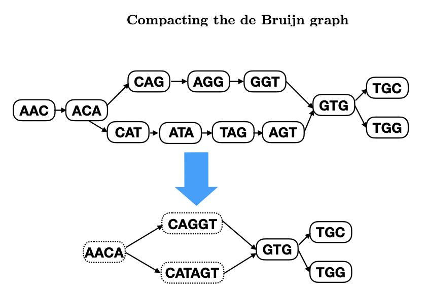
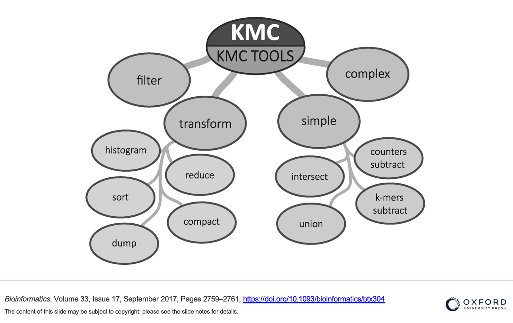

# Cuttlefish

"Cuttlefish is a program to produce the compacted de Bruijn graph from sequencing reads or reference sequences."

<center>
{width=50%} 
</center>

Cuttlefish Code  
https://github.com/COMBINE-lab/cuttlefish

Original Cuttlefish  
https://academic.oup.com/bioinformatics/article/37/Supplement_1/i177/6319696?login=false

Cuttlefish 2  
https://genomebiology.biomedcentral.com/articles/10.1186/s13059-022-02743-6


## Colored compact De Bruijn Graphs

Cuttlefish produces colored compact de Bruijn graphs. The "color" is the paths of each assembly through the graph. It is really fast, memory efficient, and highly scalable.

<center>
{width=50%} 
</center>

## Kmers

It uses a version of KMC3, a fast and low memory algorithm for identifying and manipulating kmers. KMC3 and Cuttlefish have an overlaping set of authors.

<center>
{width=80%} 
</center>

Canonical kmers are used (kmers that are reverse complements of each other are treated as the same kmer).

Kmers must be odd. Max kmer sizes are 63 in the default installation but can be configured up to 127 when installing.

## Cuttlefish 1 vs 2

Cuttlefish 1 and Cuttlefish 2 are packaged together. Some parameters are specific for each version and you cannot choose parameters specific to version 1 and to version 2 in the same run. Cuttlefish 2 is also supposed to be faster, though it didn't seem to be on the yeast data.

**Cuttlefish 1**  
Input = assembled reference sequences  
Output = GFA (version 1 or 2), reduced GFA, fasta

**Cuttlefish 2**  
Input = sequencing reads or reference sequences (not both)  
Output = fasta (others coming soon)


A few notes on output formats: 

+ The fasta format for both versions is the sequence of the maximal unitigs (non-branching paths) of the de Bruijn graph  
+ When using GFA, we'll use GFA1, which is more appropriate for pangenomics. More info at the websites below if you want to learn more.  
+ http://gfa-spec.github.io/GFA-spec/GFA2.html  
+ https://github.com/GFA-spec/GFA-spec/issues/49  
+ The reduced GFA format has 2 files with extensions .cf_seg (maximal unitigs = GFA1 segments) and .cf_seq (tiling with orientation = GFA1 paths).

"For moderate to large sized genomes, this [reduced-GFA] output format is preferrable to the GFA ones as the GFA formats can be quite verbose for this particular scenario, while the reduced representation provides effitively the same information, while taking much less space. For example, for the 7-human genome dataset (experimented with in the manuscripts) and using k = 31, the compacted graph takes 112 GB in GFA2, but only 29.3 GB in this reduced format."

https://github.com/COMBINE-lab/cuttlefish#io-formats


## Running Cuttlefish

### Increase the ulimit {-}

Cuttlefish often exceeds the open file-handle limit and gives an error that is hard to decipher. We'll increase it before we run.

```{bash, eval=FALSE}
ulimit -n 2048
```

### Input data {-}

Cuttlefish requires a single fasta with all the genomes (wildcards that point to all the indiviual genome fasta files result in only the first one being run).


```{bash, eval=FALSE}
mkdir ~/cuttlefish
cd ~/cuttlefish
cat /home/data/pangenomics-2402/yprp/assemblies/*fa > 12genomes.fa
```


### Parameters {-}

You can see all the parameters with:

```{bash, eval=FALSE}
cuttlefish build
```

or 

```{bash, eval=FALSE}
cuttlefish build --help
```


Here are the parameters that we'll focus on:

>-s   input fasta  
>-t   threads (we'll use 6; default 22)  
>-k   kmer size (we'll use 63)  
>-o   output  
>-f   format (0: FASTA, 1: GFA 1.0, 2: GFA 2.0, 3: GFA-reduced)

### GFA 1.0 {-}


```{bash, eval=FALSE}
cuttlefish build -s 12genomes.fa -t 6 -k 63 -o 12genomes.k63.f1 -f 1
```

List the files with the newest ones last

```{bash, eval=FALSE}
ls -ltr
```

Take a look at the json file

```{bash, eval=FALSE}
cat 12genomes.k63.f1.json
```

What line types are there in the GFA output and how many are there of each?

```{bash, eval=FALSE}
cut -f 1 12genomes.k63.f1.gfa1 | sort | uniq -c
```

How much overlap is there between each segment (Hint: look at the end of the link lines)?

Note that as we run different formats, we have to change the output name because it will recognize that the json file is already printed and it will exit.

### reduced GFA {-}

```{bash, eval=FALSE}
cuttlefish build -s 12genomes.fa -t 6  -k 63 -o 12genomes.k63.f3 -f 3
```

What files were output (list the files with the newest first)?

What is in each of the files?

### FASTA {-}

We'll try the FASTA output with both Cuttlefish 1 and Cuttlefish 2.

**Cuttlefish 1**

```{bash, eval=FALSE}
cuttlefish build -s 12genomes.fa -t 6  -k 63 -o 12genomes.k63.f0 -f 0
```

**Cuttlefish 2**

```{bash, eval=FALSE}
cuttlefish build -s 12genomes.fa -t 6  -k 63 -o 12genomes.k63.ref --ref
```


How many sequences are there in each?

```{bash, eval=FALSE}
grep -c '>' 12genomes.k63.f0.fa
grep -c '>' 12genomes.k63.ref.fa
```

How long are the shortest and longest sequences?

```{bash, eval=FALSE}
grep -v '>' 12genomes.k63.f0.fa | awk '{print length($1)}' | sort -n |head -1
grep -v '>' 12genomes.k63.f0.fa | awk '{print length($1)}' | sort -n |tail -1
```

Now find the shortest and longest sequences for the fasta from cuttlefish 2.

## 1011 yeast data (127 genomes)

Create GFA1 Cuttlefish output (k=63) for the 1011 yeast assemblies (127 genomes). We'll keep track of how much time it takes by using the time command.

Link to the data (make sure you are using the file with all the assemblies in it.)

```{bash, eval=FALSE}
ln -s  /home/data/pangenomics-2402/1011yeast/assemblies/1011genomes.fasta.gz .
```

Now run cuttlefish.

```{bash, eval=FALSE}
time cuttlefish build -s 1011genomes.fasta.gz -t 6 -k 63 -o 1011genomes.k63.f1 -f 1
```


We'll do more with the cuttlefish files, including looking at the CUP1 region in the next section.
