# Graph-specific Analyses

{width=50%} 

## Frequented Region (FR) Algorithm

Identify regions in a graph that are co-visited by a set of supporting
paths from individual sequences in the pangenome.

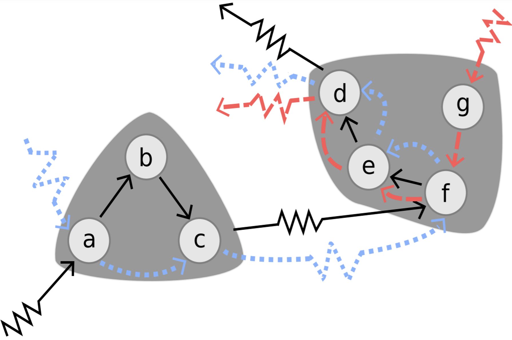{width=80%} 


1. Similar evolutionary histories
2. Similar selection pressures

3. Heuristic but scalable
4. Node merging with noise tolerance
    + Error
    + Divergence
5. Nucleotide level

### A few of the parameters

1. penetrance (𝛼)
minimum fraction of nodes
2. the maximum insertion parameter (κ)
maximum number of inserted nodes

## Yeast Insertion for Alcohol Tolerance

### 17kb insertion on chromosome XIV

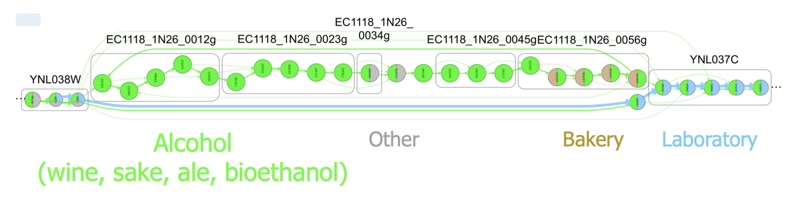{width=100%} 

### 17kb insertion across all 55 strains

+ 9 of 20 additional alcohol related strains share EC1118’s inserted FRs. 
+ Strains sharing four or more FRs are highlighted.
+ 5 genes inserted


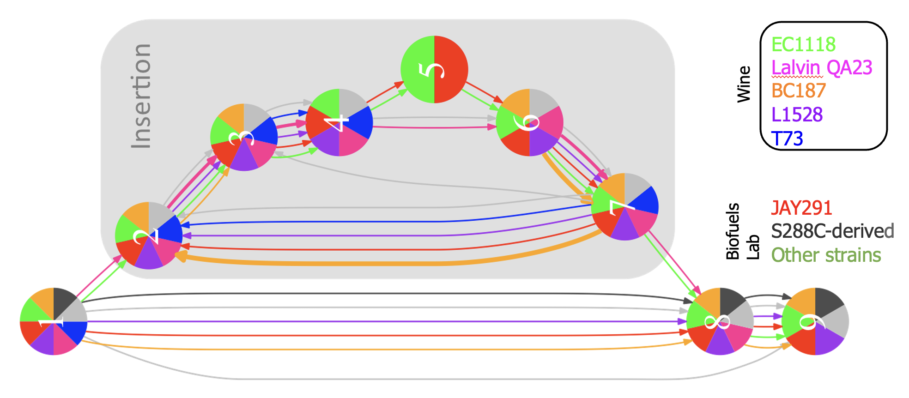{width=100%} 

## SARS-CoV-2

+ Identify conserved genomic regions
    + Vaccine and treatment targets

+ Identify genomic shifts over time and geographic space
    + Mutations affecting spread and virulence

+ Identify genomic regions that differentiate strains
    + Implications in modelling and treatment
 
{width=20%}

## Genomic shifts across time and space

733 SARS-CoV-2 genomes from the beginning of the pandemic through April

Highlight

+ Early strains:
    + (Wuhan, 12/30/2019)
    + (Italy, 4/27/2020)
    
+ **Spike protein**
    + Engages the human ACE2 cell receptor to gain entry into the host cell. Target for vaccines, template for antibody production, and candidate for generating entry inhibitors.
    
### Wuhan & Italy compared to 733 strain support

Spike protein conserved, especially end Genomic shift

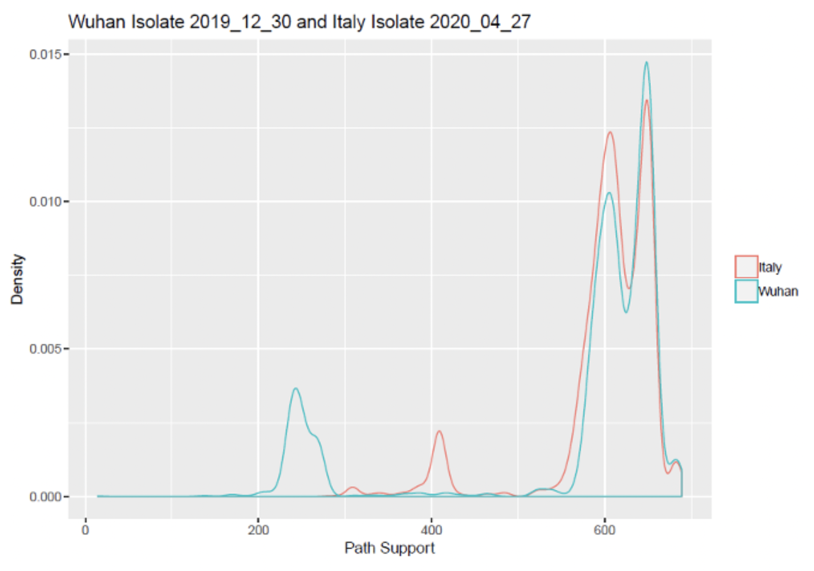{width=100%}

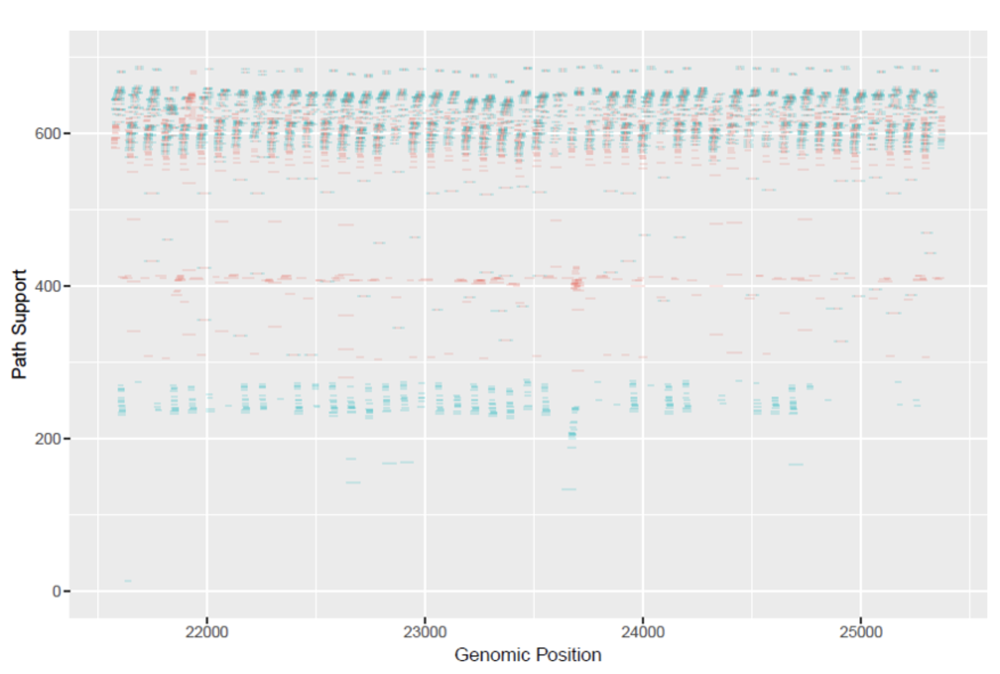{width=100%}

### D614G mutation

A mutation seen in Europe in February that spread across the globe to become the dominant strain. Preliminary analyses suggest it might increase contagion and/or virulence and that strains people with immunity to the original strain might not be immune to the mutated strain. The figure shows the region has undergone genomic shift and isn’t conserved in all the genomes.

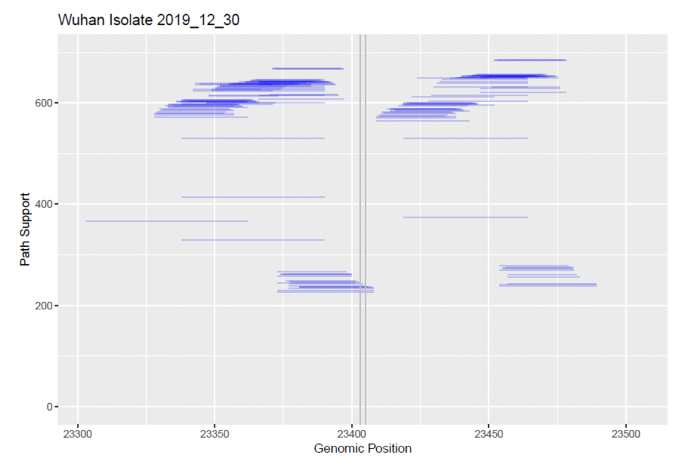{width=100%}

### Conserved haplotype blocks and selection coefficients

##### Soft and incomplete selective sweeps{-}

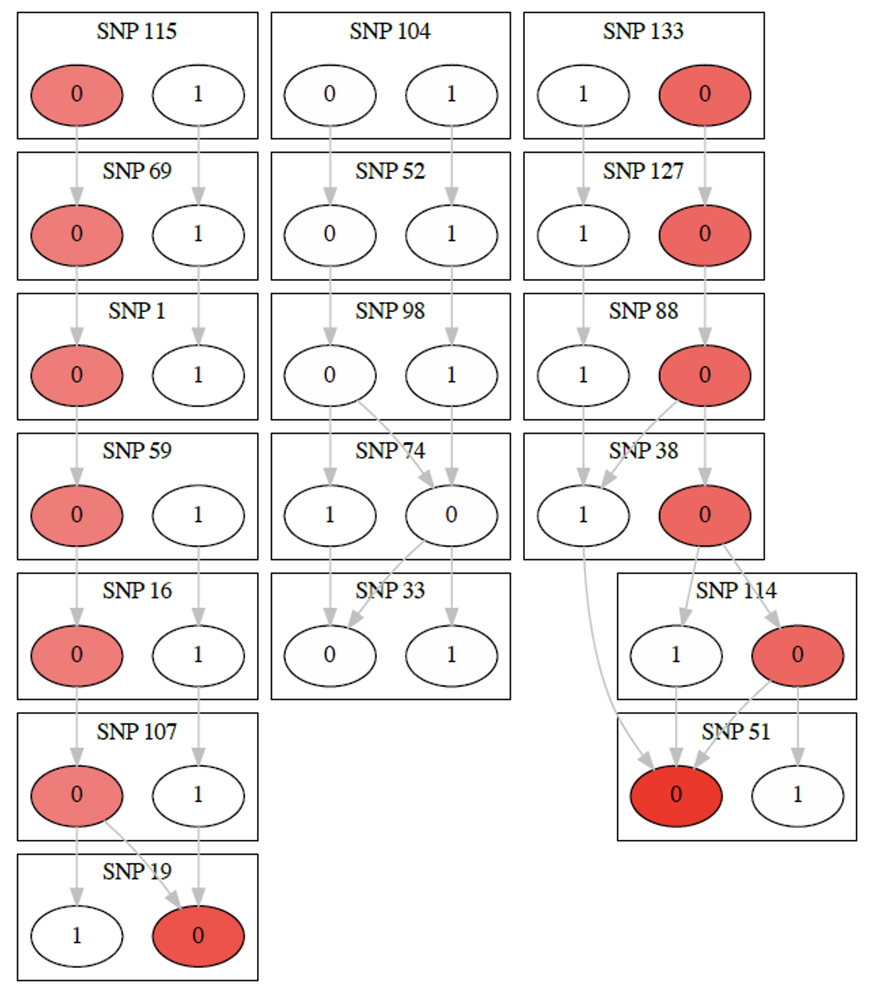{width=80%}


{width=100%}

## Medicago truncatula

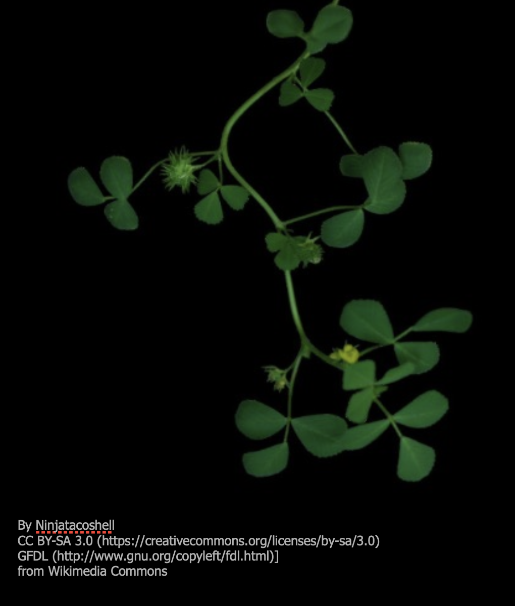{width=50%}

+ Model legume
+ 450 Mb genome
+ Selfing
+ Whole genome duplications
+ High level of rearrangements and gene family expansions

### Medicago Pan-13 genome size curve

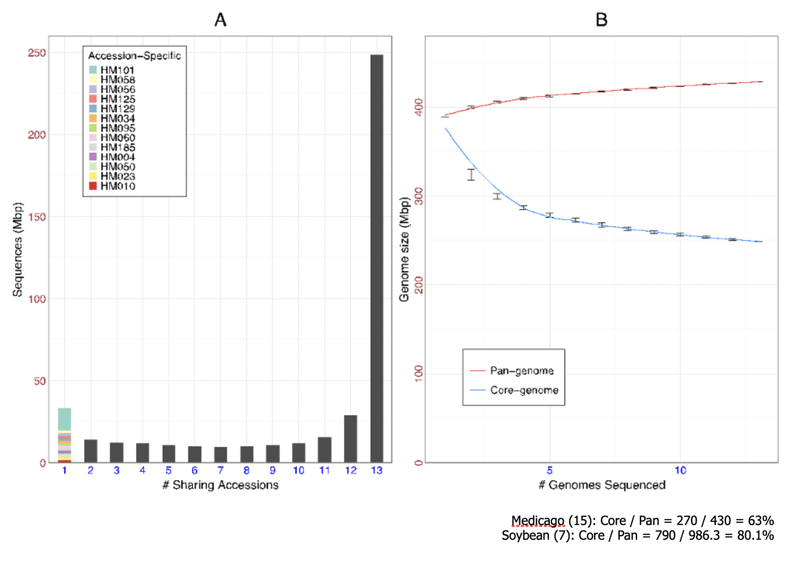{width=100%}

+ Zhou, P., Silverstein, K.A., Ramaraj, T., Guhlin, J., Denny, R., Liu,
J., Farmer, A.D., Steele, K.P., Stupar, R.M. & Miller, J.R. Exploring
structural variation and gene family architecture with De Novo
assemblies of 15 Medicago genomes. BMC genomics 18, 261 (2017).

### Medicago Pan-13 *proteome* size curve

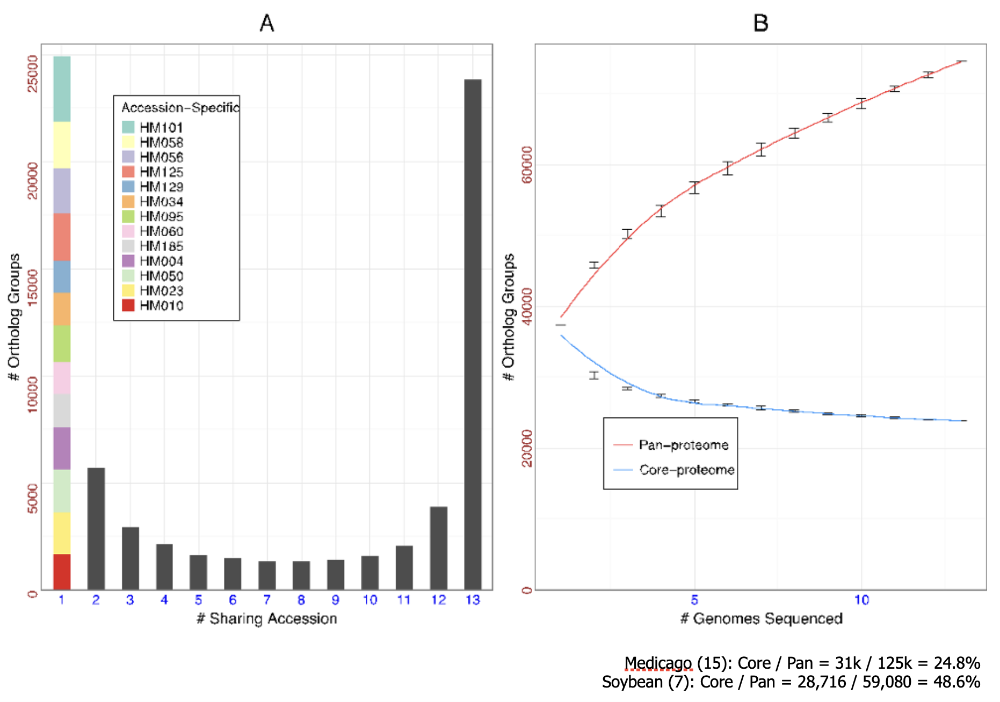{width=100%}

### Medicago HapMap Summary

1. As much as 22% of the genome is involved in large structural changes;
2. Medicago 13 pangenome expands reference space by 16% (63 Mbp);
3. Pangenome analysis revealed that 42% (180 Mbp) of genomic sequences are missing in one or more assemblies, while pan-proteome analysis identified 67% (50,700) of all ortholog groups as dispensable;
4. Environmentally Sensitive Gene Families found to be enriched in the accession-specific gene pool.

### Medicago: 23 accessions for de novo assembly 

1. 15 genomes from 3 phylogenetic hubs (incl. A17)
2. 6 genomes from RIL parents
3. 3 “random” genomes

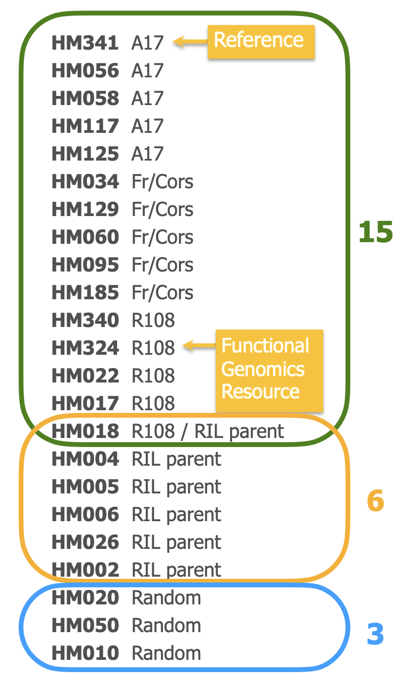{width=60%}

### Medicago: LEED..PEED (LP) family

1. Short secreted peptides
2. Transcribed in nitrogen-fixing nodules but absent from other plant tissues
3. Not found in other sequenced legumes
4. M. truncatula A17 (reference)
    + 12 LP genes on chromosome 7
    + 1 LP gene on chromosome 4
    
+ leucine:glutamic acid:glutamic acid:aspartic acid
+ proline:glutamic acid:glutamic acid:aspartic acid

Genomic Characterization of the LEED..PEEDs, a Gene Family Unique to the Medicago Lineage
Diana I. Trujillo, Kevin A. T. Silverstein and Nevin D. Young 
G3: GENES, GENOMES, GENETICS October 1, 2014 vol. 4 no. 10 2003-2012; https://doi.org/10.1534/g3.114.011874

#### LEED..PEED{-}

{width=100%}

### *Medicago truncatula*

1. Horizontal gene transfer among symbionts and between symbionts and plants

2. Nodule specific gene families

3. Expansion of plant gene families

## Using Machine Learning to Connect Genotype to Phenotype

{width=100%}

### Yeast

1. FR matrix as features
2. Random Forest
3. Predict Phenotypes

### Yeast Root Mean Square Error (RMSE)

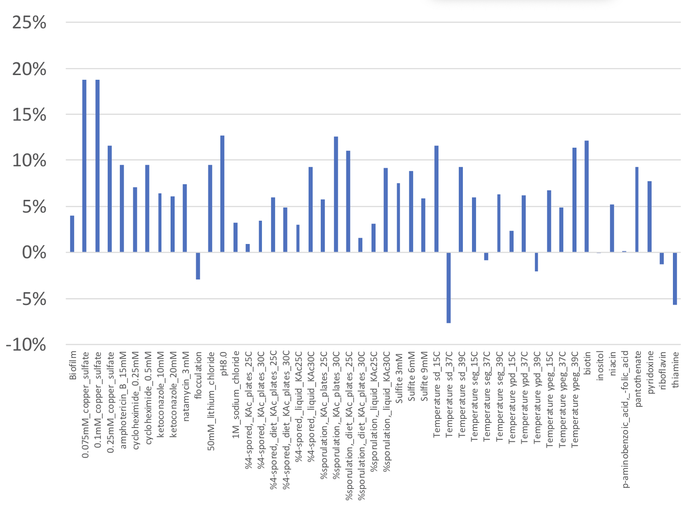{width=100%}

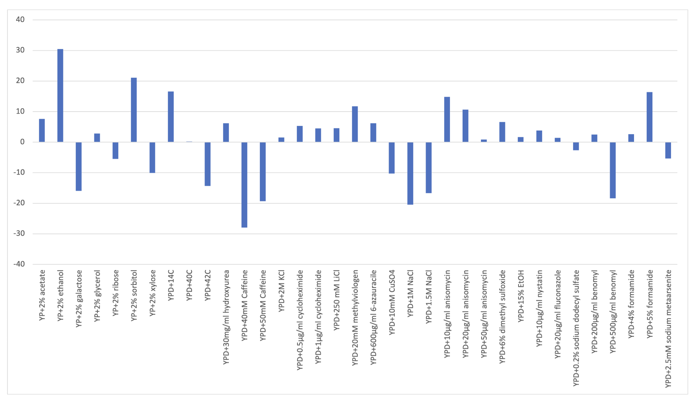{width=100%}

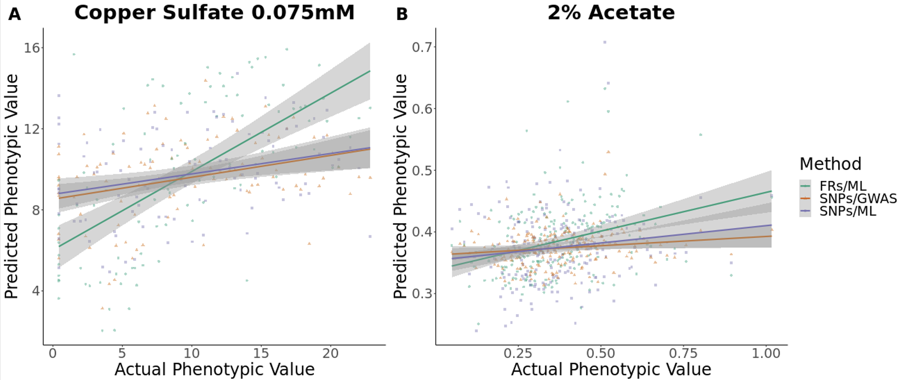{width=100%}


## VG and Machine Learning

### vg vectorize (xg graph or gcsa)

{width=100%}

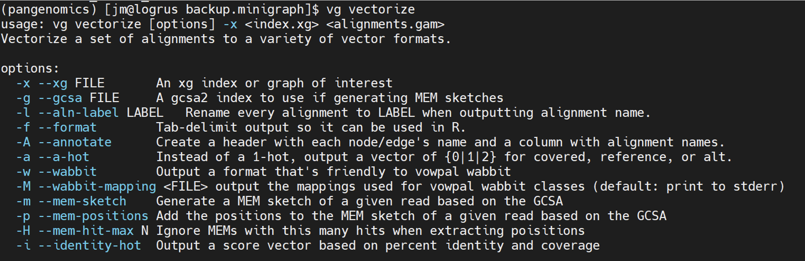{width=100%}


## Running FindFRs3

Let's look for frequented regions in the cuttlefish graphs. Note that FindFRs3 is a heuristic algorithm, which means that results can vary slightly from run to run. You're FR numbers might look a bit different than mine.

This version is more efficient and uses reduced-GFA format. It also will look for alternate paths in the same part of the graph.

We'll use the cuttlefish reduced-GFA graphs. Note that you need to use the same kmer size in FindFRs3 that you used in cuttlefish.

Go into your cuttlefish directory (if you aren't already there)

```{bash, eval=FALSE}
cd ~/cuttlefish
```

Let's get usage.

```{bash, eval=FALSE}
java -jar /opt/FindFRs3.jar
```

Missing required options: n, p, b, a, k, m  
usage: FindFRs3  
 -a,--alpha <arg>    alpha parameter  
 -b,--bed <arg>      BED output file  
 -k,--kmer <arg>     k-mer size  
 -ka,--kappa <arg>   kappa parameter (default = 0)  
 -l,--minlen <arg>   min avg support length parameter (bp)  
 -m,--minsup <arg>   min support parameter  
 -n,--seg <arg>      GFA3 seg file  
 -p,--seq <arg>      GFA3 seq file  

Run FindFRs3 on the cuttlefish graph (~15min)

```{bash, eval=FALSE}
java -Xmx26g -jar /opt/FindFRs3.jar -a 0.7 -k 63 -ka 10 -m 2 -l 100 -b 12genomes.k63.a70.ka10.m2.l100.bed -n 12genomes.k63.f3.cf_seg -p 12genomes.k63.f3.cf_seq
```

Take a look at the output files (note that yours might be a little different):  
BED file (connects fr nodes to input assemblies)  
fr nodes  
fr variant paths

```{bash,eval=FALSE}
head 12genomes.k63.a70.ka10.m2.l100.bed
head 12genomes.k63.a70.ka10.m2.l100.bed.frs
head 12genomes.k63.a70.ka10.m2.l100.bed.frv
```


How many segments are there in the cuttlefish GFA? [Hint: count the lines in 12genomes.k63.f3.cf_seg]

How many frs are there? [Hint: count the lines in 12genomes.k63.f3.cf_seq.bed.frs]

Haw many paths through those frs are there? [Hint: count the lines in 12genomes.k63.f3.cf_seq.bed.frv]

## CUP1 region


{width=100%}
 
Find the region in the graph based on its S288C coordinates  

Let's pull out S288C chrVIII and sort by position so we can look for the S288C path through the CUP1 region:  
S288C.chrVIII:213045-233214


```{bash, eval=FALSE}
grep S288C.chrVIII 12genomes.k63.a70.ka10.m2.l100.bed|sort -nk2
```

<!--
S288C.chrVIII	209011	209136	fr18473:0
S288C.chrVIII	213728	215320	fr7:0
S288C.chrVIII	215726	217318	fr7:0
S288C.chrVIII	217724	219317	fr7:1
S288C.chrVIII	219723	221314	fr7:3
S288C.chrVIII	221952	223316	fr7:4
S288C.chrVIII	223722	225243	fr7:2
S288C.chrVIII	225720	227312	fr7:0
S288C.chrVIII	227718	229310	fr7:0
S288C.chrVIII	229716	231308	fr7:0
S288C.chrVIII	231714	233307	fr7:1
S288C.chrVIII	242374	242442	fr708:0
-->


What are the flanking frs (reminder, yours might be different)?

<!--fr18473:0 and fr708:0-->

Let's find the segments in the S288C paths for these flanking frs.

```{bash, eval=FALSE}
grep -E "fr18473:0|fr708:0" 12genomes.k63.a70.ka10.m2.l100.bed.frv
```

<!--
fr708:0	 57988274-
fr18473:0	 4582018-
-->

Now find the S288C segments that span the region between the flanking frs.

The cf_seq file has the full paths for each of the chromosomes. Let's look at S288C.chrVIII.

```{bash, eval=FALSE}
grep S288C.chrVIII 12genomes.k63.f3.cf_seq
```

Let's get each of the fields on their own line.

```{bash, eval=FALSE}
grep S288C.chrVIII 12genomes.k63.f3.cf_seq | sed 's/\s\+/\n/g' > S288C.chrVIII.segs.txt
head S288C.chrVIII.segs.txt
```

Now grab all the segments in the S288C path between and including your flanking segments. You could do this manually by searching for one then scrolling to the other but let's work on our unix skills.

First, find which row each segment is on in the S288C.chrVIII.segs.txt file.

```{bash, eval=FALSE}
grep -n 57988274 S288C.chrVIII.segs.txt
grep -n 4582018 S288C.chrVIII.segs.txt
```

<!--
6510:57988274-
5636:4582018-
-->

Now, we'll remove lines after those we want, then remove lines before those we want. We'll also remove the + and - signs at the end of each segment.

```{bash, eval=FALSE}
head -6510 S288C.chrVIII.segs.txt | tail -n +5636 | sed 's/[+-]//' > S288C.segs.txt
```

<!--includes the flanking frs-->

We can use gfatools view to pull out the gfa for these segments. Before we fed in only one segment but you can also feed in a file of segments. Check out the usage to figure out how.

```{bash, eval=FALSE}
gfatools view
```

Usage: gfatools view [options] <in.gfa>  
Options:  
  -v INT        verbose level [2]  
  -l STR/@FILE  segment list to subset []  
  -R STR        a region like chr1:101-200 (a 1-based closed region) []  
  -r INT        subset radius (effective with -l) [0]  
  -d            delete the list of segments (requiring -l; ignoring -r)  
  -M            remove multiple edges  
  -S            don't print sequences  


We'll pull the S288C segments out of the cuttlefish GFA1 file.

```{bash, eval=FALSE}
gfatools view -l @S288C.segs.txt -r 0 12genomes.k63.f1.gfa1 > S288C.0.segs.gfa
```

View it in bandage and blast the CUP1 and YHR054C genes against it.

{width=100%}


Now let's expand the graph so that we capture some nearby paths from other yeast strains.

```{bash, eval=FALSE}
gfatools view -l @S288C.segs.txt -r 10 12genomes.k63.f1.gfa1 > S288C.10.segs.gfa
```

View it in bandage and blast the CUP1 and YHR054C genes.

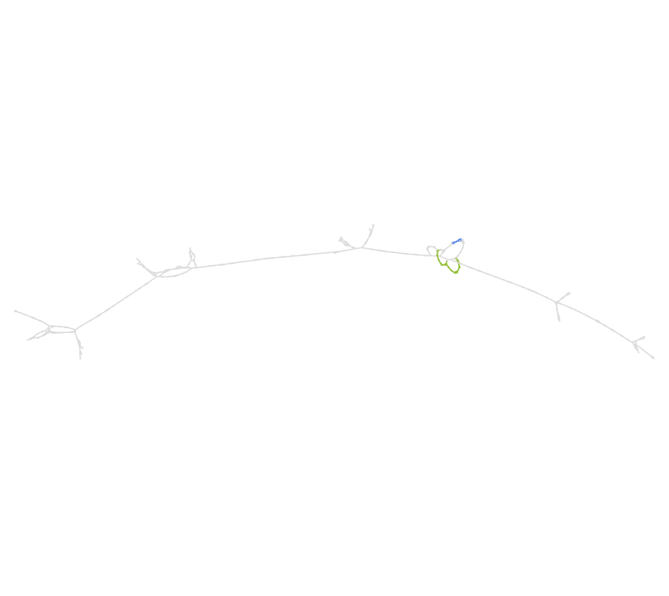{width=100%}
Zoomed in.

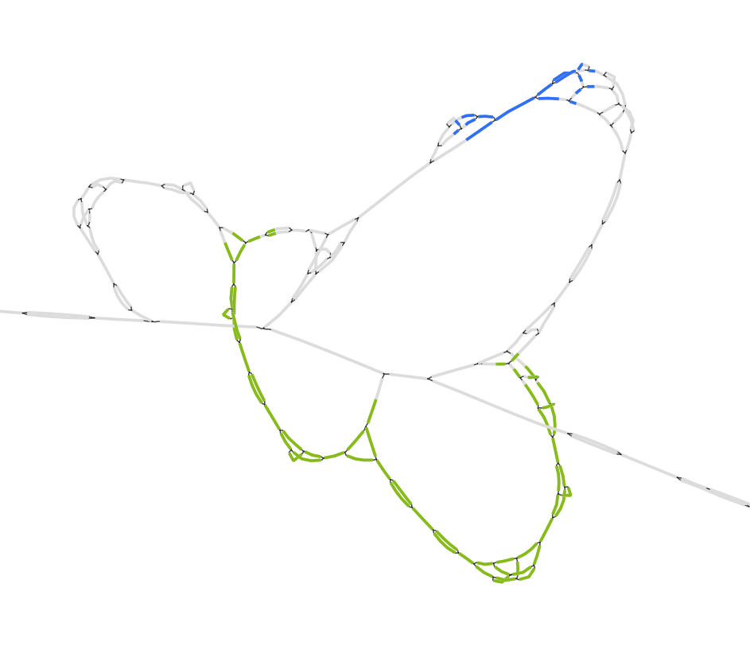{width=100%}


