# Other Tools and Methods

## Workshop Tools Review

+ **Bandage**
    + https://rrwick.github.io/Bandage/
    + https://academic.oup.com/bioinformatics/article/31/20/3350/196114
+ **IGV**
    + https://software.broadinstitute.org/software/igv/
    + https://www.nature.com/articles/nbt.1754
+ **vg**
    + https://github.com/vgteam/vg
    + https://www.nature.com/articles/nbt.4227
+ **minigraph**
    + https://github.com/lh3/minigraph
    + https://link.springer.com/article/10.1186/s13059-020-02168-z
+ **cactus**
    + https://github.com/ComparativeGenomicsToolkit/cactus
    + https://www.nature.com/articles/s41586-020-2871-y
+ **pggb**
    + https://github.com/pangenome/pggb
    + https://www.biorxiv.org/content/1
+ **cuttlefish**
    + https://github.com/COMBINE-lab/cuttlefish
    + https://genomebiology.biomedcentral.com/articles/10.1186/s13059-022-02743-6
+ **gfatools**
    + https://github.com/lh3/gfatools
+ **samtools**
    + http://www.htslib.org/

## Other Visualizations

### Bandage with Paths

https://github.com/asl/Bandage

A fork of Bandage that supports embedded paths

+ graphs constructed with minigraph **don’t have paths**!
    
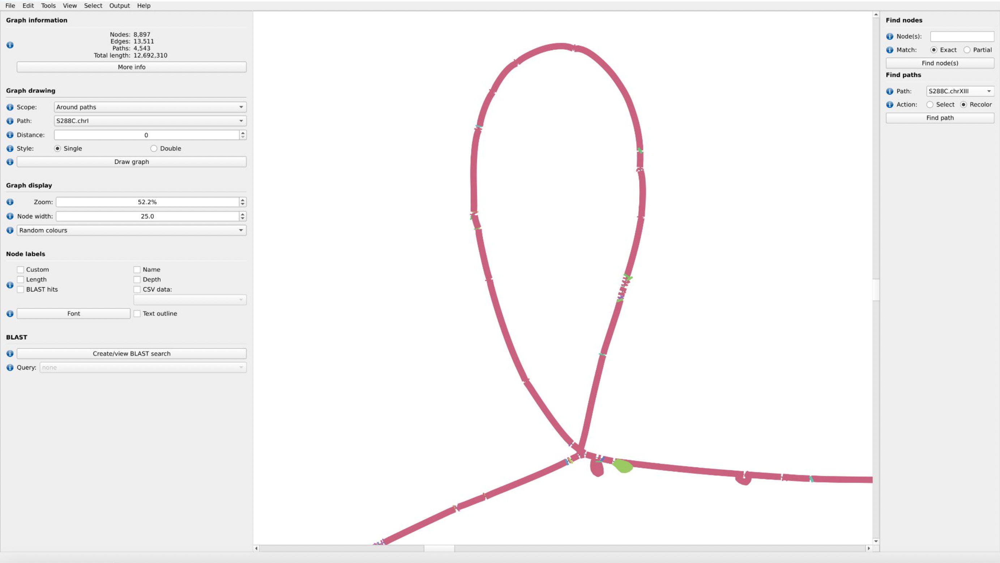{width=100%}

### GfaViz

https://github.com/ggonnella/gfaviz 

+ Manuscript:
    + https://academic.oup.com/bioinformatics/article/35/16/2853/5267826?login=false

A GFA viewer that explicitly supports variation graphs (Fig c).

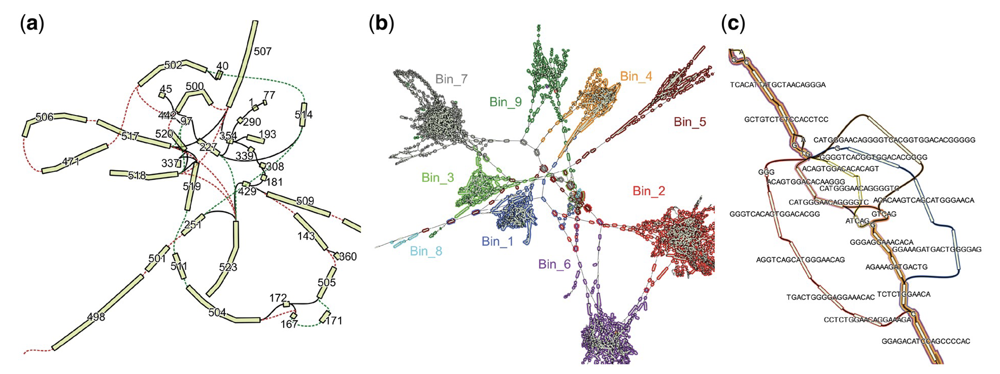{width=100%}

### Panache 

https://github.com/SouthGreenPlatform/panache

+ Manuscript:
    + https://academic.oup.com/bioinformatics/article/37/23/4556/6380547

Web browser-based visualization of linearized pangenomes

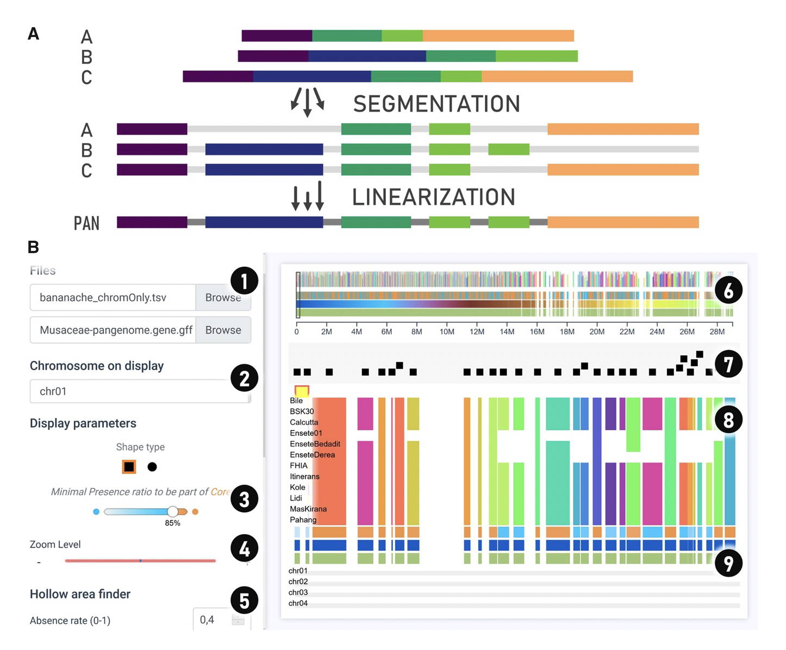{width=100%}

### Anvi'o

https://anvio.org

+ Manuscript:
    + https://peerj.com/articles/1319/
+ Pangenomics Workflow:
    + https://merenlab.org/2016/11/08/pangenomics-v2/

An analysis and visualization platform that can run pipelines on microbial pangenomic data.

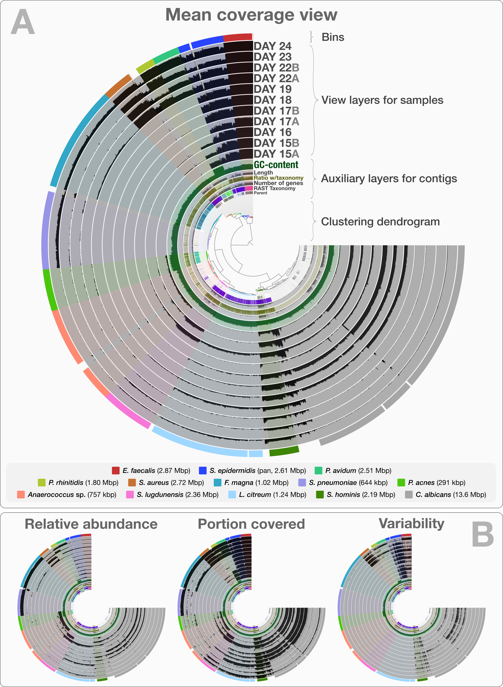{width=100%}

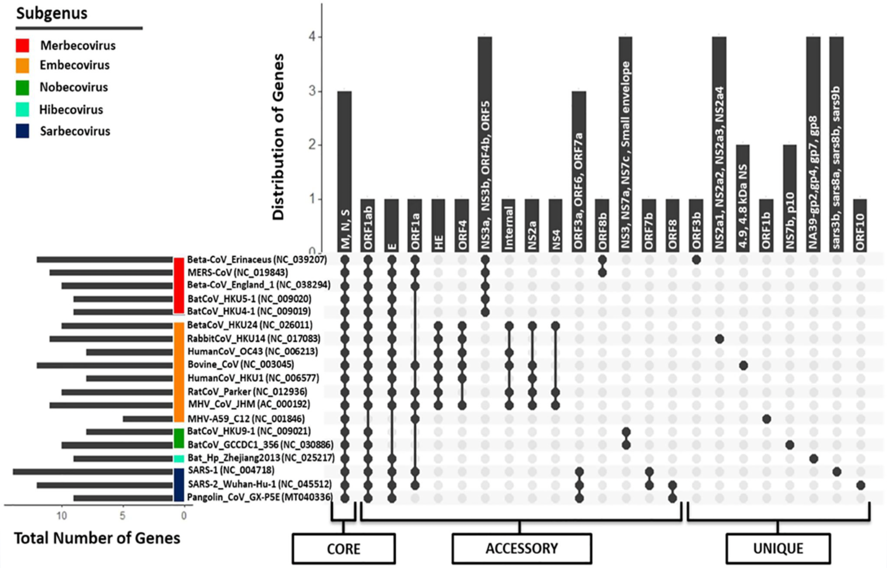{width=100%}

### Visualizing Alignment of Microbial Genomes

+ Manuscript:
    + https://peerj.com/articles/9576/
    
Sequence-level alignment showing common and rare variations at sequence level.

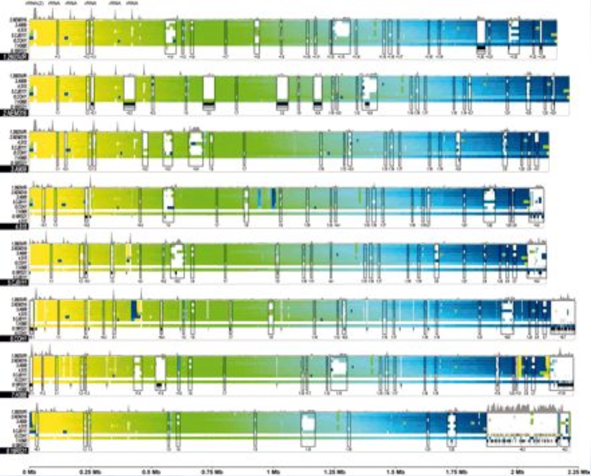{width=80%}

### PanX

https://github.com/neherlab/pan-genome-analysis

+ Manuscript:
    + https://academic.oup.com/nar/article/46/1/e5/4564799
+ Demo:
    + https://pangenome.org
    
Pangenome analysis pipeline and visualizations.

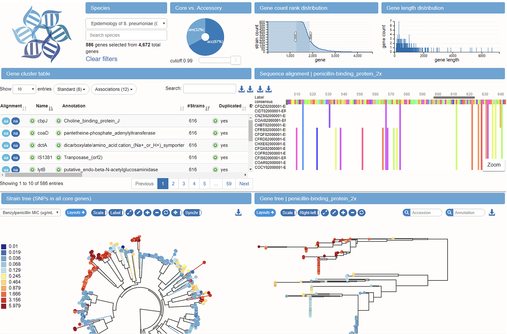{width=100%}

### Sequence Tube Maps

https://github.com/vgteam/sequenceTubeMap

+ Manuscript:
    + https://academic.oup.com/bioinformatics/article/35/24/5318/5542397
+ Demo:
    + https://vgteam.github.io/sequenceTubeMap/

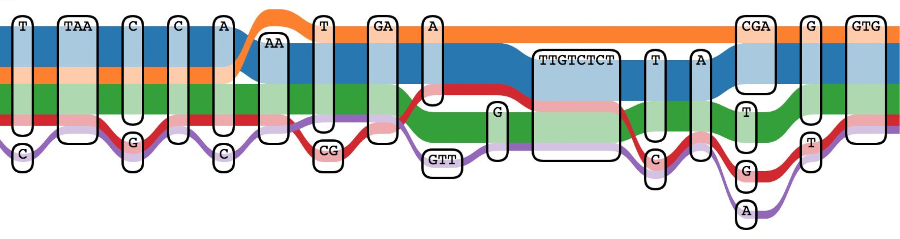{width=100%}

### MoMI-G

https://github.com/MoMI-G/MoMI-G

+ Manuscript
    + https://bmcbioinformatics.biomedcentral.com/articles/10.1186/s12859-019-3145-2
+ Demo:
    + http://demo.momig.tokyo

Web-based multi-scale genome graph browser.

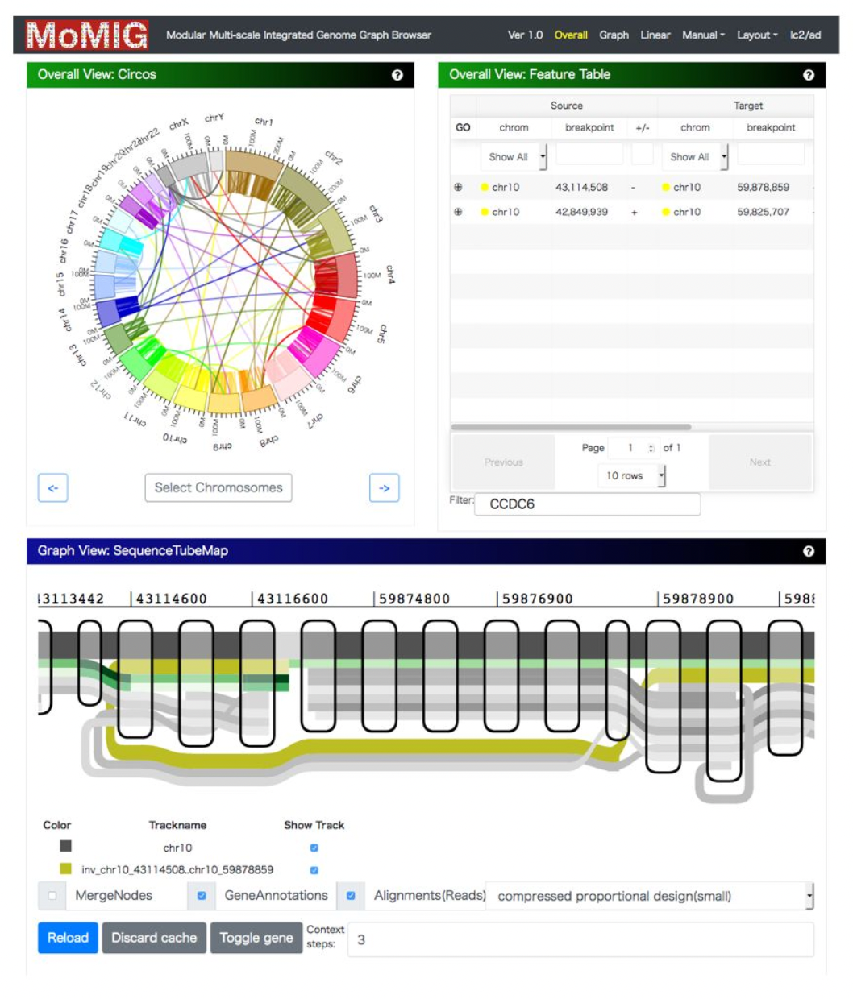{width=100%}

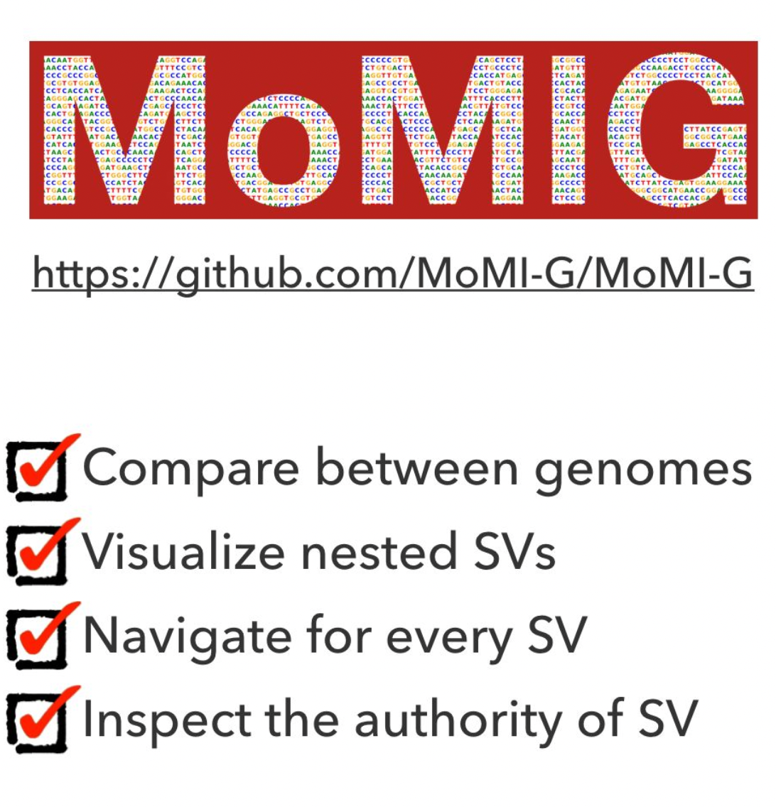{width=50%}

### PGV (Pangenome Graph Viewer)

https://github.com/ucrbioinfo/PGV

+ Manuscript:
    + https://bmcbioinformatics.biomedcentral.com/articles/10.1186/s12859-021-04424-w
+ Demo:
    + https://panviz-22b36.firebaseapp.com 

Web-based reference-agnostic representation and visualization of pan-genomes constructed using a **progressiveMauve** pipeline.

+ https://darlinglab.org/mauve/user-guide/progressivemauve.html

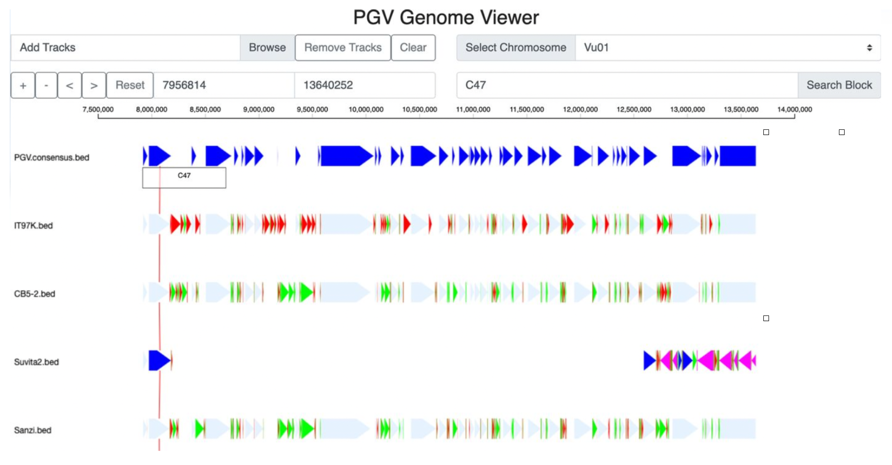{width=100%}

{width=100%}

### panGraphViewer

https://github.com/TF-Chan-Lab/panGraphViewer

+ Manuscript:
    + https://www.biorxiv.org/content/biorxiv/early/2023/04/02/2023.03.30.534931.full.pdf
    
Pangenome graph visualizer that can incorporate annotation.

{width=80%}

## Other Graph Construction / Manipulation Tools / Pipelines

### odgi (optimized dynamic genome/graph implementation)

https://github.com/pangenome/odgi

+ Manuscript:
    + https://www.biorxiv.org/content/10.1101/2021.11.10.467921v1
+ Documentation:
    + https://odgi.readthedocs.io/en/latest/
    
“A toolkit for understanding pangenome graphs.”

Functionality:

1. Explore graphs via 1D and 2D visualization
2. Detect complex regions in the graph
3. Extract selected loci
4. Sorting and laying out, e.g. in preparation for visualization
5. Navigating and annotating graphs, e.g. bringing annotations in
to Bandage
6. Remove artifacts and complex regions
7. MultiQC report for graph statistics

### seqwish

https://github.com/ekg/seqwish

+ Dissertation
    + https://github.com/ekg/seqwish
    
“The sequences wish they were squished into a graph.” 

+ Converts pairwise alignments between sequences into a variation graph, i.e. pangenome.

+ Takes one or more PAF files as input (e.g. output of minimap2)
+ Infers graph nodes and node orderings from alignment blocks
and how they overlap between sequences.

###  smoothxg

https://github.com/pangenome/smoothxg

“Linearize and simplify variation graphs using blocked partial order alignment.”

+ “Smooths” graph by consolidating structures that are artifacts of graph assembly / data.

## Other Mapping, Variant Calling, and Genotyping Tools

### GraphAligner

https://github.com/maickrau/GraphAligner

+ Manuscript
    + https://genomebiology.biomedcentral.com/articles/10.1186/s13059-020-02157-2
    
“Aligns long reads to genome graphs. Compared to the state-of-the-art tools, GraphAligner is 13x faster and uses 3x less memory. When employing GraphAligner for error correction, we find it to be more than twice as accurate and over 12x faster than extant tools.”

### GraphTyper / GraphTyper2

https://github.com/DecodeGenetics/graphtyper

+ Manuscripts
    + https://www.nature.com/articles/ng.3964
    + https://www.nature.com/articles/s41467-019-13341-9

“A graph-based variant caller capable of genotyping population-scale short read data sets. It represents a reference genome and known variants of a genomic region using an acyclic graph structure (a "pangenome reference"), which high-throughput sequence reads are re-aligned to for the purpose of discovering and genotyping SNPs, small indels, and structural variants.”

+ GraphTyper2 is the v2 release of GraphTyper, i.e. the same GitHub repository

### BayesTyper

https://github.com/bioinformatics-centre/BayesTyper

+ Manuscript:
    + https://www.nature.com/articles/s41588-018-0145-5

Performs genotyping of all types of variation by exactly aligning sequence k-mers to a reference graph and then using Bayesian inference built on a “variation-prior” database to do genotyping.

BayesTyper enables “sensitive and accurate genotyping across classes and varying lengths of structural variants” as compared to other methods

### Paragraph

https://github.com/Illumina/paragraph

+ Manuscript
    + https://genomebiology.biomedcentral.com/articles/10.1186/s13059-019-1909-7

A suite of graph-based genotyping tools to support accurate genotyping of short-read data.

Developed by Illumina.

“Paragraph has better accuracy than other existing genotypers and can be applied to population-scale studies.”

### Practical Haplotype Graph (PHG)

https://bitbucket.org/bucklerlab/practicalhaplotypegraph/wiki/Home

+ Manuscript
    + https://academic.oup.com/g3journal/article/12/2/jkab390/6423995
    
A graphical genotyping data storage and genotype imputation platform designed to be used on skim sequencing methods to infer high-density genotypes directly from low-coverage sequence.

+ Developed by the Buckler Lab
+ Has been used extensively with wheat and maize    

### PanGenie

https://github.com/eblerjana/pangenie

+ Manuscript
    + https://doi.org/10.1038/s41588-022-01043-w
    
A short-read genotyper for single nucleotide polymorphisms, indels, and structural variants.

"Genome inference" using kmers from short reads plus haplotypes in the pangenome reference

"Compared with mapping-based approaches, PanGenie is more than 4 times faster at 30-fold coverage and achieves better genotype concordances for almost all variant types and coverages tested."

## Gene Resolution Tools

### Genome Context Viewer

https://github.com/legumeinfo/gcv

+ Manuscript:
    + https://academic.oup.com/nar/article/46/1/e5/4564799
+ Demo:
  + https://www.legumeinfo.org/gcv2/instructions
  
Visual exploration of population using synteny derived from gene homology relationships (e.g. gene families).

{width=100%}

### pandagma

https://github.com/legumeinfo/pandagma

PANgenome Directed Acyclic Graph Multiple Alignment

"Pandagma is a collection of tools for calculating pangene sets and gene families."

+ `pandagma pan` for pangene sets
+ `pandagma fam` for gene families

{width=100%}

## So Much More...

New tools are coming out constantly!

Check the citations of tools of interest to stay up-to-date!

## Future Tools

+ Data compression!
+ This research is happening now
  + Developing techniques that allow computation directly on compressed data
  + Techniques specifically for pangenomes
  + Fundamental data compression algorithms still need to be solver
  + Usable software is still a few years away...

## The Pangenome book, edited by Tettlin!

https://library.oapen.org/handle/20.500.12657/37707
