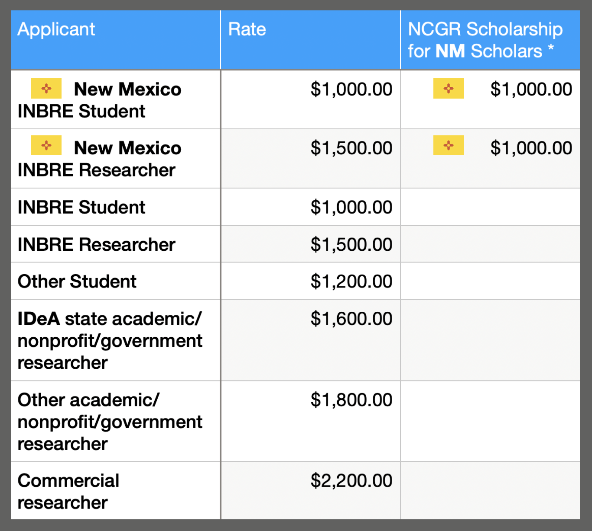

--- 
title: "NCGR Bioinformatics Workshops"
site: bookdown::bookdown_site
documentclass: book
bibliography: [book.bib, packages.bib]
# url: your book url like https://bookdown.org/yihui/bookdown
# cover-image: path to the social sharing image like images/cover.jpg
description: |
 This is the material offered by NCGR in collaboration
  with NM-INBRE.
link-citations: yes
github-repo: ncgr/INBRE-Bookdown
---


# License and Copyright{-}

Creative Commons Attribution-NonCommercial-NoDerivatives 4.0
https://creativecommons.org/licenses/by-nc-nd/4.0/

© 2023 National Center for Genome Resources

<br>

{width=20%} 

<br>

{width=30%} 


```{r include=FALSE}
# automatically create a bib database for R packages
knitr::write_bib(c(
  .packages(), 'bookdown', 'knitr', 'rmarkdown'
), 'packages.bib')
```

<!--chapter:end:index.Rmd-->


# Upcoming NCGR Workshops{-}

### Metagenomics Workshop{-}

- Fill out this online application here: 
[**Metagenomics Workshop Application**](https://forms.gle/Ai2psNtZJRvxygZZ9)


- Application **due** by midnight **October 28th, 2024**

- Space is limited!

### When{-}

**November 04 – November 08, 2024** (5 days)

9 am – 4 pm


- More Info about [**Metagenomics Workshops here**](https://inbre.ncgr.org/ncgr-workshops/metagenomics-workshop-1.html)

### How much does it cost?{-}

[**Click here**](https://inbre.ncgr.org/ncgr-workshops/workshop-rates.html) to get workshop rates.

<br>

{width=50%}


#### Contact{-}

Please contact Project Coordinator, Ethan Price with any additional questions you may have at inbre@ncgr.org and we look forward to your participation!

Sponsored by New Mexico IDeA Network for Biomedical Research Excellence (NM-INBRE).

<!--chapter:end:01-Welcome.Rmd-->

# Workshop Calendar{-}

## November 4th - November 8th, 2024 | Metagenomics Workshop!{-}


<<iframe src="https://calendar.google.com/calendar/embed?height=600&wkst=1&ctz=America%2FDenver&bgcolor=%23ffffff&showPrint=0&showTabs=0&src=Y18yZTE1NDQ2MGI1ZDQ5ZmQ3YTAxNGJhNzg0MzAxY2MyZjgyZWQ2NmQzMGFjNDljMjQzZWUzZTQwNmQ1ZDIyNzkyQGdyb3VwLmNhbGVuZGFyLmdvb2dsZS5jb20&src=ZW4udXNhI2hvbGlkYXlAZ3JvdXAudi5jYWxlbmRhci5nb29nbGUuY29t&color=%23EF6C00&color=%230B8043" style="border:solid 1px #777" width="700" height="600" frameborder="0" scrolling="no"></iframe>>


<!--chapter:end:02-WorkshopCalendar.Rmd-->

# About Us{-}

**NM-INBRE (New Mexico IDeA Networks of Biomedical Research Excellence):**

{width=20%}

NM-INBRE Champions biomedical and community based research excellence in the state of New Mexico through the development of innovative, supportive and sustainable research environments for faculty and students, community engaging health initiatives, while building a network of lead scientists and educators at the state, regional and national level.
 
Funded by the Institutional Development Award (**IDeA**) of the National Institutes of Health (**NIH**) & National Institute of General Medical Sciences (**NIGMS**)  Grant # P20GM103451 

<br>

**NCGR (National Center for Genome Research):** 

{width=30%}

Located in Santa Fe, New Mexico, the National Center for Genome Resources is a not-for-profit research institute that innovates, collaborates, and educates in the field of genomic data science. As leaders in DNA sequence analysis, we partner with government, industry, and academia to drive biological discovery in all kingdoms of life. 

NCGR operates NM-INBRE's Sequencing and Bioinformatics Core (SBC).  Through this partnership we offer the NM-INBRE SBC Pilot Award, which is a funding opportunity primarily for New Mexico researchers through which NCGR can help you with your research. 


<!--chapter:end:03-AboutUs.Rmd-->

# Workshop Rates{-} 

{width=90%}

#### * New Mexico Scholarship Link:{-} 
[**Scholarship link - Click here**](https://forms.gle/MkgHEQGCBMkcVYBX8) to apply for a **New Mexico** scholarship!

- There are a limited number of scholarships available per workshop.
- Scholarships only available to New Mexico students and researchers.
- We will contact workshop and scholarship applicants within a week of the application deadline.
- Check with **your institution's INBRE program** for other funding opportunities!

For more information about [Institutional Development Award (IDeA)](https://www.nigms.nih.gov/capacity-building/division-for-research-capacity-building/institutional-development-award-%28idea%29)


<!--chapter:end:04-WorkshopRates.Rmd-->

# Pangenomics Workshop{-}

Application: Fill out this online application here: [Pangenomics Workshop Application](https://docs.google.com/forms/d/e/1FAIpQLScJPueRpT0M4CHb2RjJI5DGHTXu6mutGBVBoOMCEQsO2JnQ1A/viewform)

Space is limited!


## When{-}

February 12-16, 2024


## Where{-}

Virtual (by the National Center for Genome Resources (NCGR) Santa Fe, NM)


## Audience{-}

This program is geared towards training biologists (undergraduates, graduates and researchers) with minimal or no bioinformatics experience. Space is limited.


## Topic Overview{-}

The proliferation of reference quality genome assemblies within any single species has necessitated the need for pangenome analyses. Such analyses remove reference-bias and elucidate biological signals at a more comprehensive population scale. In this workshop, students will learn what exactly a pangenome is, how to build a pangenome, and how to perform fundamental bioinformatic analyses on pangenomic data.


## Objective{-}

Students will learn to use the command-line interface to conduct graphical pangenome analyses. Specifically, students will learn to build pangenome graphs using vg, minigraph, and Cactus. They will learn to visualize these pangenomes using Bandage and IGV, and they will learn how to map reads and call variants on the graphs, comparing both run-time and mapping performance between methods. Additionally, students will be given an overview of other, interoperable tools to broaden their understanding of the rapidly moving pangenomics space.

## Prerequisites{-}

Unix, sequencing basics and other study guides will be provided upon acceptance.

## What to expect upon acceptance{-}

Email confirming acceptance into the internship program and further details.

## Logistics{-}

The workshop will be conducted virtually using primarily Zoom as our conferencing platform.  We will also use a variety of other software and tools, and you will log onto NCGR’s Unix analysis server for the command line tools.  After the workshop, students can use our analysis server for their research or education purposes for up to one year.

Late applications will not be accepted.  Selection Committee to select participants shortly after the deadline. If any questions arise while reviewing your application packet, we will contact you directly.

Contact

Please contact Project Coordinator, Ethan Price, with any additional questions you may have at inbre@ncgr.org and we look forward to your participation!

Sponsored by New Mexico IDeA Network for Biomedical Research Excellence (NM-INBRE).


<!--chapter:end:05-PangenomicsWS.Rmd-->


# Single Cell RNA-seq Workshop{-}

Application: Fill out this online application here: [Single Cell Workshop Application](https://docs.google.com/forms/d/e/1FAIpQLSfPdh4grpQd94_-kRvZ-NCZbd4RY2W7A31wnqkzwhKTdYZuxg/viewform)

Space is limited!

Application and letter of recommendation due by midnight October 30th, 2023


## When{-}

Nov 6 – 10, 2023 (5 days)

9 am – 4 pm


## Where{-}

Virtual (by the National Center for Genome Resources (NCGR) Santa Fe, NM)


## Objective{-}

Students will leverage their Unix and R command knowledge and become familiar with the SingleCellExperiment and Seurat R packages as well as an interactive Shiny web application to perform statistical metrics and data visualization for a variety of bioinformatic approaches to single cell sequencing analysis. 

## Audience{-}

This advanced workshop is targeted towards undergraduate or graduate students in biology or related fields.  

## Prerequisites{-}

Unix, sequencing basics and other study guides will be provided upon acceptance.

What to expect upon acceptance

Email confirming acceptance into the internship program and further details.

## Logistics{-}

The workshop will be conducted virtually using primarily Zoom as our conferencing platform.  We will also use a variety of other software and tools, and you will log onto NCGR’s Unix analysis server for the command line tools.  After the workshop, students can use our analysis server for their research or education purposes for up to one year.

Late applications will not be accepted.  Selection Committee to select participants shortly after the deadline. If any questions arise while reviewing your application packet, we will contact you directly.

Contact

Please contact Project Coordinator, Ethan Price with any additional questions you may have at inbre@ncgr.org and we look forward to your participation!

Sponsored by New Mexico IDeA Network for Biomedical Research Excellence (NM-INBRE).


<!--chapter:end:06-SingleCellWS.Rmd-->

# Metagenomics Workshop{-}

Application: Fill out this online application here: [Metagenomics Workshop Application](https://forms.gle/Ai2psNtZJRvxygZZ9)

Space is limited!

Application due by midnight October 28th, 2024


## When{-}

**November 04 – November 08, 2024** (5 days)

9 am – 4 pm

- Including a 1 hour break for lunch

## Where{-}

Virtual (via the National Center for Genome Resources (NCGR) Santa Fe, NM)


## Objective{-}

Learn how to use the UNIX command line, analytical workflows and public tools to independently analyze sequencing data plus how to visualize and render data using graphing tools.

This workshop covers analyses of 16s and whole genome shotgun metagenomic sequence data, including community analysis and assembly.


## Audience{-}


This workshop is targeted towards undergraduate or graduate students, and researchers in biology or related fields.  


## Prerequisites{-}

Unix, sequencing basics and other study guides will be provided upon acceptance.

What to expect upon acceptance

Email confirming acceptance into the internship program and further details.

## Logistics{-}

The workshop will be conducted virtually using primarily Zoom as our conferencing platform.  We will also use a variety of other software and tools, and you will log onto NCGR’s Unix analysis server for the command line tools.  After the workshop, students can use our analysis server for their research or education purposes for up to one year.

Late applications will not be accepted.  Selection Committee to select participants shortly after the deadline. If any questions arise while reviewing your application packet, we will contact you directly.
Contact

Please contact Project Coordinator, Ethan Price, with any additional questions you may have at inbre@ncgr.org and we look forward to your participation!

Sponsored by New Mexico IDeA Network for Biomedical Research Excellence (NM-INBRE).


<!--chapter:end:07-MetagenomicsWS.Rmd-->

# Differential Expression Workshop{-}

Application: Fill out this online application here: 
[Differential Expression Workshop Application](https://docs.google.com/forms/d/e/1FAIpQLScpoKxE0yAnCK3yOl5hBde7MtOWCOeXYxvjBfWyDcA9hHDGrw/viewform)

Space is limited!

Application due by midnight March 11th, 2024


## When{-}

March 18 – 22, 2024 (5 days)

9 am – 4 pm


## Where{-}

Virtual (by the National Center for Genome Resources (NCGR) Santa Fe, NM)


## Objective{-}

Come learn about differential gene expression analysis in this virtual workshop that will teach you with hands-on analysis from start to finish. This differential expression workshop covers basic linux skills, quality control, read alignment, abundance estimation, differential expression analysis, visualization, and pathway analysis. Note that this workshop covers differential expression of bulk tissues (we cover single cell expression in a separate workshop). 

## Audience{-}

This advanced workshop is targeted towards undergraduate or graduate students in biology or related fields.  

## Prerequisites{-}

Unix, sequencing basics and other study guides will be provided upon acceptance.

What to expect upon acceptance

Email confirming acceptance into the internship program and further details.

## Logistics{-}

The workshop will be conducted virtually using primarily Zoom as our conferencing platform.  We will also use a variety of other software and tools, and you will log onto NCGR’s Unix analysis server for the command line tools.  After the workshop, students can use our analysis server for their research or education purposes for up to one year.

Late applications will not be accepted.  Selection Committee to select participants shortly after the deadline. If any questions arise while reviewing your application packet, we will contact you directly.

Contact

Please contact Project Coordinator, Ethan Price with any additional questions you may have at inbre@ncgr.org and we look forward to your participation!

Sponsored by New Mexico IDeA Network for Biomedical Research Excellence (NM-INBRE).

<!--chapter:end:08-DEWS.Rmd-->


# Citing NM INBRE{-}

If you received funding from NM-INBRE that contributed to your research or career development, you must cite NM-INBRE support on all publications, presentations, press releases, requests, requests for proposals, bid invitations, or any other documents or applications related to your funded research. Also, please be sure to cite NM-INBRE if your work benefited from the use of NM-INBRE equipment or an NM-INBRE sponsored student worked in your lab. 

For instructions on how to cite NM-INBRE and where to find our logos, please visit https://nminbre.nmsu.edu/cite-us/cite-us.html


<p style="margin-left: 25px;">
<span style="color: tan;">**NIH requires the following format for citing INBRE support, to be used for presentations, publications, and other acknowledgements:**</span>
</p>

<p style="margin-left: 25px;">
<span style="color: tan;">*Research reported in this publication was supported by an Institutional Development Award (IDeA) from the National Institute of General Medical Sciences of the National Institutes of Health under grant number P20GM103451.*</span>
</p>

<!--chapter:end:09-CitingNM-INBRE.Rmd-->

# Server Access & Acknowledgement{-}

For those of you who requested continued access to our server, we will extend your account for 1 year. If you need it longer, please email us and we'll be happy to work with you. We ask that you don't run really large jobs while we are running workshops to avoid slowing things down. So, if you have a really large job to run, please check in with us so we can let you know when workshops will be happening.

Please note, if you use our servers to do analysis that you publish, you need to acknowledge the National Center for Genome Resources (NCGR) and the INBRE grant in your acknowledgements. Instructions for the latter can be found here: https://nminbre.nmsu.edu/cite-us/cite-us.html. 

This is really important for our annual reports so thank you in advance!

Additionally, in order to share your publications in our annual reporting, and to comply with NIH guidelines for open access, please include a PMCID with your publication.  Instructions: [Include PMCID in Citations](https://publicaccess.nih.gov/include-pmcid-citations.htm).


Additional details from https://nminbre.nmsu.edu/cite-us/cite-us.html:

<p style="margin-left: 25px;">
<span style="color: tan;">If you received funding from NM-INBRE that contributed to your research or career development, you must cite NM-INBRE support on all publications, presentations, press releases, requests, requests for proposals, bid invitations, or any other documents or applications related to your funded research. Also, please be sure to cite NM-INBRE if your work benefited from the use of NM-INBRE equipment or an NM-INBRE sponsored student worked in your lab.</span>
</p>

<p style="margin-left: 25px;">
<span style="color: tan;">**NIH requires the following format for citing INBRE support, to be used for presentations, publications, and other acknowledgements:**</span>
</p>

<p style="margin-left: 25px;">
<span style="color: tan;">*Research reported in this publication was supported by an Institutional Development Award (IDeA) from the National Institute of General Medical Sciences of the National Institutes of Health under grant number P20GM103451.*</span>
</p>

<!--chapter:end:11-ServerAccessAcknowledgements.Rmd-->


# Questions{-}

If you have **bioinformatics or technical questions**, please email inbre@ncgr.org, which will send emails to everyone on the inbre team. 

If you have questions on **passwords/password resets, payments, receipts, etc,** please email Ethan Price at inbre@ncgr.org and cc inbre@ncgr.org. 

Occasionally, we change servers or change how to log in so if you are having issues, please contact us.

<!--chapter:end:14-Questions.Rmd-->

# Acknowledgements{-}

This publication was supported by an Institutional Development Award (**IDeA**) from the National Institute of General Medical Sciences of the **National Institutes of Health** under grant number **P20GM103451**. Additional support came from **National Science Foundation** Award numbers **1759522** (Collaborative Research: Innovation: Pioneering New Approaches to Explore Pangenomic Space at Scale) and **2105391** (CRII: III: Toward the Compression of Pangenomic DNA Sequence Data Using Context-Free Grammars).

<br>

<center>
{width=40%} 

<br>

{width=50%} 
</center>


<!--chapter:end:15-Acknowledgements.Rmd-->

